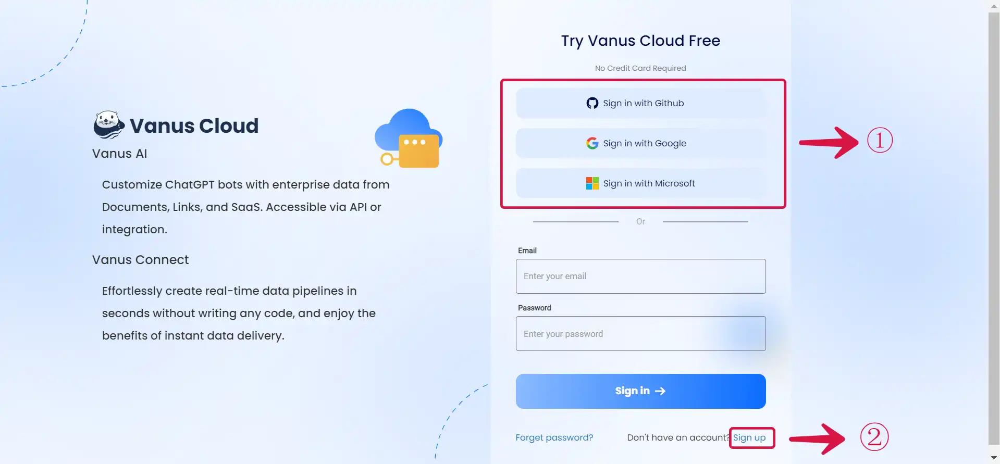
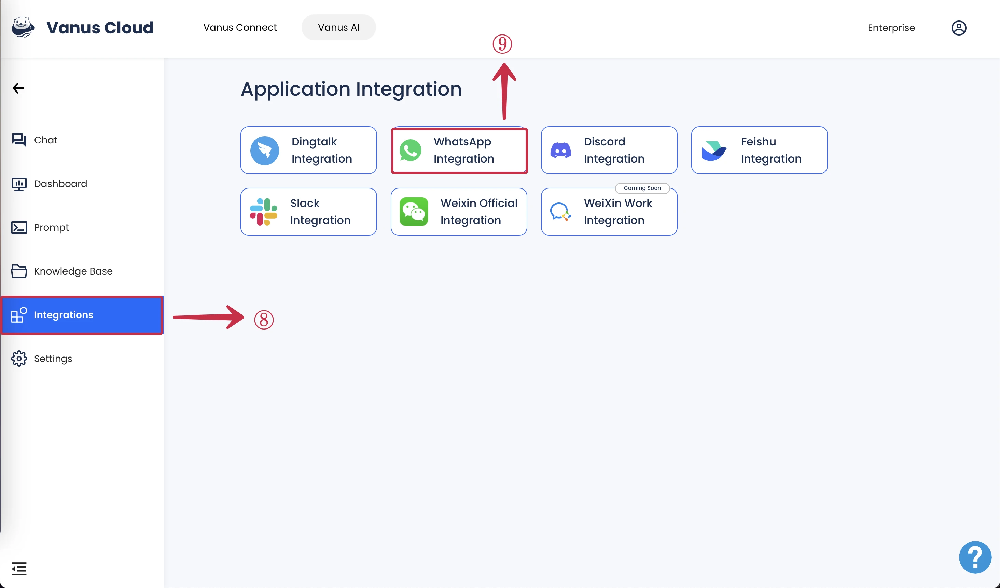
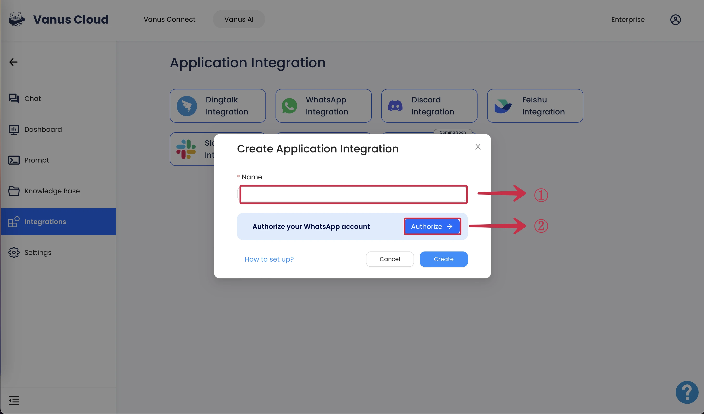
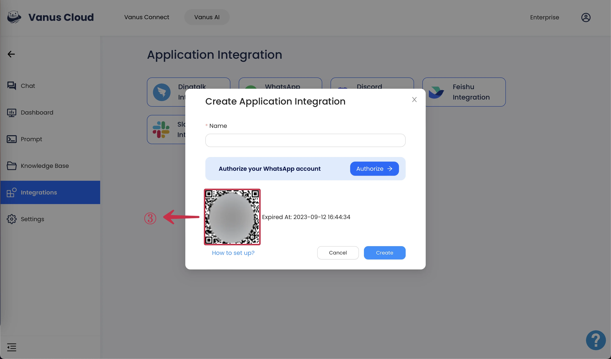
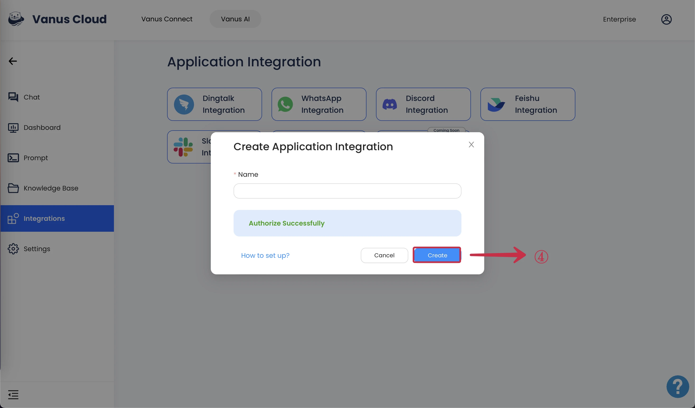
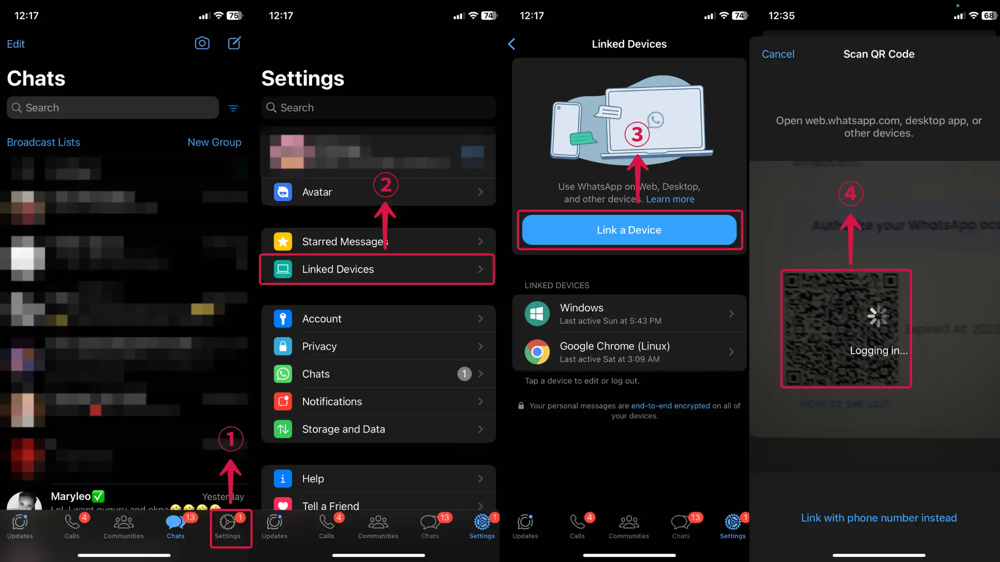
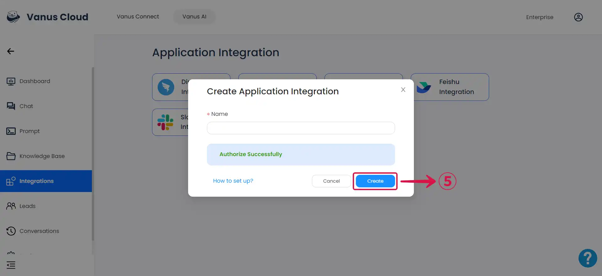
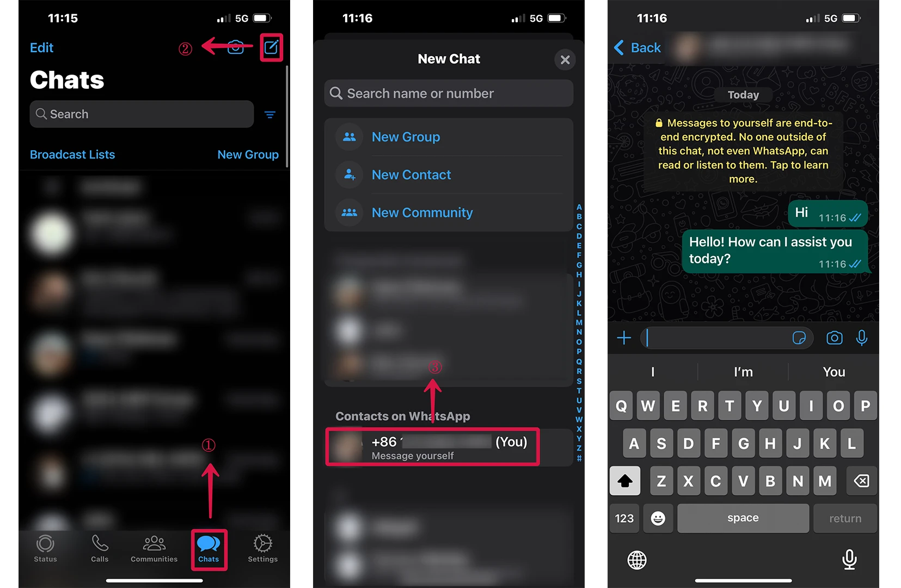

# WhatsApp 
This documentation will teach you how to use the WhatsApp integration to turn your WhatsApp account into an AI able to respond to your contacts.

Integration is a paid user feature. Therefore, only users with professional subscriptions and above can use integrations.

Learn how to set a personal GPT AI at [**WhatsApp GPT**](https://www.vanus.ai/blog/how-to-setup-chatgpt-on-whatsapp-with-vanus-connect/).

## How to Setup a WhatsApp Integration

**Prerequisites:**

- Have a [**WhatsApp account**](https://www.whatsapp.com).
- Have a [**Vanus AI account**](https://ai.vanus.ai).

### Step 1: Establish an AI Application

1. Navigate to [**Vanus AI**](https://ai.vanus.ai) and Sign up with your **Github, Google, Microsoft Account**① or click **Sign up**②.

2. Initiate a new AI App by hitting the **Create App**③ button.

3. Input an **App Name**④, select an **App Model**⑤, upload to the **Knowledge Base**⑥, then click **Create**⑦.

If you find yourself uncertain about which app model to select, please refer to the [**Large Language Models (LLM) Documentation**](https://docs.vanus.ai/vanus-ai/beginning/large-language-models/) for clear guidance on choosing the most suitable LLM for your requirements.

4. Select the **Integrations Tab**⑧ and click the **WhatsApp Integration**⑨.

### Step 2: Connect WhatsApp to Vanus AI

1. Enter a **Name**① for your integration and click **Authorize**②.

3. Use your mobile WhatsApp to scan the **QR code**③.

**Scanning the QR Code**

<Tabs>

<TabItem label="Android" value="android">

4. Tap on the **kebab icon**① to reveal the menu.

5. Select **Linked devices**②.

6. Tap on the **Link a device**③ button.

7. Align your phone's camera with the QR code so that the QR code is completely within the **camera frame**④.

</TabItem>

<TabItem label="iOS" value="ios">

4. Tap on the **gear icon**① to reveal the settings menu.

5. Select **Linked Devices**②.

6. Tap on the **Link a Device**③ button.

7. Align your phone's camera with the QR code so that the QR code is completely within the **camera frame**④.

</TabItem>

</Tabs>

8. Once authorization is successful, click **Create**⑤.  

### Step 4: How to use Vanus AI on WhatsApp

import Tabs from '@theme/Tabs';
import TabItem from '@theme/TabItem';

<Tabs>

<TabItem label="Android" value="android">

1. Tap on the 💬① icon at the bottom-right corner to display the contact list.

2. Within the contact list, select the **contact**② with your profile display. It's typically the first contact on the list and has the word `You` attached to it.

3.  Send a message or pose a question and you'll receive a response.
  

</TabItem>

<TabItem label="iOS" value="ios">

1. Tap the 💬①  icon at the bottom menu and tap the 📝② icon at the top.

2. Within the contact list, select the **contact**③ with your profile display. It's typically the first contact on the list and has the word `You` attached to it.

3. Send a message or pose a question and you'll receive a response.
  

</TabItem>

</Tabs>

To use in WhatsApp groups just tag the AI account using `@`. 

:::note
WhatsApp does not allow users to assign a universal name to a contact. The name you have saved for that contact in your own phone's address book is what you will see, and the name other group members have saved for that contact is what they will see. Therefore, it's important to inform your group members to choose a memorable name for the contact used in the integration to avoid confusion when mentioning the AI.
:::
