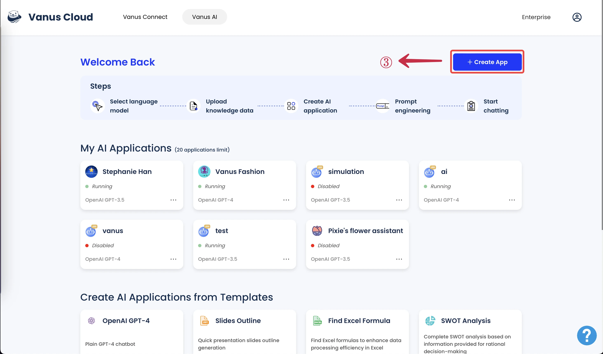
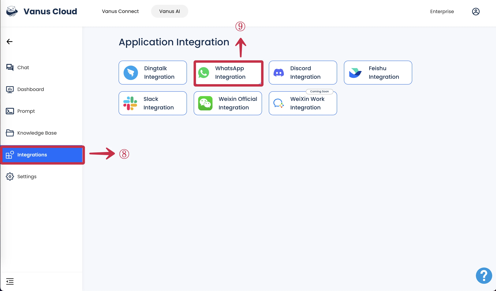
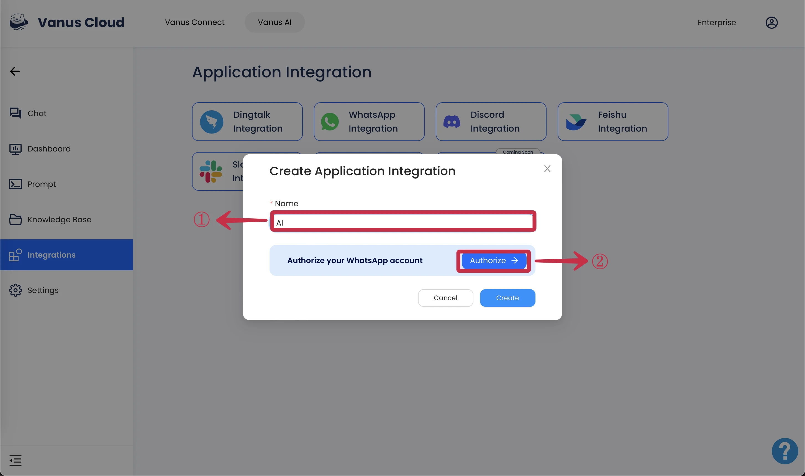
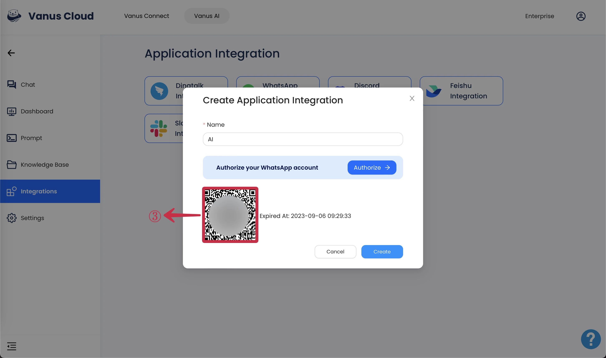
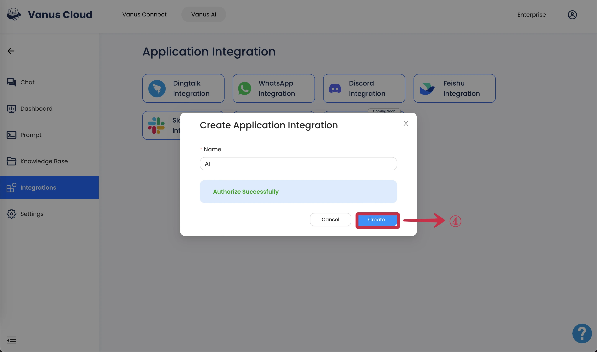

# WhatsApp 
This documentation will teach you how to use the WhatsApp integration to turn your WhatsApp acount into an AI able to respond to your contacts.

Integration is a paid user feature. Therefore, only users with professional subscriptions and above can use integrations.

learn how to set a personal GPT AI at [**WhatsApp GPT**](https://www.vanus.ai/blog/how-to-setup-chatgpt-on-whatsapp-with-vanus-connect/).

## How to Setup a WhatsApp Integration

**Prerequisites:**

- Have a [**WhatsApp account**](https://www.whatsapp.com).
- Have a [**Vanus AI account**](https://ai.vanus.ai).

### Step 1: Establish an AI Application
1. Navigate to [**Vanus AI**](https://ai.vanus.ai) and Sign up with your **Github, Google, Microsoft Account**① or click **Sign up**②.

2. Initiate a new AI App by hitting the **Create App**③ button.

3. Input an **App Name**④, select an **App Model**⑤, upload to the Knowledge Base⑥, then click **Create**⑦.

4. Select the **Integrations Tab**⑧ and select the **WhatsApp Integration**⑨.

### Step 2: Connect WhatsApp to Vanus AI
1. Enter a **Name**① for your integration and click **Authorize**②.

3. Use your mobile WhatsApp to scan the **QR code**③.

  

4. Once authorization is successful, click **Create**④.  

### Step 3: How to use Vanus AI on WhatsApp

import Tabs from '@theme/Tabs';
import TabItem from '@theme/TabItem';

<Tabs>

<TabItem label="Android" value="android">

1. Tap on the 💬① icon at the bottom-right corner to display the contact list.

2. Within the contact list, select the **contact**② with your profile display. It's typically the first contact on the list and has the word `You` attached to it.

3.  Send a message or pose a question and you'll receive a response.
  

</TabItem>

<TabItem label="iOS" value="ios">

1. Tap the 💬①  icon at the bottom menu and tap the 📝② icon at the top.

2. Within the contact list, select the **contact**③ with your profile display. It's typically the first contact on the list and has the word `You` attached to it.

3. Send a message or pose a question and you'll receive a response.
  

</TabItem>

</Tabs>

To use in WhatsApp groups just tag the AI account using `@`.  

