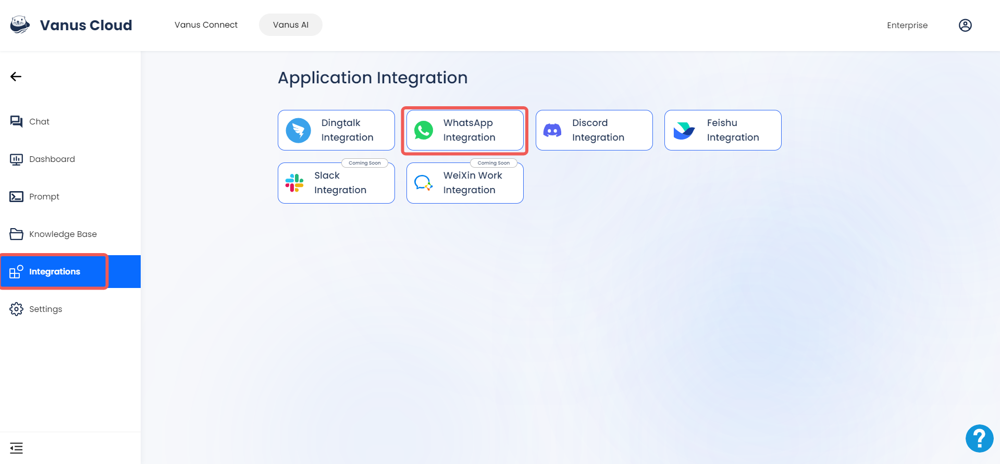
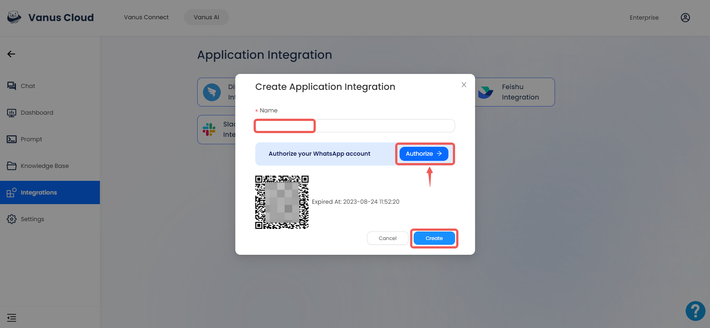
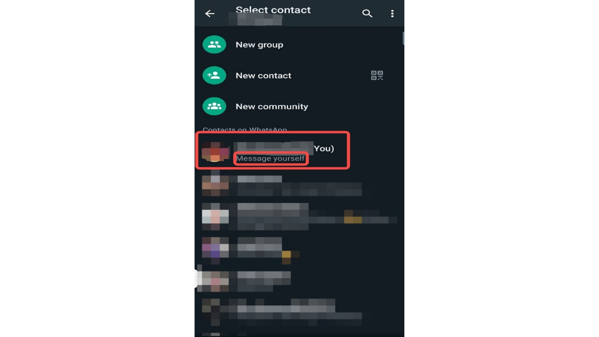
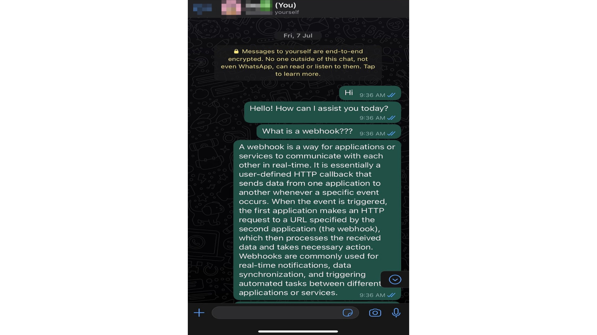
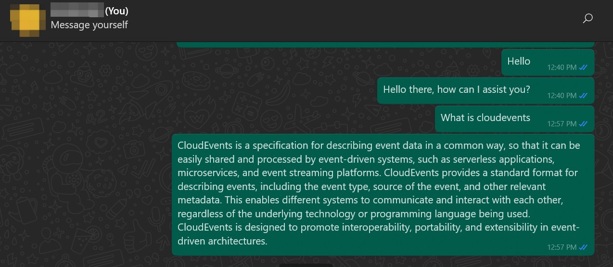

# WhatsApp 
This documentation will teach you how to integrate an AI into WhatsApp.
Integration is a paid user feature. Therefore, only users with professional subscriptions and above can use integrations.

## How to Setup a WhatsApp Integration

**Prerequisites:**

- Have a [WhatsApp account](https://www.whatsapp.com).
- Have a [Vanus AI account](https://ai.vanus.ai).

### Step 1: Establish an AI Application
1. Navigate to [Vanus AI](https://ai.vanus.ai) and log in.
2. Initiate a new AI App by hitting the **Create App** button.
   
3. Input a name, select the model, upload to the knowledge base, then click **Create**.
   
4. Direct yourself to the **Integration** tab and select the WhatsApp integration.
   

### Step 2: Connect WhatsApp to Vanus AI
1. Input a connection name.
2. Press `Authorize` to permit Vanus to form a connection with your WhatsApp account.
3. Use your mobile WhatsApp to scan the QR Code.
4. After successful authorisation, hit the `Create` button.
   

### Step 3: Utilizing Your AI on WhatsApp
The AI you've crafted is applicable on WhatsApp through an Android device, an iOS device, WhatsApp Web, and WhatsApp Desktop. In essence, your account now operates as the AI, automatically responding to messages from your contacts. Nevertheless, this setup isn't intended for personal AI usage. Please navigate [here](https://docs.vanus.ai/vanus-connect/connector-guides/source/whatsapp/setup) for instructions on setting up a personal AI in WhatsApp.

#### WhatsApp Mobile (Android)
On WhatsApp Android, execute the following steps:

- Tap on the `Chat` icon at the bottom-right corner to display the contact list.
  

- Within the contact list, select the contact with your profile display. It's typically the first contact on the list and has the word `You` attached to it.
  

- Simply write a message or pose a question and you'll receive a response.
  

#### WhatsApp Mobile (iOS)
On WhatsApp iOS, execute the following steps:

- Tap the `Chats` icon at the bottom menu to open the contact list.
  

- Within the contact list, select the contact with your profile display. It's typically the first contact on the list and has the word `You` attached to it.
  

- Simply write a message or pose a question and you'll receive a response.
  

#### WhatsApp Desktop & WhatsApp Web
- On WhatsApp Desktop/Web, the contact button will display your contact list. The Contact button has been marked as `1` in the screenshot. Press on the button and your contacts will be displayed. Select the one with your contact profile, it's marked as `2` and also has the word `You`. This way, you chat with your AI by chatting with yourself.
  

- Simply type any question you like to ask, the AI will respond to you on the chat.
  

#### Utilizing your AI in a Group
Your AI can be used on WhatsApp Groups by tagging the contact used to establish the connection on Vanus AI. To tag the contact, use the `@` symbol.

