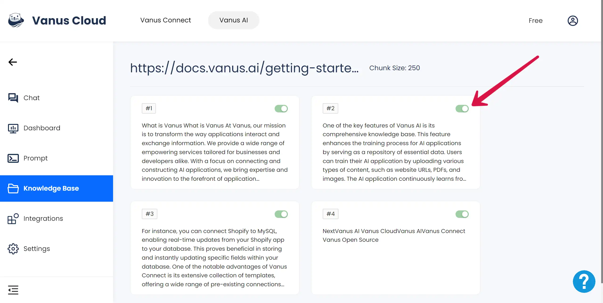

# Data Cleaning
## Why do we need data cleaning?
In the process of building and optimizing dialogue-oriented robots, the quality of data plays a decisive role. **High-quality data** can help robots generate answers more accurately and naturally, thereby improving the user experience. However, if the user-uploaded data contains a lot of noise, such as **irrelevant information, incorrect information, or redundant information**, these could seriously affect the quality of the robot's answers.

Data noise can come from a variety of factors, including errors in the **data collection process, errors in the data processing process, or problems with the source data itself**. These noises can interfere with the robot's understanding and processing of data, resulting in answers that deviate from the user's questions, or are vague. Therefore, data cleaning, that is, **processing and reducing data noise**, is an important link in optimizing chat robots.

## Two Possible Solutions. 
### Question and Answer Files
The first solution is to provide a file that corresponds to the question and answer. 

In this file, **a question corresponds to a standard answer**. Using this question and answer data type, the robot can refer to the preset questions and answers to generate more accurate and appropriate responses. This not only improves the quality of the answers but also reduces the impact of data noise. 

However, this method requires a lot of **manual work** and needs dedicated personnel to **create and maintain** this file of question and answer pairs.

### Edit Text Segment
The second solution is to edit text segments in the knowledge base. 

In Knowledge Base, all the uploaded data will be represented in text segment under the setting chunk size, where users can view and check these contents. If there is some data irrelevant or noisy, users can **manually turn off** this text segment. After closing the button, this part of the text will not be learned by the model.  

The advantage of this method is that users can participate directly in the data processing process, personally check and determine the quality of the data. This not only reduces data noise but also ensures that the answers generated by the robot are closer to the actual needs of users. However, this method also has certain challenges, such as how to **effectively cut and organize text**, how to correctly identify and handle irrelevant data, etc.

In summary, both of these solutions have their own advantages and challenges. You can choose the plan that suits them best based on their **actual needs and resources**. Through effective data cleaning, we can greatly improve the quality of the chatbot's responses and optimize the user experience.
