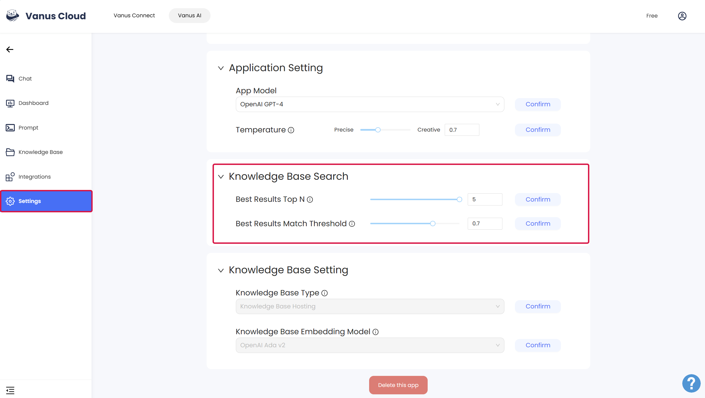

# Tuning Parameter

In this guide, we explored the impact of **chunk size** on Language Model (LLM) responses, how to reasonably segment text, and the parameters **"Best Results Top N"** and **"Best Results Match Threshold"** used in text generation models.

## What is the impact of chunk size on LLM responses?
The chunk size, when using a language model (LLM) for text generation, refers to the size of the input text that is divided into multiple chunks. This chunk size can have a certain effect on the responses generated by the LLM.  

  

A smaller chunk size may lead to the following impacts:
1. **Incomplete context**: A smaller chunk size may not provide enough context information for the LLM, leading to replies that lack coherence or relevance.
2. **Semantic discontinuity**: When the chunk size is too small, the LLM may produce semantic discontinuity between chunks, leading to replies that are incoherent or unreasonable.

A larger chunk size may lead to the following impacts:
1. **Memory limitations**: A larger chunk size may require more memory to process. If it exceeds the system's memory limit, it may cause the program to crash or performance to decline (With Vanus Cloud, you don't have to worry about that.).
2. **Context is too long**: A larger chunk size may contain too much context information. The LLM may forget or confuse previous information when processing long texts, leading to inaccurate or invalid replies.

Therefore, when choosing the chunk size, one needs to balance the aforementioned factors to obtain better LLM responses.

## How should text be reasonably segmented?

Choosing an appropriate chunk size depends on multiple factors, including the architecture of the language model and the size of the training data. Here are some general guidelines:

- **Text length**: Shorter texts can use a smaller chunk size, while longer texts may need a larger chunk size. This is because shorter texts may only need a small amount of contextual information, while longer texts may require more context information to generate coherent responses.

- **Model architecture**: Different language model architectures may have different requirements for chunk size. Some models may be more sensitive to a larger chunk size, while others may be more adapted to a smaller chunk size. It is recommended to refer to relevant documents or research papers to understand the specific model's recommendation for chunk size.

- **Size of training data**: A larger training dataset can usually support a larger chunk size, as the model has been trained on a large amount of data and can better understand the context. Conversely, a smaller training dataset may need a smaller chunk size to avoid the model overfitting or not being able to capture enough context information.

:::tip
- For text classification tasks, text is usually segmented by sentence or paragraph
- For machine translation tasks, the entire sentence or paragraph needs to be used as the segmentation unit
:::

Generally speaking, chunk size can be chosen within a range of several tens to hundreds of words. It can be adjusted and optimized based on the specific application scenario and experimental results. At the same time, one can also try to use different chunk sizes for comparison experiments to determine the best chunk size.

It should be noted that the choice of chunk size depends not only on the length of the text but also on the model and data. Therefore, the best chunk size may vary depending on the application scenario and the specific model. It is recommended to conduct experiments and tuning in actual applications to find the most suitable chunk size.

## What are "Best Results Top N" and "Best Results Match Threshold"?

"Best Results Top N" and "Best Results Match Threshold" are two parameters related to the use and adjustment of text generation models, usually used to control the quality and relevance of the text generated by the model.  

### Best Results Top N
This parameter specifies how many best results the model should return when generating text. Usually, the model will generate multiple embryonic text fragments, and then the device selects one or more results with the highest quality or relevance. Best Results Top N specifies the number of entrepreneurial results to be returned. A higher value will result in more choices, but may also contain lower quality results. A lower value will limit the number of choices, but the results are more likely to be high quality. The appropriate Top N value depends on the task and performance requirements.

### Best Results Match Threshold
This parameter is used to set the match threshold to determine which generated text results are considered relevant. Text generation models may generate multiple different text fragments, and the quality and relevance of these fragments vary. By setting the match threshold, the first text result related to the input or condition can be filtered out. If the relevance of a result exceeds the match threshold, it will be considered as other, otherwise, it will be excluded.

### Relationship between the "Top N" and "Match Threshold"
The value of this parameter can usually be adjusted and optimized according to the specific application scenario and task. Usually, you can experiment with different values to find the parameter configuration that best suits your needs. A higher best result will usually be Top N value increases to find the diversity of the generation, while a lower value will usually improve the quality of the generation, but in practice, a balance point needs to be established between the diversity and quality of the generation. The choice of match threshold depends on the strictness of the irrelevant or low-quality results that need to be filtered out.

These parameters can usually be set when using the text generation API to meet specific application needs.

## How to determine "Best Results Top N" and "Best Results Match Threshold"

Determining the best values for "Best Results Top N" and "Best Results Match Threshold" usually requires some experimentation and tuning. Here are the steps and suggestions to help you determine the best values:

| Step                                  | How to                                      |
| ------------------------------------- | ------------------------------------------------ |
| **1. Start with Default Values**      | Begin with the default parameter values, which are often reasonable starting points for most applications. For example, set an initial Best Results Top N of 3 or 5, and a matching threshold of 0.7 or 0.8. |
| **2. Define Performance Metrics**      | Clearly define your performance metrics before determining the optimal configuration. Different tasks and applications may require different performance measures, such as text quality, relevance, diversity, speed, etc. |
| **3. Systematic Experiments**          | Design a series of experiments to try different parameter configurations. For instance, create a set of different Best Results Top N values and matching thresholds, run the model with the same input conditions, collect generated text results, and record performance metrics. |
| **4. Evaluate Results**               | Evaluate the generated text results for each parameter configuration. Use the pre-defined performance metrics to measure the performance of each configuration. This may involve human evaluation, automated assessment, relevance scores, readability of generated text, etc. |
| **5. Choose the Best Configuration**  | Based on the experimental results, select the configuration that performs best according to your defined metrics. This may involve trade-offs between different performance measures, finding what suits your specific needs best. |
| **6. Validate and Iterate**           | Once you've identified a promising parameter configuration, further validate its performance with a wider range of data and real-world applications. Depending on actual usage, you may need to fine-tune and iterate on the configuration. |
| **7. Consider Specific Requirements**  | The optimal configuration may vary depending on the specific requirements of your application. For example, if you prioritize text relevance, you may choose a higher matching threshold, while if you prioritize diversity, you may increase the Best Results Top N value. |

**Remember**, determining the best values usually requires some time and experimentation. The key is to **choose parameter values based on the task goal and performance requirements** to ensure that the generated text meets your needs, and also needs to be adjusted and optimized according to the specific application scenario and performance requirements. It may take some time and effort, but it can help you get the model configuration that best suits your application.
