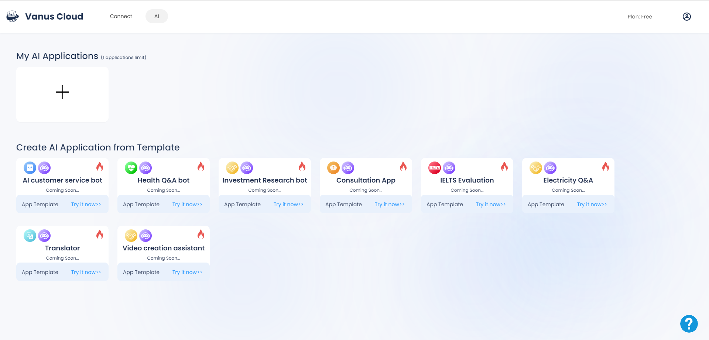

# What is Vanus AI
Vanus AI is a groundbreaking cloud-based platform that enables users and enterprises to build AI Applications based on Large Language Models. As an integral part of Vanus Cloud, it collaborates seamlessly with Vanus Connect to facilitate the development of groundbreaking AI applications that seamlessly integrate with essential external services. These AI applications can be built in minutes without writing any code.

When developing their applications, users have the option to select from a range of expansive models. Vanus AI presently offers users models like GPT-3.5, GPT 4.0, and ERNIE Bot, with plans to include additional large models in the future.

Vanus AI provides a knowledge base feature that simplifies training your AI Application. The knowledge base is a central repository for housing the data required to effectively train your application. Training your AI application is as easy as uploading website URLs, PDFs, images and other file types with relevant content. The AI application continuously learns from its data source, acquiring new knowledge through user interactions and engagement with third-party applications and services.

The created AI Applications can interact with many existing apps, databases and search engines, through the Vanus plugin mechanism. You can connect your AI Application to your company's database server, and the application continuously receives data from the connected service and updates its knowledge base, keeping it up-to-date and efficient. Using the power of Vanus Connect, users can also connect their AI application with 3rd party Apps. As an example, you have the ability to establish a connection between your AI application and WhatsApp, allowing you to send crucial updates either to a WhatsApp group or your personal messages.

With Vanus AI, users have the option to either have the Vanus AI team handle the hosting and management of their data, or they can choose to self-host and retain complete control over their data. It's important to note that all data is hosted on an AWS server. You can freely choose your cloud service platform and deployment region. Vanus AI currently supports AWS and Alibaba Cloud, with plans to add more platforms in the future.
Vanus AI offers a wide range of application possibilities across various business fields and purposes. Your AI application could be trained to serve as an intelligent customer service application, investment research assistant, translator, health Q&A bot, and much more. The possibilities are endless.

Users can further streamline their AI application to meet their specific business requirements by integrating predefined prompts. These prompts can be configured to guide users to a designated customer care agent in case of errors or gently steer website visitors towards a specific product. Discover more about the remarkable capabilities of the prompt feature and other features by visiting our [features page](../vanus-ai/features.md)

 

We are deeply committed to assisting our users in achieving significant time and resource savings by harnessing the immense power of Vanus AI to create highly efficient AI applications that automate their business processes. Join the ever-growing community of businesses and developers by visiting our website at [ai.vanus.ai](https://ai.vanus.ai/) or contacting us directly via email at contact@linkall.com.
