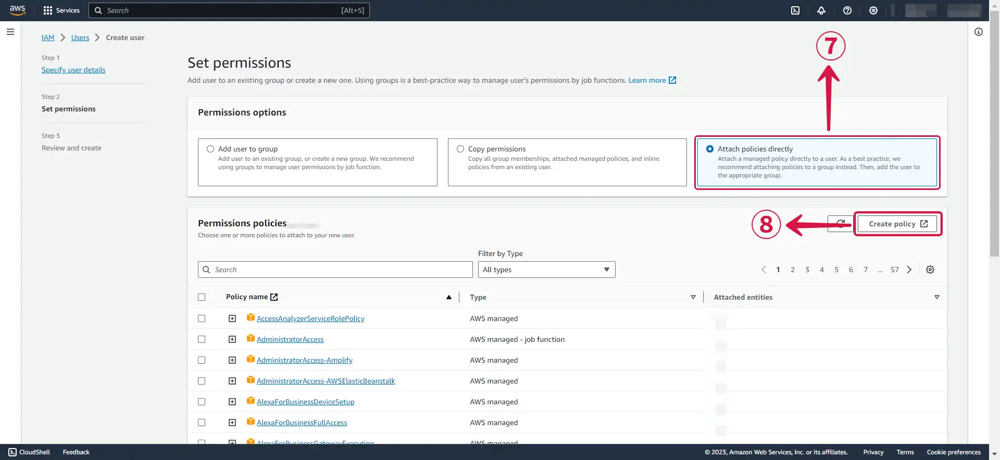
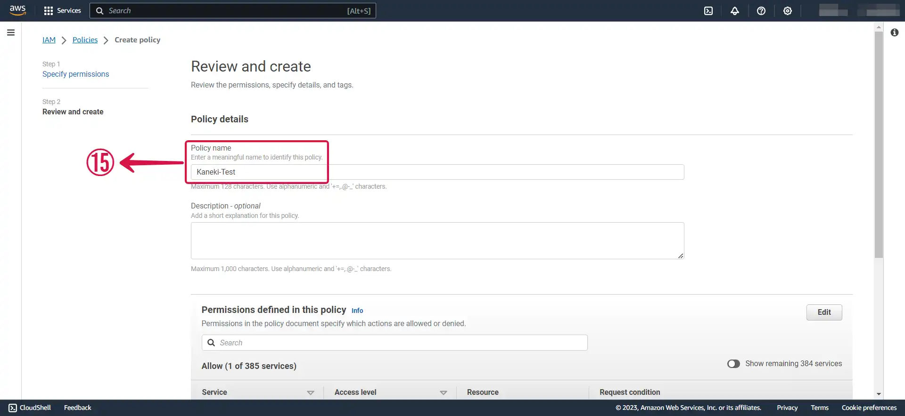
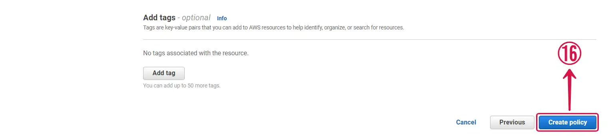
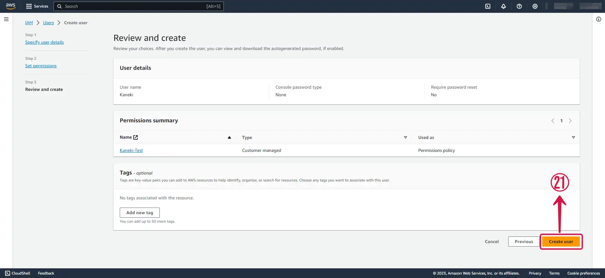
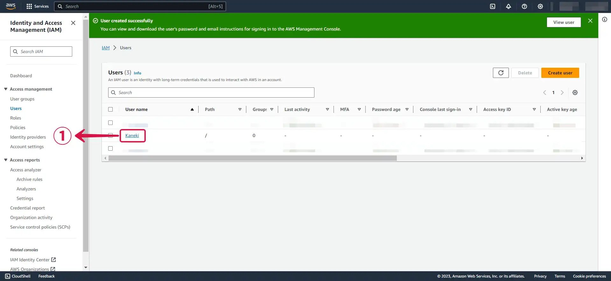
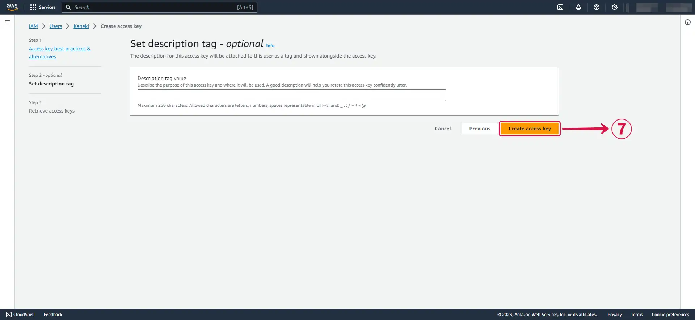
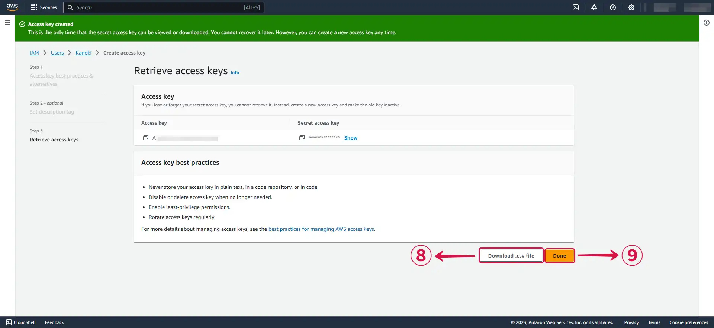
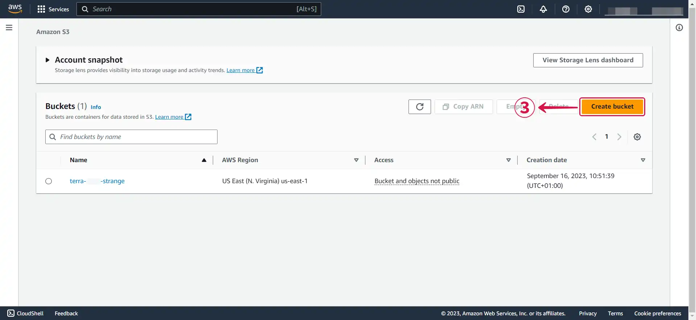
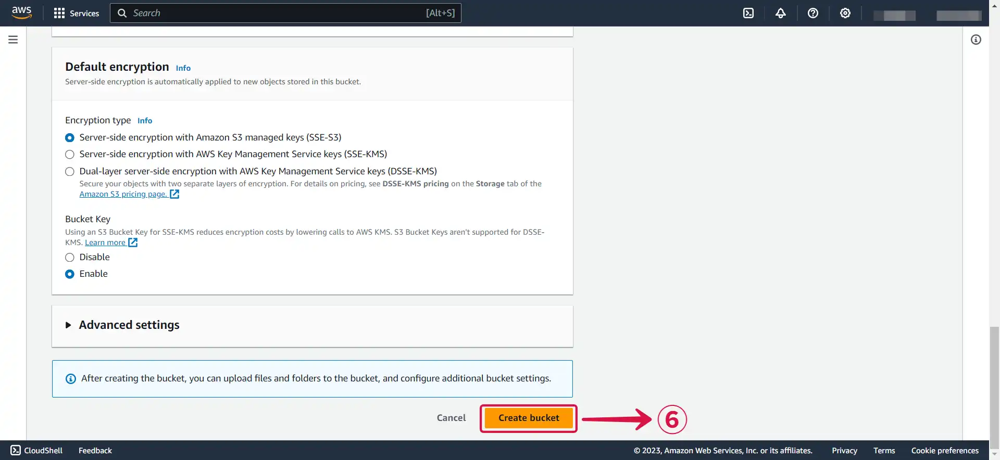

# S3

This guide contains the required information to set up S3 Sink in Vanus Connect.

## Introduction

Amazon S3 (Simple Storage Service) is a highly scalable and durable object storage service provided by Amazon Web Services (AWS). It is designed to store and retrieve any amount of data from anywhere on the internet, making it ideal for a wide range of use cases such as backup and restore, disaster recovery, data archiving, content delivery, and big data analytics.

With Amazon S3 Sink in Vanus Connect, you can easily forward data or events to your S3 bucket automatically. The S3 Sink connector lets you save the events you need to any bucket of your choosing.


## Prerequisites

Before forwarding events to an S3 bucket, you must have:

- A [**Vanus Cloud account**](https://cloud.vanus.ai).
- An [**Amazon Web Services**](https://aws.amazon.com) account.

## Getting Started

### Step 1: Create an AWS User

1. Log in to the AWS [**Management Console**](https://aws.amazon.com) using your root account credentials.

2. Navigate to the [**IAM**](https://console.aws.amazon.com/iam/) service by searching for **IAM**① and clicking the **IAM**② service.


3. Click on the **Users tab**③ in the left navigation menu, and then click the **Create user**④ button.


4. Write your **User name**⑤ and click **Next**⑥.


5. Select **Attach policies directly**⑦, and click on **Create policy**⑧.



6. **Search for s3**⑨ and **select s3**⑩.


7. **Search**⑪ and select the required Actions.


- **`PutObject`⑫**
- **`GetObject`**
- **`GetObjectVersion`**
- **`DeleteObject`**
- **`DeleteObjectVersion`**


8. Select **Any**⑬ and click **Next**⑭ to proceed to the next page.


9. Specify a **Policy name**⑮.



10. Click **Create policy**⑯.



11. Return to your previous **`TAB`**.

12. **Refresh**⑰ the policy list, **search**⑱ for your custom policy, **select your created policy**⑲, and click **Next**⑳.


13. Review and click **Create user**㉑.



---

### Step 2: Get your Access key and Secret access key

1. Now click on the **User**① you just created.



2. Under **Security credentials**②, scroll down the page to **`Access Keys`**, and Click **Create access key**③.


3. Select **Command line interface (CLI)④**, tick the **confirmation box**⑤ and click **Next**⑥.


4. Click **Create access key**⑦.



5. Download your **`Access key`** and **`Secret access key`** by clicking the **Download .csv file**⑧ button, and then click **Done**⑨.



---

### Step 3: Amazon S3 Connection Settings

**To set up S3 Sink in Vanus Connect:**

1. Enter your **Access Key**① and **Secret access Key**② in Vanus Connect from the previous steps.


2. Now let's go back to Amazon Web Services under the [**Amazon S3 service**](https://s3.console.aws.amazon.com).

3. At this point, you can either **create a new bucket** or **select an existing** bucket.

4. Create a new bucket by clicking the **Create bucket**③ button.



5. Specify a **Bucket name**④ and select your desired **AWS Region**⑤.


6. Click on **Create bucket**⑥ to finish creating your bucket.



7. After selecting or creating a bucket, remember to take note of your **bucket name**⑦ and the **AWS Region**⑧.


8. In Vanus Connect, choose your **Region**⑨ and enter your **Bucket**⑩ name, select the upload interval time (**HOURLY**⑪ or **DAILY**⑫), and then click **Next**⑬ to proceed.


---

## Required Data Format

The event data must be in JSON format with the following way:

```json
{
  "data": {
    "myData": "simulation event data"
  }
}
```
