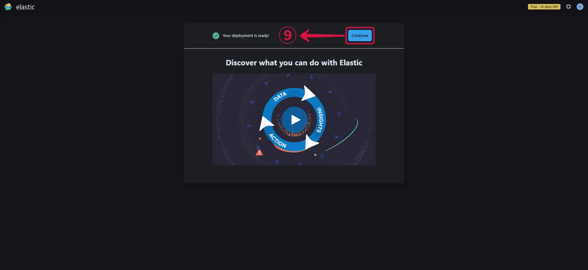
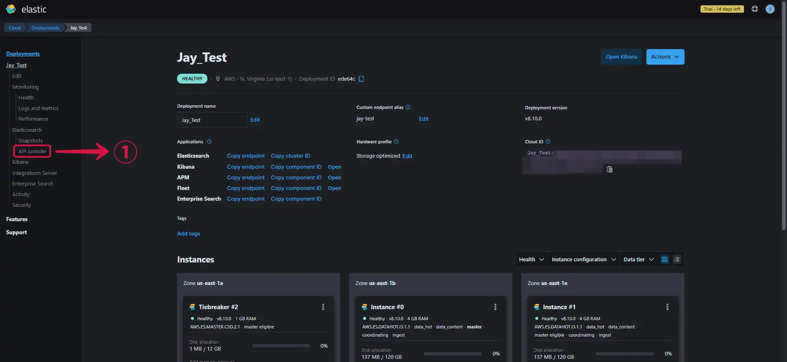
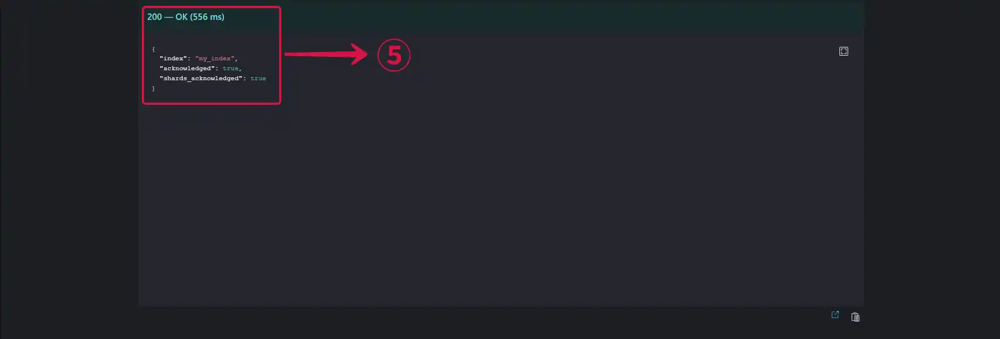
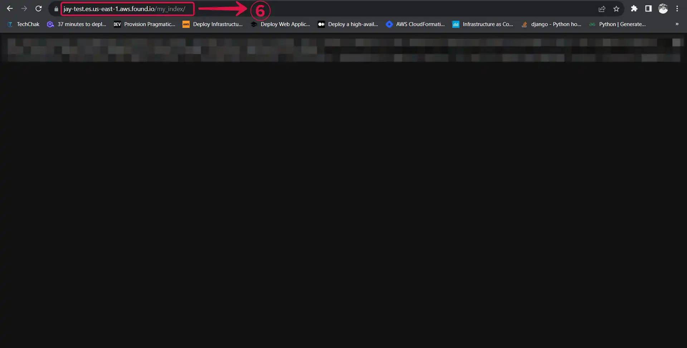
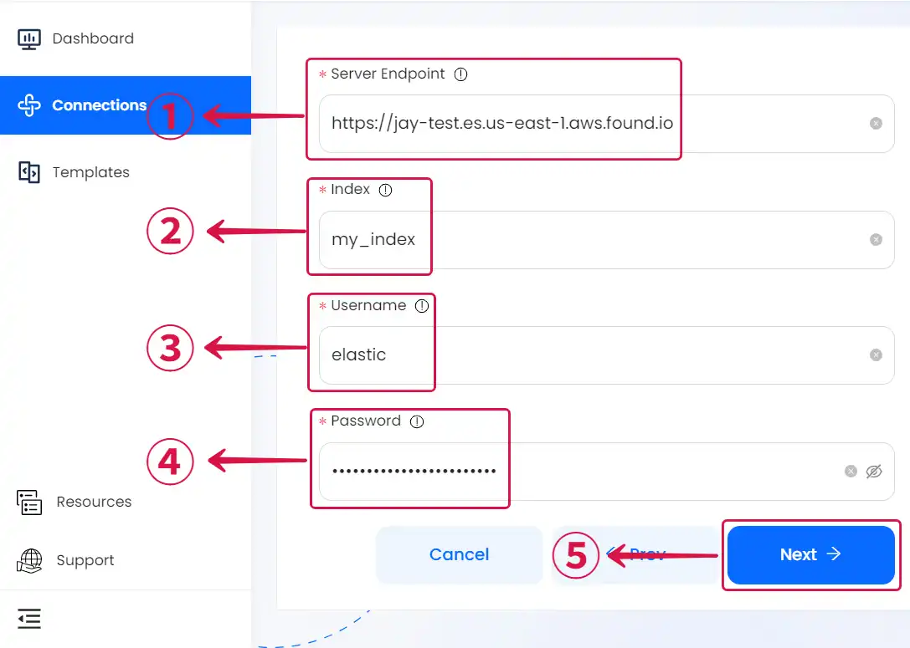

# Elasticsearch

This guide contains information to set up a Elasticsearch Sink in Vanus Connect.

## Introduction

Elasticsearch is a fast and scalable search and analytics engine used as a backend for search-heavy applications. One of the key features of Elasticsearch is its scalability, which allows it to handle large volumes of data across multiple nodes in a cluster. It also has a powerful query language and a rich set of APIs that make it easy to interact with and integrate into a wide range of applications and systems.

The Elasticsearch Sink simplifies the process of delivering data to your Elasticsearch cluster. With this tool, you can easily and efficiently transfer your data to your Elasticsearch cluster, making it searchable and accessible for analysis and other processing needs.

## Prerequisites

Before forwarding events to Elasticsearch, you must have:

- A [Vanus Cloud account](https://cloud.vanus.ai).
- Have an Elasticsearch cluster. 

## Getting Started

### Step 1: Create a Deployment

1. Go to the [**Elasticsearch**](https://www.elastic.co/) official website.

2. Input your **Email and Password**①, then click **Sign up with email**②.


3. Give your deployment a **Name**③ and click **Create deployment**④.


*A deployment includes Elasticsearch, Kibana, and other elastic stack features.*

4. Click on the **Cloud Provider**⑤ field to change your cloud provider and the **Region**⑥ field to change your region.


*You can leave the other settings on default or customize your settings further, depending on your use case.*

5. Click on **Create deployment**⑦ to finish creating your deployment.


6. **Download**⑧ your deployment credentials, you will need them to log in to your endpoint, and they will also be needed for your Vanus connection.


7. Your deployment has been successfully created, now click **Continue**⑨.




#### Getting your server endpoint

1. Navigate to the [**Deployment Page**](https://cloud.elastic.co/deployments/) to see your deployments.

2. Click on the the **created deployment**①.


3. Copy your Elasticsearch endpoint by clicking on **Copy endpoint**②.


4. Paste the copied **endpoint**③ in your browser, fill in the **credentials**④ you downloaded while creating your deployment and click on **Sign in**⑤.


#### Creating an Index

1. Click on **API Console**①.



2. Select the **PUT**② option, write the **name of your index**③, and click **Submit**④.


3. You'll get a **200-OK**⑤ message if your index was successfully created.



3. Add a **backslash and your index name**⑥ to your endpoint to see the content of your index.



---

### Step 2: ElasticSearch Connection Settings

1. Provide the following credentials.

- **Server Endpoint①:** The endpoint of your ElasticSearch cluster.

- **Index②:** The name of the index you created.

- **Username③:** The username you downloaded during the creation of your deployment.

- **Password④:** The password you downloaded during the creation of your deployment.



2. Click **Next**⑤ and finish the configurations.


## Custom Connection

Create your template following the structure of your database, an example:

```json
{
  "_index": "vanus_test",
  "_type": "_doc",
  "_id": "CqFnBIEBzJc0Oa5TERDD",
  "_version": 1,
  "_source": {
    "id": 123,
    "date": "2022-06-13",
    "service": "test data"
  }
}
```
