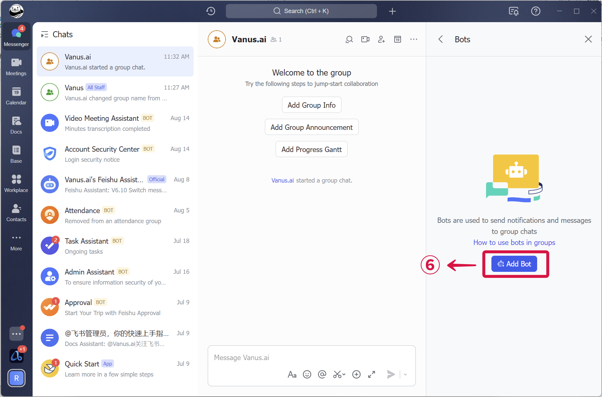
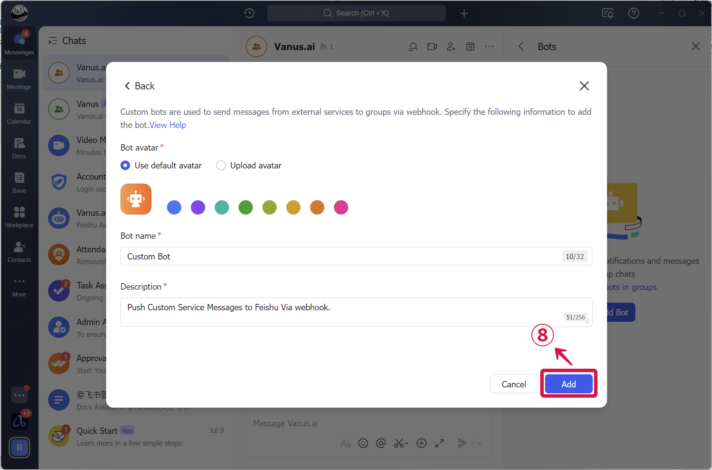
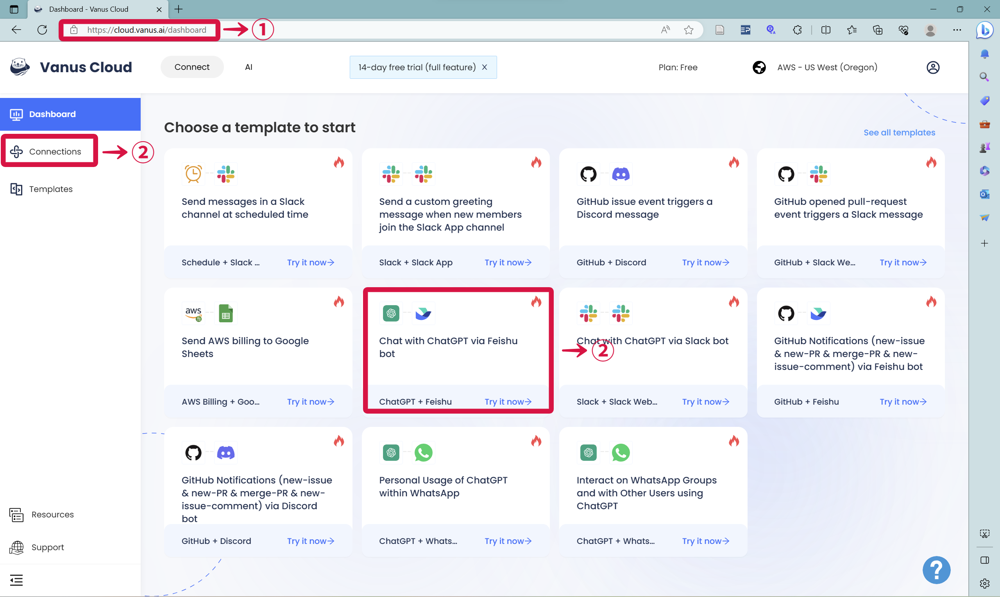
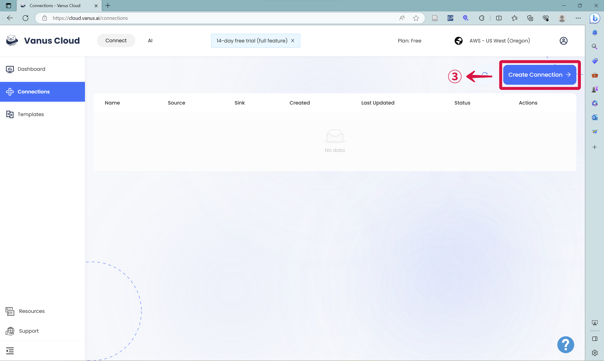
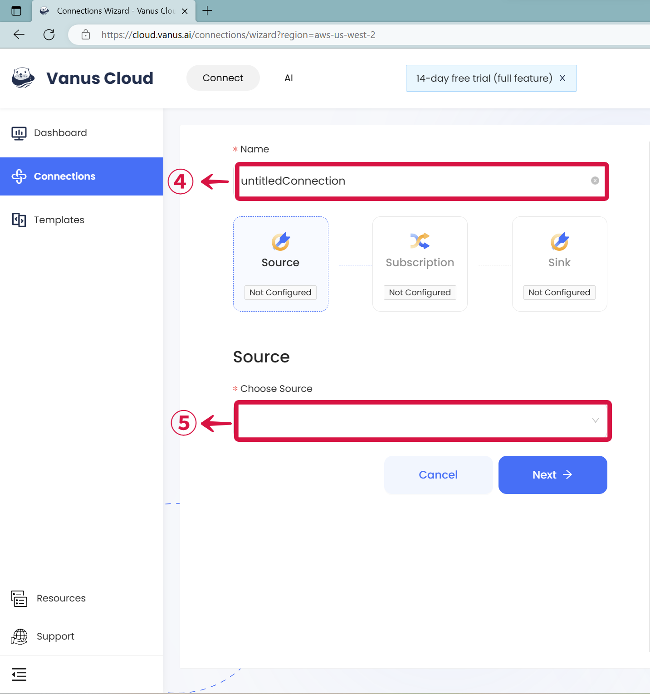
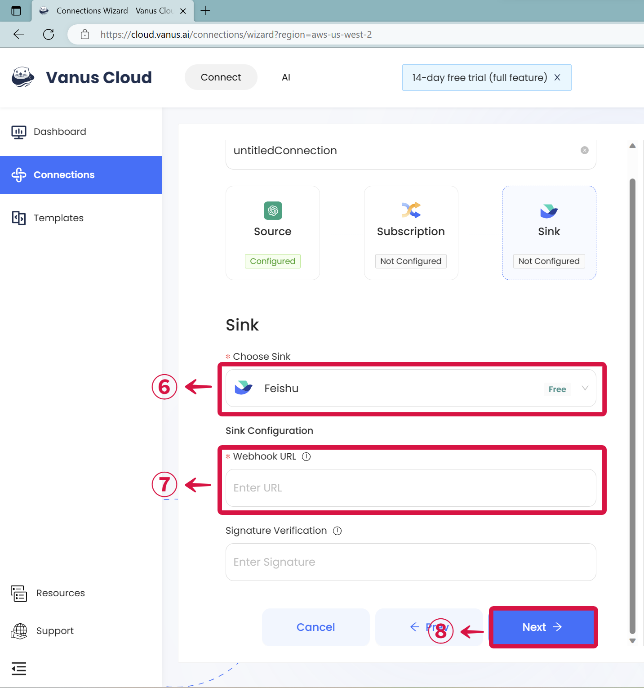
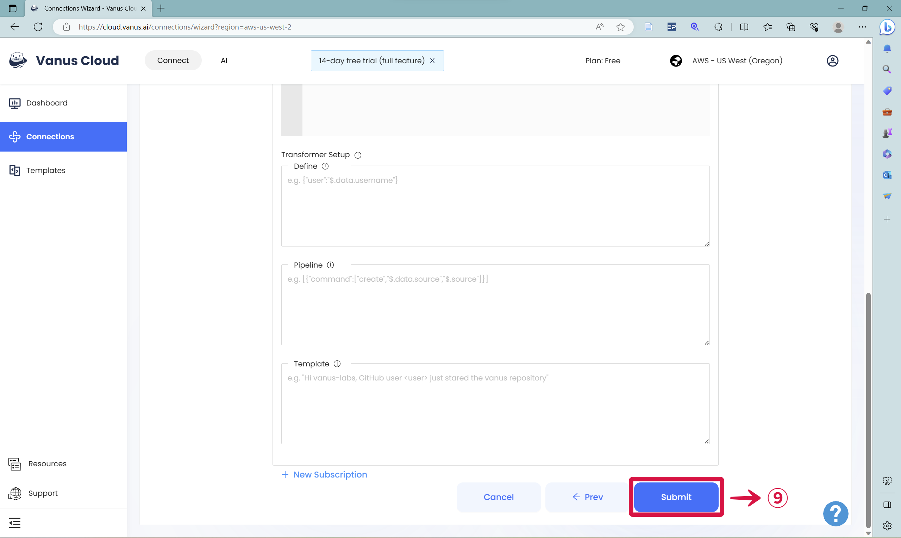
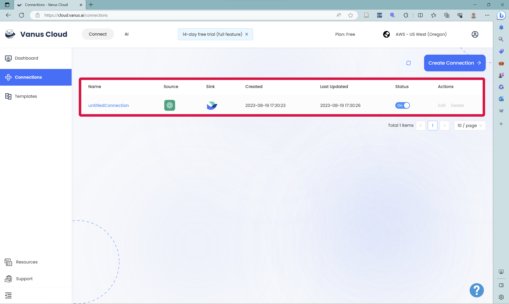
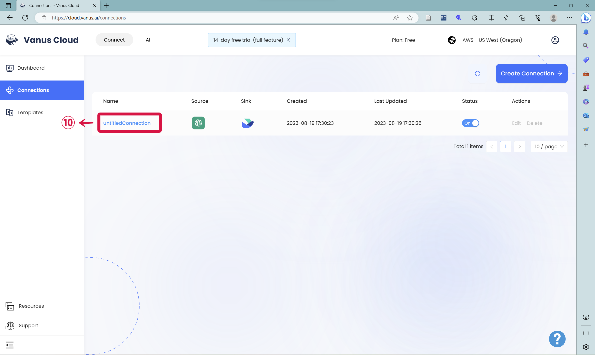
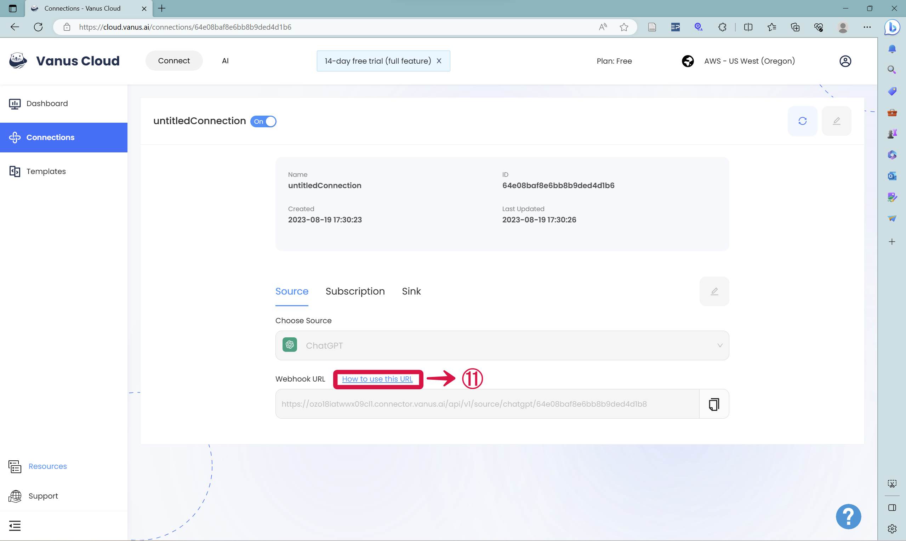

# Feishu

This guide contains information to set up a Feishu Sink in Vanus Connect.

## Introduction

Feishu provides a powerful platform for team communication and collaboration.

With Feishu Sink connector in Vanus Connect, you can easily forward real-time updates to a Feishu group chat, allowing your team to stay up-to-date on all events generated by your application.

## Prerequisites

Before forwarding events to Feishu, you must have:

- A [Feishu](https://www.feishu.cn) account.
- A [Vanus Cloud account](https://cloud.vanus.ai).

## Getting Started

### Step 1: Setup a Feishu bot
1.  Create a **New Group**❶❷ chat.

2.  In the Feishu group click `...`❸  and then **Settings**❹.

3.  Now click **Bots**❺.

4.  Click on **Add Bot**❻ and select **Custom Bot**❼.

5.  Enter a name for your bot and click **Add**❽.

6.  Copy the **Webhook URL**❾, and click **Finish**❿.

### Step 2: Set up your Connection in Vanus Connect  

1.  **Log in** to your [Vanus](https://cloud.vanus.ai "Vanus") account❶ and click on **connections**❷, and click on **Create Connections**❸. Or you can **Choose a template to start**❷—`Chat with ChatGPT via Feishu bot`.
    
    
2.  **Name** your connection❹, Choose your **Source**❺ and click next.
    
3.  Click on **Sink** and choose **Feishu**❻. Paste the \*\* Feishu Webhook URL\*\*❼ into the "URL" field. Click **Next** to continue.
    
4.  Click on **Submit** to finish the configuration.
    
5.  You've successfully created your Vanus feishu sink connection.
    
6.  ⚠Don't forget the next step❗ Click your **Connection**❿ , and then click **How to Use this URL**⓫ to setup ChatGPT in Feishu.&#x20;
    
    

Check out this article on how to get a [Feishu Webhook](https://www.vanus.ai/blog/retrieve-feishu-webhook-url/) for more details.

:::caution
**ChatGPT Source**
Trying to create a ChatGPT to Feishu connection, Checkout the article on how to proceed after creating the connection [**click here**](https://xjxt2gkbqf.feishu.cn/wiki/wikcnQpoi1rqoo4jI7q7j4iMYob).
Also note that after creating your connection there is still some more steps.
:::

