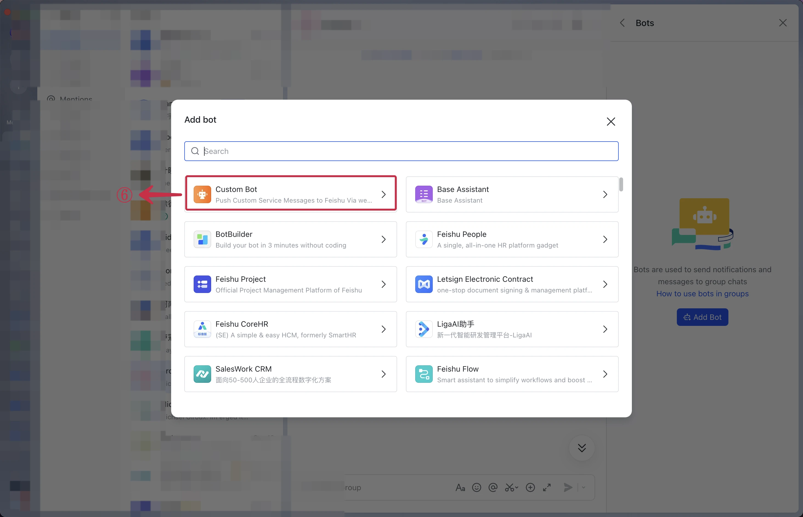
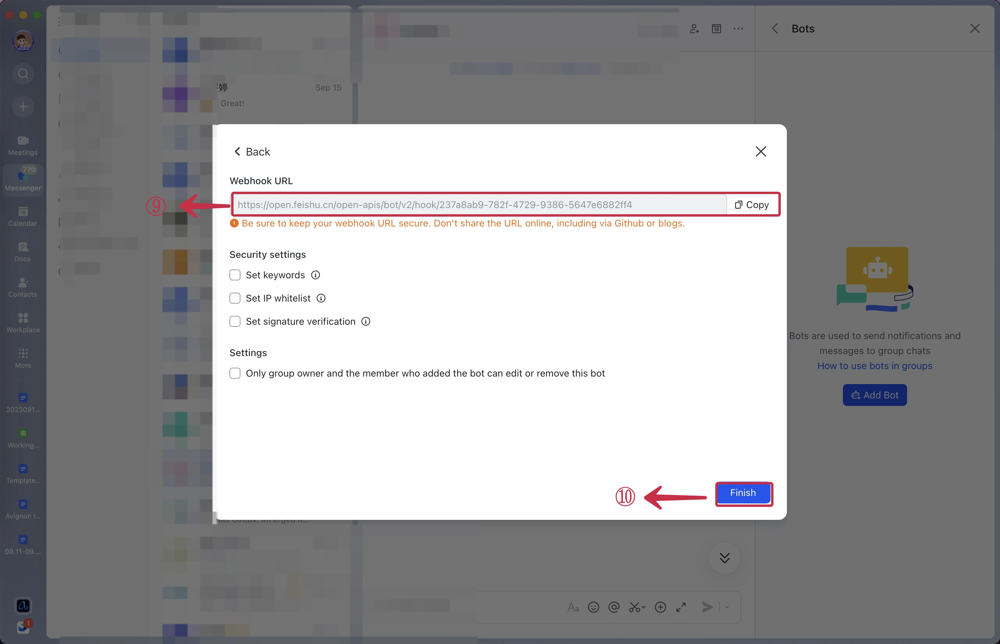
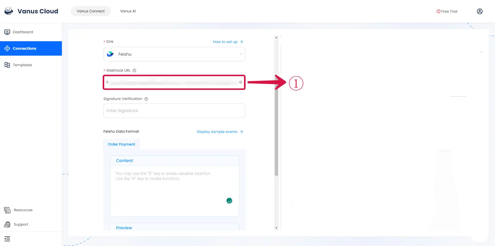

# Feishu

This guide contains information to set up a Feishu Sink in Vanus Connect.

## Introduction

Feishu provides a powerful platform for team communication and collaboration.

With Feishu Sink connector in Vanus Connect, you can easily forward real-time updates to a Feishu group chat, allowing your team to stay up-to-date on all events generated by your application.

## Prerequisites

Before forwarding events to Feishu, you must have:

- A [Feishu](https://www.feishu.cn) account.
- A [Vanus Cloud account](https://cloud.vanus.ai).

## Getting Started

### Step 1: Setup a Feishu bot
1.  Create a **New Group**① chat.

2.  In the Feishu group click `...`②  and then **Settings**③.

3.  Now click **Bots**④.

4.  Click on **Add Bot**⑤ and select **Custom Bot**⑥.

5.  Enter a **name**⑦ for your bot and click **Add**⑧.

6.  Copy the **Webhook URL**⑨, and click **Finish**⑩.

### Step 2: Set up your Connection in Vanus Connect  

1.  Paste the step **Feishu Webhook URL**❶ into the "URL" field.&#x20;
2.  ⚠Don't forget the next step❗Click your **Connection**❷ , and then click **How to Use this URL**❸ to setup ChatGPT in Feishu.&#x20;
3.  Now click **Submit** to continue.

Check out this article on how to get a [Feishu Webhook](https://www.vanus.ai/blog/retrieve-feishu-webhook-url/) for more details.

:::caution
**ChatGPT Source**
Trying to create a ChatGPT to Feishu connection, Checkout the article on how to proceed after creating the connection [**click here**](https://xjxt2gkbqf.feishu.cn/wiki/wikcnQpoi1rqoo4jI7q7j4iMYob).
Also note that after creating your connection there is still some more steps.
:::

