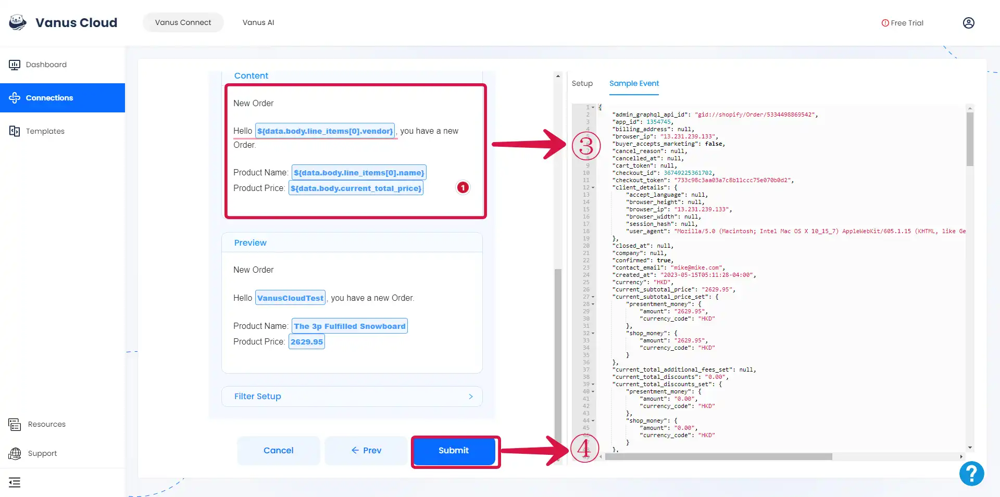

# Feishu

This guide contains information to set up a Feishu Sink in Vanus Connect.

## Introduction

Feishu provides a powerful platform for team communication and collaboration.

With Feishu Sink connector in Vanus Connect, you can easily forward real-time updates to a Feishu group chat, allowing your team to stay up-to-date on all events generated by your application.

## Prerequisites

Before forwarding events to Feishu, you must have:

- A [Feishu](https://www.feishu.cn) account.
- A [Vanus Cloud account](https://cloud.vanus.ai).

## Getting Started

### Step 1: Setup a Feishu bot

1.  Create a **New Group**① chat.

2.  In the Feishu group click `...`②  and then **Settings**③.

3.  Now click **Bots**④.

4.  Click on **Add Bot**⑤ and select **Custom Bot**⑥.

5.  Enter a **name**⑦ for your bot and click **Add**⑧.

6.  Copy the **Webhook URL**⑨, and click **Finish**⑩.

### Step 2: Set up your Connection in Vanus Connect  

Paste the step **Feishu Webhook URL**① into the "URL" field.

### Step 3: Personalize Event Structure

:::note
This is a general instruction on how to personalize your event structure. You can structure your events to suit your specific requirements and create connections for different scenarios.
:::

1. Click on **Display sample events**① for reference.

2. Search for the **data**② of the event you want.

3. **Customize**③ the data as you wish to receive. Click **Submit**④ to finish the configuration process.

---

:::caution
**ChatGPT Source**
Trying to create a ChatGPT to Feishu connection, Checkout the article on how to proceed after creating the connection [**click here**](https://xjxt2gkbqf.feishu.cn/wiki/wikcnQpoi1rqoo4jI7q7j4iMYob).
Also note that after creating your connection there is still some more steps.
:::

