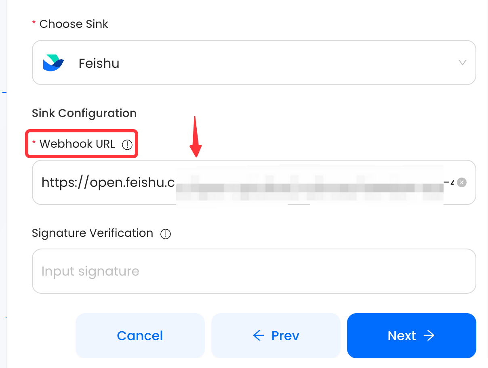

# Feishu

This guide contains information to set up a Feishu Sink in Vanus Connect.

## Introduction

Feishu provides a powerful platform for team communication and collaboration.

With Feishu Sink connector in Vanus Connect, you can easily forward real-time updates to a Feishu group chat, allowing your team to stay up-to-date on all events generated by your application.

## Prerequisites

Before forwarding events to Feishu, you must have:

- A [Feishu](https://www.feishu.cn) account.
- A [Vanus Cloud account](https://cloud.vanus.ai).

## Getting Started

### Step 1: Setup a Feishu bot
1. Create a new Group chat

2. In the feishu group click `...` and then **settings**.

3. Now click **Bots**.
   
4. Click on **Add Bot** and select **Custom bot**.
   
5. Enter a name for your bot and click **Continue**.
6. Copy the **Webhook URL** and keep it safely.
7. (Optionally) you can also set a **Signature verification** for added security.
   

### Step 2: Set up your Connection in Vanus Connect  

1. Log in to your [Vanus](https://cloud.vanus.ai) account and click on **connections**  
  

2. Click on **Create Connections**  
  

3. Name your connection, Choose your source and click next 
 

4. Click on **Sink** and choose **feishu** 
 

5. Paste the ** Feishu Webhook URL** into the "URL" field.
 

6. (Optionally) add your **Signature Verification**.
 

7. Click "Next" to continue.  

8. Click on submit to finish the configuration. 
  

9. You've successfully created your Vanus feishu sink connection.  
  

Check out this article on how to get a [Feishu Webhook](https://www.vanus.ai/blog/retrieve-feishu-webhook-url/) for more details.

:::caution
**ChatGPT Source**
Trying to create a ChatGPT to Feishu connection, Checkout the article on how to proceed after creating the connection [**click here**](https://xjxt2gkbqf.feishu.cn/wiki/wikcnQpoi1rqoo4jI7q7j4iMYob).
Also note that after creating your connection there is still some more steps.
:::

