# Google Sheets

This guide contains information to set up a Google Sheets Sink in Vanus Connect.

## Introduction

Google Sheets is a powerful spreadsheet tool that can be used to store and analyze data. 

With Google Sheets Sink connector in Vanus Connect, you can easily forward real-time updates to a designated sheet in your Google Sheets account, allowing you to track events generated by your application.

## Prerequisites

Before forwarding events to Google Sheets, you must have:

- A Google account with administrative privileges.
- A [Vanus Cloud account](https://cloud.vanus.ai).

## Getting Started

**To set up a Google Sheets Sink in Vanus Connect:**

### Step 1: Create a Google spreadsheet
1. Go to [Google Sheets](https://docs.google.com/spreadsheets/u/0/) and **Sign in**.  

2. Create a new blank spreadsheet.
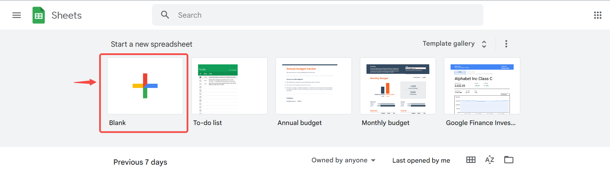  

3. Copy the `ID` of the spreadsheet found in the link.
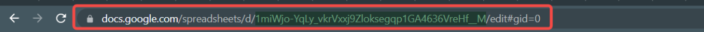  

### Step 2: Create a connection  

import Tabs from '@theme/Tabs';
import TabItem from '@theme/TabItem';

<Tabs>

<TabItem label="Authentication via Google" value="authentication-via-google">

1. Log in to your [Vanus](https://cloud.vanus.ai) account and click on **connections**  
  

2. Click on **Create Connections**  
  

3. Name your connection, Choose your source and click next 
 

4. Click on **Sink** and choose **google-sheets** 
 


5. Click on "Sign in with Google" and follow the process to sign in to your Google account.
   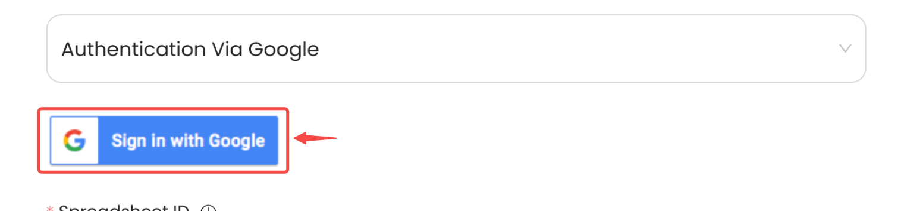

</TabItem>

<TabItem label="Service Account Credentials" value="service-account-credentials">

1. Go to the Google [Service account](https://console.cloud.google.com/iam-admin/serviceaccounts) and click create project.
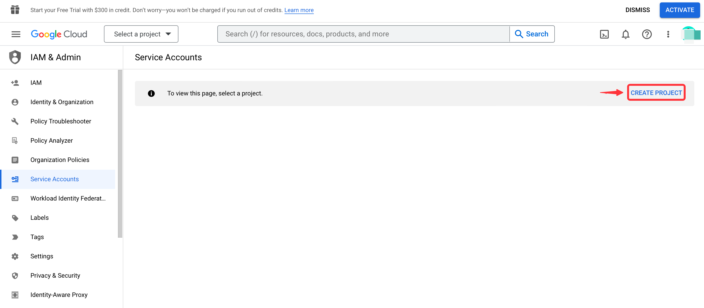  

2. Give a name to your project and click **CREATE**.
  

3. Now click '+ CREATE SERVICE ACCOUNT'.
  

4. Create **Service account details**
    - First write a **Service account name**, this can be any name you would like to give it. 

    - Secondly write a Service account ID, this ID must be written in lowercap and needs to be at least 6 character.  

    - Now click **CREATE AND CONTINUE**.
  

5. The connection doesn't need to set specific roles you can press **DONE**.
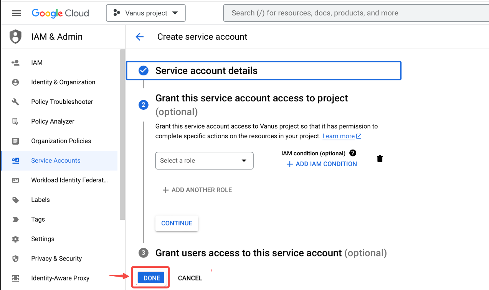  

6. Now click on your **Service Account**.
  

7. Click on **KEYS** in the TAB menu.
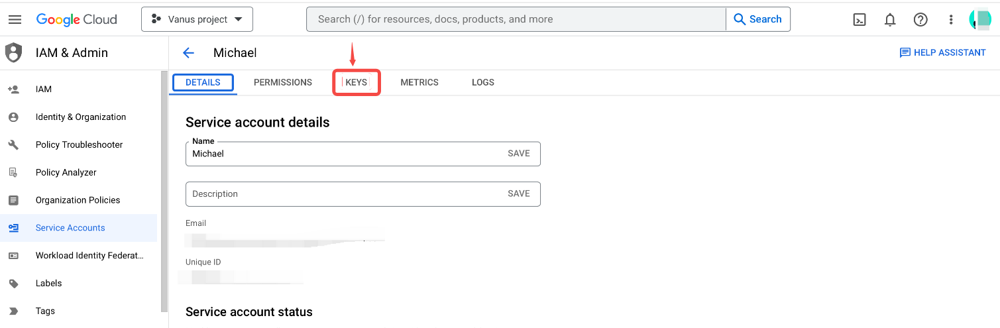  

8. Now click on **ADD KEY** and **Create new key**.
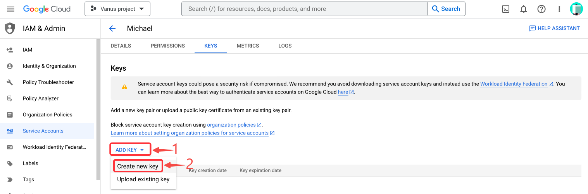  

9. Choose **JSON** and **CREATE**.
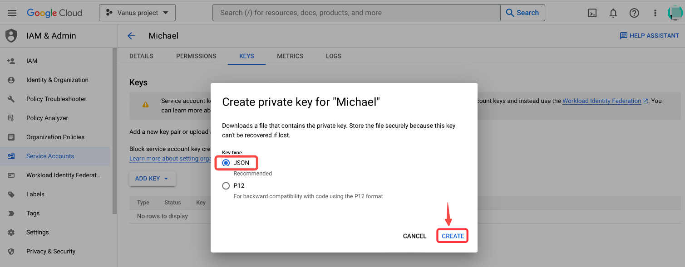  

10. It will trigger the download of a JSON file copy the whole content and paste it in Vanus Connect.
  


</TabItem>

</Tabs>

### Step 3: Finish your connection.

1. Paste the string from the sheet URL Example: `1miWjo-YqLy_vkrVxxj9Zloksegqp1GA4636VreHf__M` from Step 1.  

2. Obtain the name of the sheet at the bottom of the spreadsheet.
   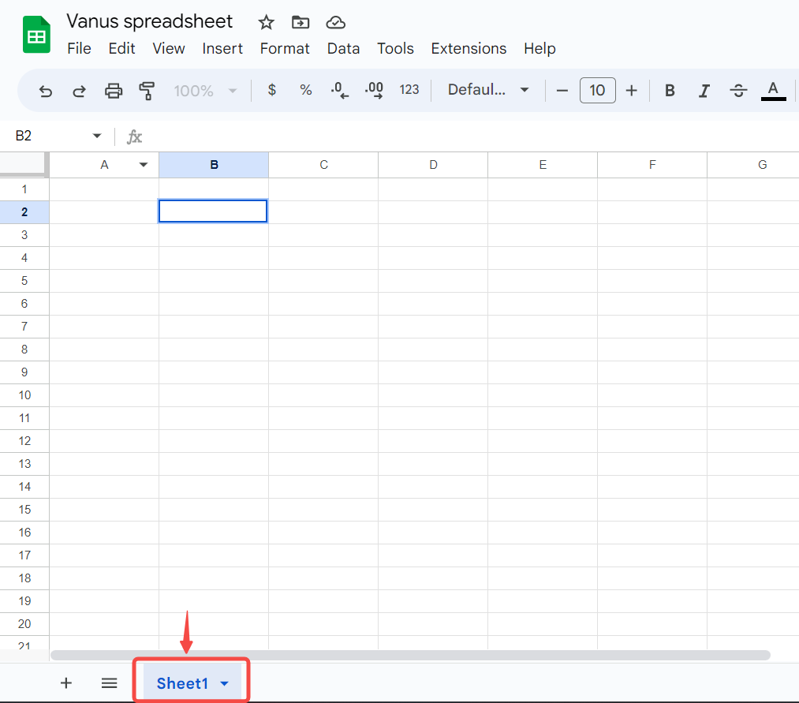  

3. Paste the sheet name default: `Sheet1`.  

4. Click **Next** to continue.  

5. Click on submit to finish the configuration. 
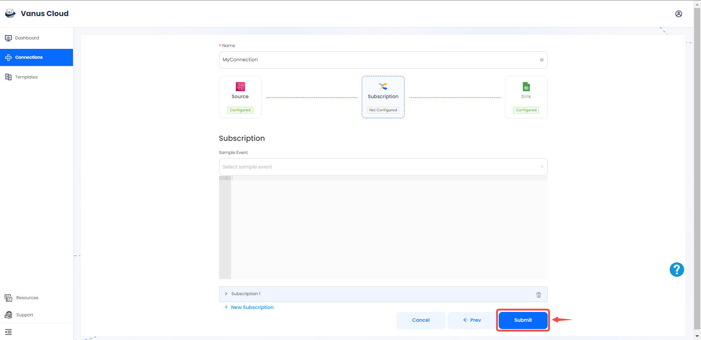  

6. You've successfully created your Vanus google-sheets sink connection.  
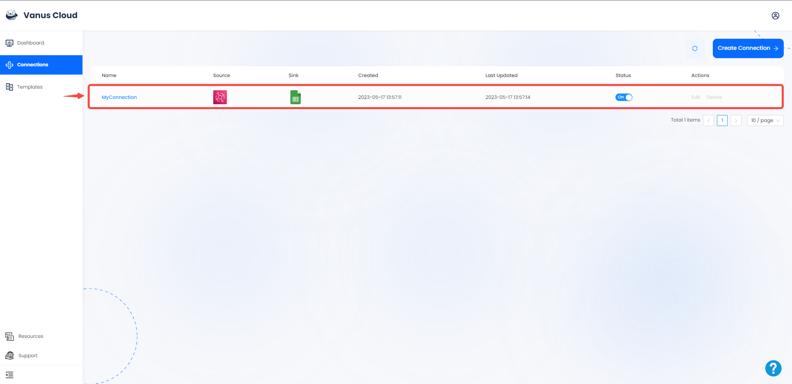  

## Required Data Format

The event data must be in JSON format with the following keys:

```json
{
    "Title": "value",
    "date": "value",
    "ect...": "value"
}
```
