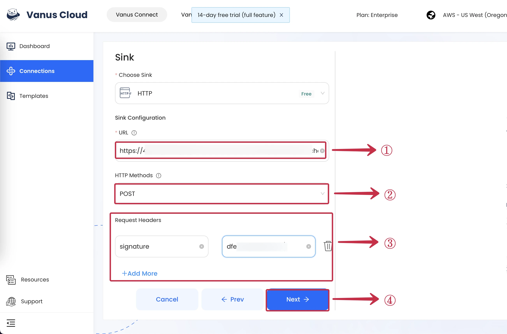

# HTTP

This guide contains information to set up a HTTP Sink in Vanus Connect.

## Introduction

HTTP is a protocol for fetching resources such as HTML documents. It is the foundation of any data exchange on the Web and it is a client-server protocol, which means requests are initiated by the recipient, usually the Web browser.

Using HTTP Sink you can send an HTTP request to any application or webhook server.

## Prerequisites

To set up HTTP Sink, you must have:

- A [Vanus Cloud account](https://cloud.vanus.ai).
- A payload URL.

## Getting Started

### HTTP Connection Settings

1. Obtain a Payload URL from your application. This should be the EndPoint URL where you want to receive the HTTP requests.
2. Paste the obtained payload URL into the **URL field**①.
3. Choose the desired **HTTP Method**② (`POST`, `GET`, `PATCH`, `DELETE`, `PUT`).
4. If needed, click on the plus **+Add More**③ icon in the Request Headers section to add key-value pairs for custom headers.
5. Click **Next**④.

