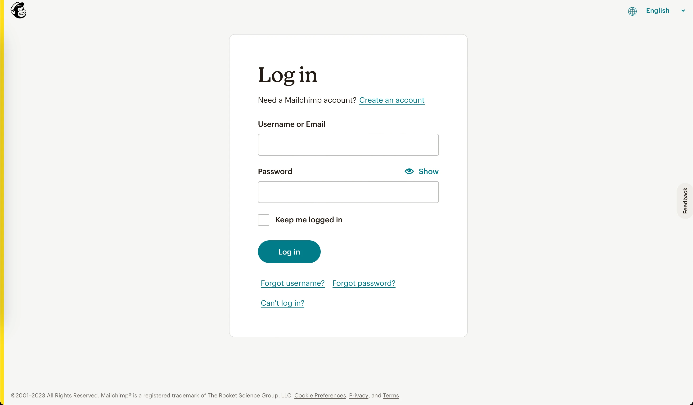
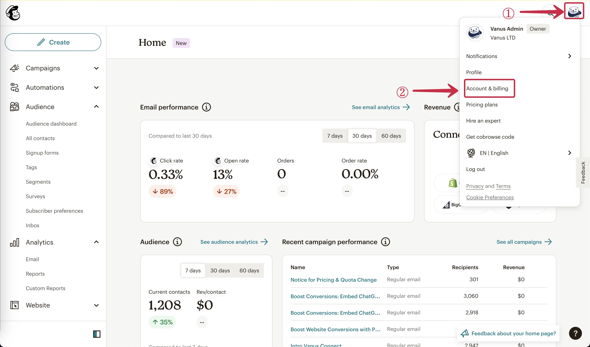
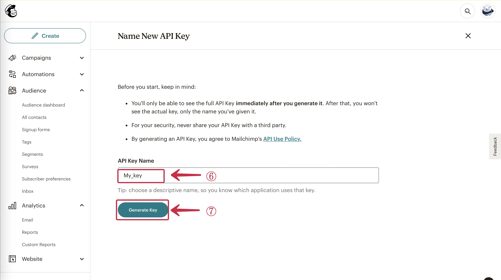
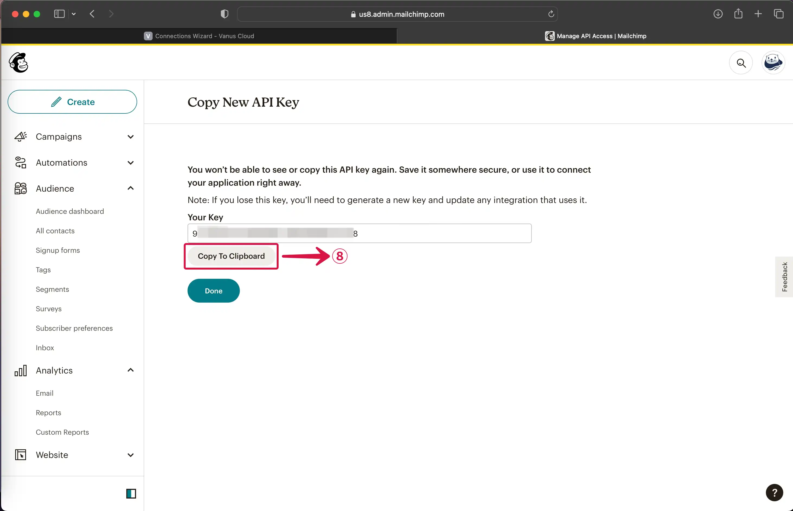
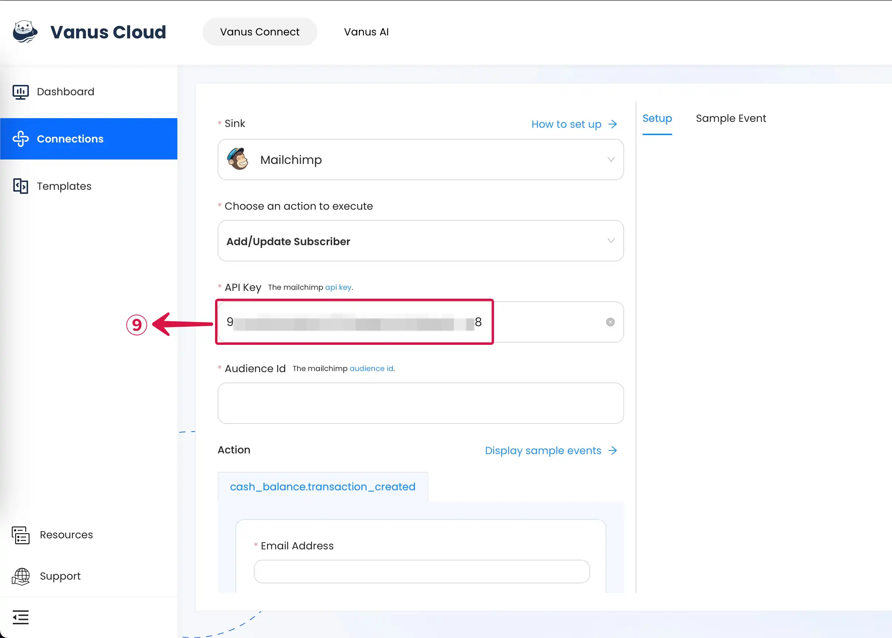
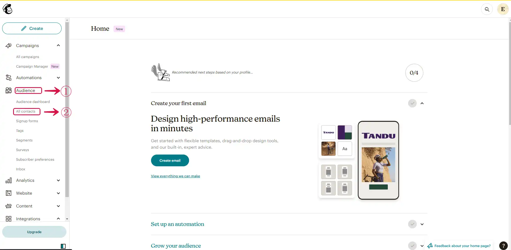
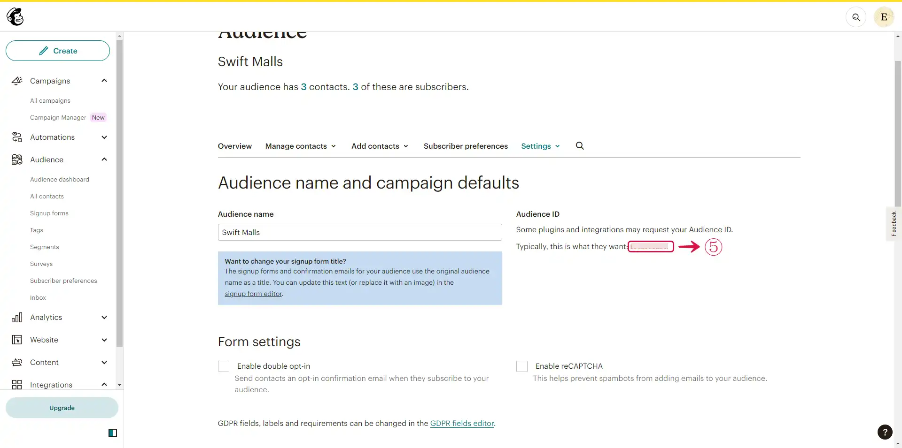

# Mailchimp

This guide contains information to set up a Mailchimp Sink in Vanus Connect.

## Introduction

Mailchimp is a widely used marketing automation platform and email marketing service that helps businesses and individuals create, manage, and analyze email marketing campaigns.

With Mailchimp Sink connector in Vanus Connect, you can easily forward real-time updates to a designated Mailchimp account, allowing you to track events generated by your application.

## Prerequisites

Before forwarding events to Mailchimp, you must have:

- A Mailchimp Account

- A [**Vanus Cloud Account**](https://cloud.vanus.ai).

## Getting Started

**To set up a Mailchimp Sink in Vanus Connect:**

### Step 1: Mailchimp API Key

1. **Sign in** to your [**Mailchimp**](https://mailchimp.com) account.
   

2. Click on your **Avatar**① and then select **Account & billing**②.
   

3. In the account settings, choose **Extras**③ and click on **API keys**④.
   

4. To create a new API key, click on **Create A Key**⑤.
   

5. Provide a name for your new **API Key**⑥, and then click **Generate Key**⑦.

6. To copy your private key to your clipboard, click on **Copy To Clipboard**⑧.
   

7. Finally, **Paste**⑨ your private **API Key** into Vanus AI.
   

---

### Step 2: Mailchimp Audience ID

1. At the left sidebar of your Mailchimp Dashboard, Click on the **Audience**① dropdown menu, then click on **All contacts**②.

2. Click on **Settings**③ dropdown menu and select **Audience name and defaults**④.

3. Copy the **Audience ID**⑤.

4. Paste the Audience ID in the **Audience ID**⑥ field.

---

### Step 3: Personalize Event Structure

:::note
This is a general instruction on how to personalize your event structure. You can structure your events to suit your specific requirements and create connections for different scenarios.
:::

1. Click on **Display sample events**① to see the events. **Select**② the event field you like to receive on Mailchimp.

2. **Customize**③ the events as you like and then click the **Submit**④ button.

---

Learn more about Vanus and Vanus Connect in our [**documentation**](https://docs.vanus.ai).
