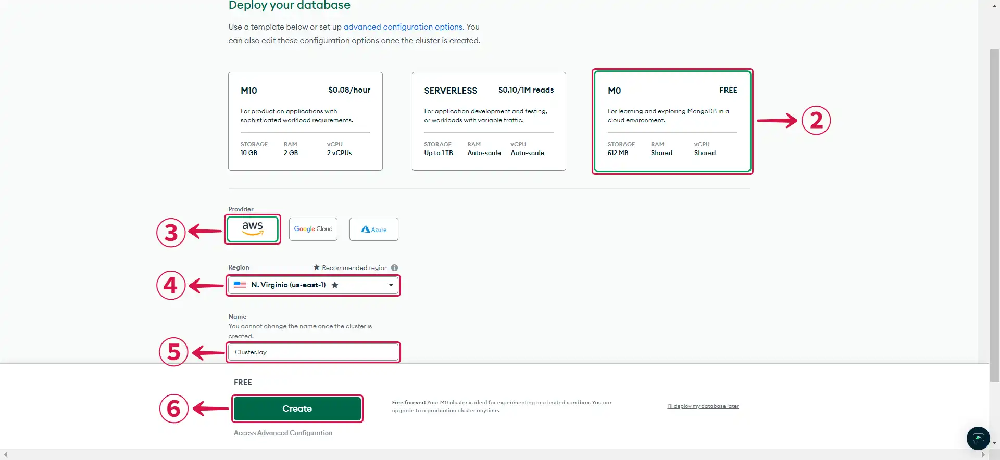
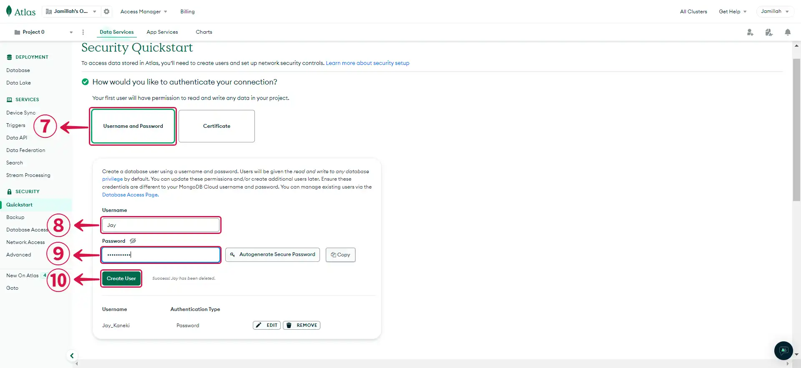
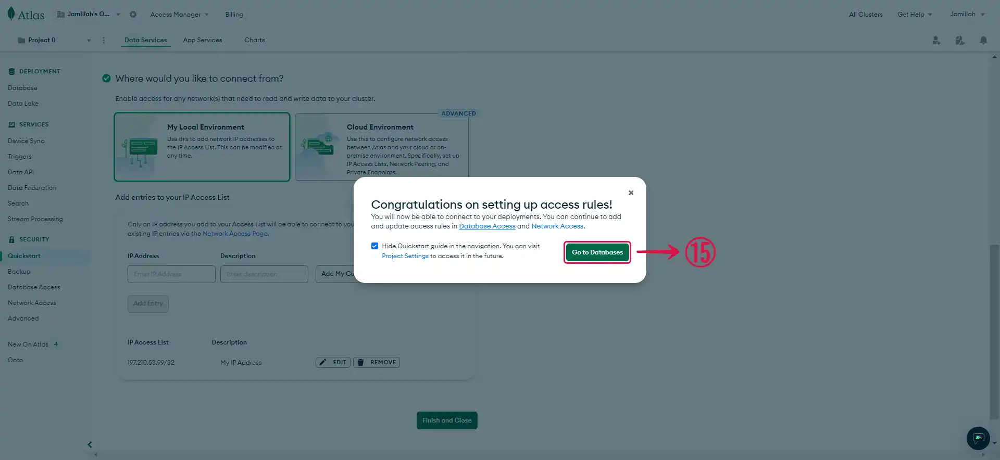
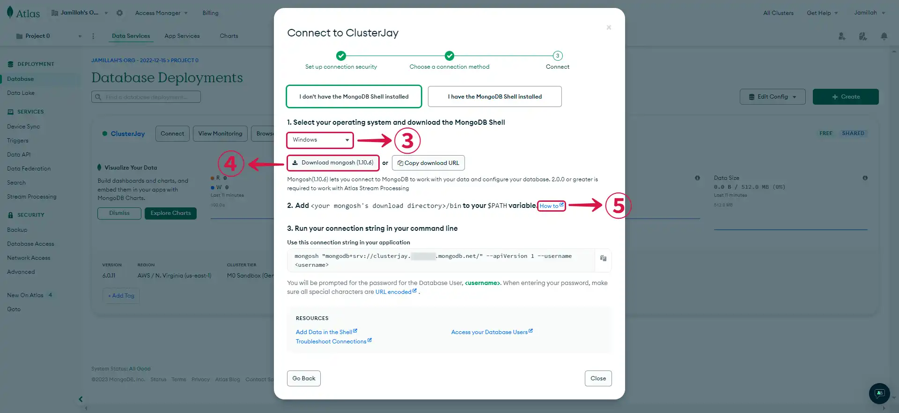
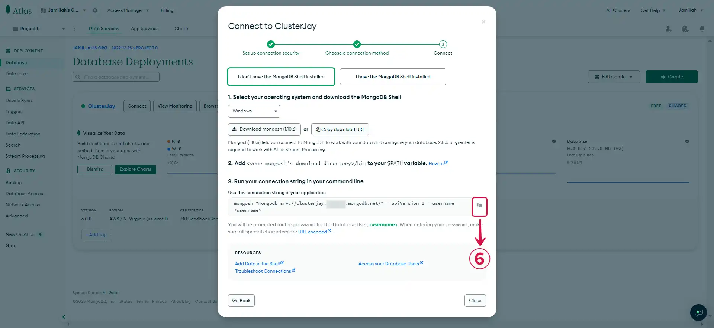
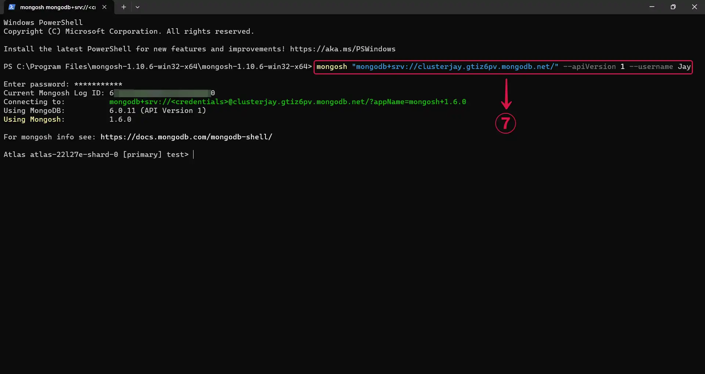
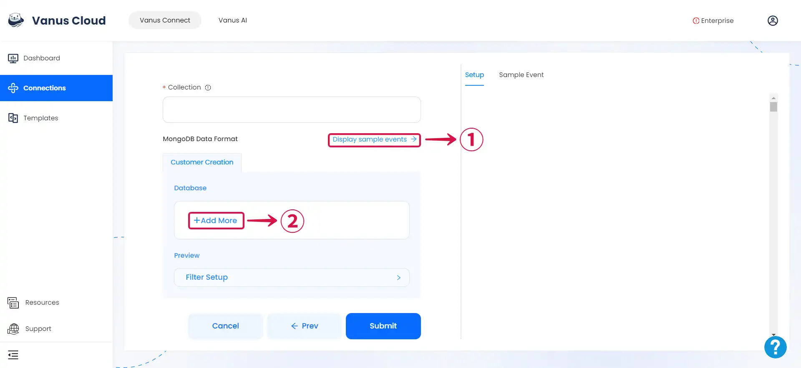
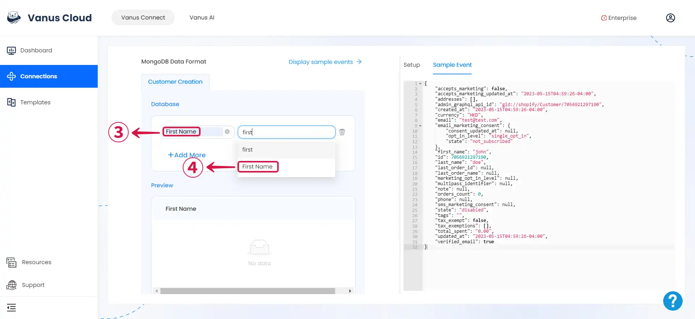

# MongoDB

This guide contains information to set up a MongoDB Sink in Vanus Connect.

## Introduction

MongoDB is a popular open-source NoSQL document database that stores data in a flexible, JSON-like format.

The MongoDB Sink connector let you insert events into a mongoDB database automatically.

## Prerequisites

Before forwarding events to MongoDB, you must have:

- A [**Vanus Cloud account**](https://cloud.vanus.ai)
- A [**MongoDB account**](https://account.mongodb.com/account/register)

## Getting Started

### Step 1: Setting up your MongoDB Cluster

1. Log in to your [**MongoDB Account**](https://account.mongodb.com/account/login)

2. Click on **Build a Database**①.


3. Select the **MO**② template for a free deployment, pick your preferred cloud **Provider**③ and **Region**④, provide a **Name**⑤ for your cluster and then click **Create**⑥.



4. Choose **Username and Password**⑦ as your authentication method, enter your **Username**⑧ and **Password**⑨, and then click **Create User**⑩.



5. Choose **My Local Environment**⑪ to connect to your MongoDB database from your local machine. Click on **Add My Current IP Address**⑫ and then hit the **Add Entry**⑬ button to grant your device access to your MongoDB cluster. Then, click **Finish and Close**⑭.


6. Click on **Go to Databases**⑮ to access your database page.



### Step 2: MongoDB Cluster Connection Settings

1. Click on the **Connect**① button.


2. Choose the method you'd like to use for connecting to your database. In our case, we selected the **Shell**②.


3. Select your **operating system**③, **Download mongosh**④, and open the [**How to**⑤](https://www.mongodb.com/docs/mongodb-shell/install/) link in a new tab to get step-by-step instructions on how to add your mongosh directory to your $PATH variable.



4. After completing the Mongosh set-up, return to the Atlas page and **Copy**⑥ the connection string provided.



5. Paste the **command**⑦ in your terminal, and you will be prompted to enter the password you set for database authentication.



6. Run the **`use <databasename>`⑧** command to create a database.


7. Run the command below to create a collection and insert values in it.

```
db.<collectionname>.insertMany([
  { name: "John", age: 30 },
  { name: "Jane", age: 25 },
  { name: "Bob", age: 35 }
]);
```

:::note
Substitute `<databasename>` and `<collectionname>` with the names you prefer for your database and collection.
:::

8. Run the **`db.your_collection_name.find()`⑨** command to confirm that your collection has been created with its inserted values.


### Step 3: Set up MongoDB Sink in Vanus Connect

1. Navigate to the Vanus Cloud platform and fill in the following credentials.


- **Connection Uri:** The URI to connect MongoDB, view [Connection String URI Format](https://www.mongodb.com/docs/manual/reference/connection-string/) for more details.
- **Username:** MongoDB username.
- **Password:** MongoDB user's password.
- **Database:** This is the database name, not to be confused with the cluster name.
- **Collection:** Collection Name

### Step 4: Personalize Event Structure

:::note
This is a general instruction on how to personalize your event structure. You can structure your events to suit your specific requirements and create connections for different scenarios.
:::

1. Click on **Display sample events**① for reference and click on **Add More**② to add events.



2. **Input key**③ and search for the corresponding **value**④ for the event you want.



3. You can fill in as many **key-value pairs**⑤ as you wish to receive.


4. Click **Submit**⑥ to finish the configuration process.


## Custom Connection

Create your template following the structure of your database, an example:

```json

{
   "inserts": [
      {
        "scenario": "quick-start"
      }
  ]
}
```
