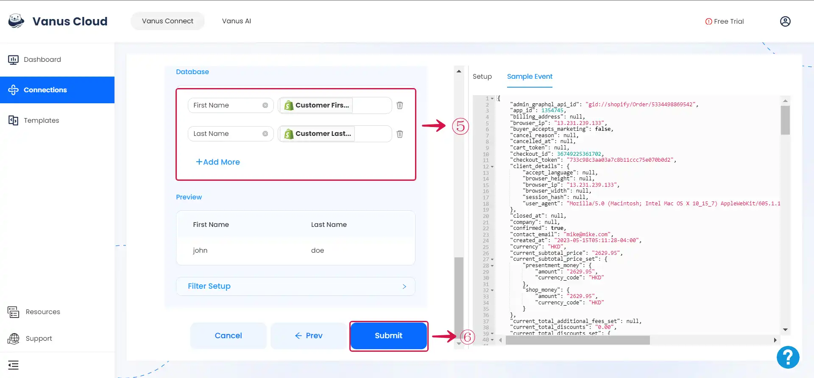

# MySQL

This guide contains information required in setting up an MySQL Sink in Vanus Connect.  

## Introduction  

MySQL is a popular open-source relational database management system used to store, organize, and retrieve data for websites, applications, and other software.

Vanus Connect's MySQL sink connector simplifies the process of transferring data/events from various sources to a MySQL database/table, with configurable filters and upsert/insert modes.

## Prerequisites

Before forwarding events to MySQL, you must have:

- A [**Vanus Cloud account**](https://cloud.vanus.ai)
- Have a running MySQL server.
- Have a Database and Table created.

**Perform the following step to configure your MySQL Sink.**

### Step 1: Create a Connection

Enter all the following information in Vanus Connect.

- **Choose the action to execute**①
- **Host**② - The IP address of your MySQL Server.
- **Port**③ - The Port of your MySQL Server: 3306.
- **Username**④ - A Username with the following permissions INSERT, UPDATE, DELETE.
- **Password**⑤ - The user password.
- **Database**⑥ - The database name.
- **Table**⑦ - The table name.


### Step 2: Personalize Event Structure

:::note
This is a general instruction on how to personalize your event structure. You can structure your events to suit your specific requirements and create connections for different scenarios.
:::

1. Click on **Display sample events**① for reference and click on **Add More**② to add events.


2. **Input key**③ and search for the corresponding **value**④ for the event you want.


3. You can fill in as many **key-value pairs**⑤ as you wish to receive. Click **Submit**⑥ to finish the configuration process.



---

## Custom Connection

The event data must be in JSON format and created following the structure of your database, here's an example:

```json
{
  "title": "value",
  "date": "value",
  "ect...": "value"
}
```
