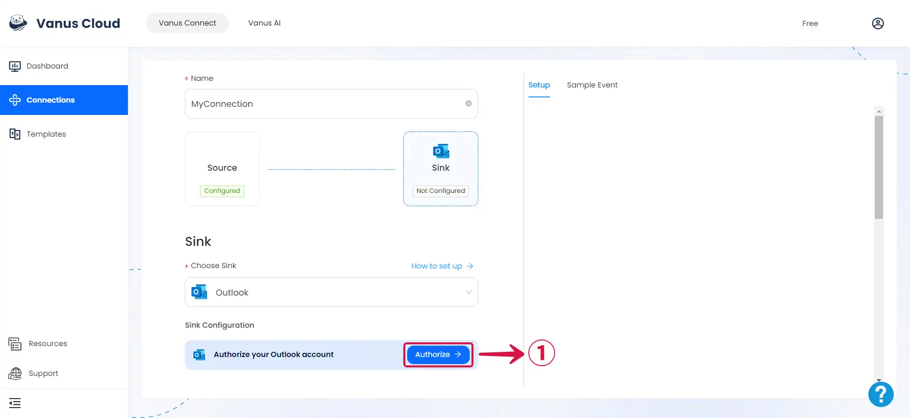
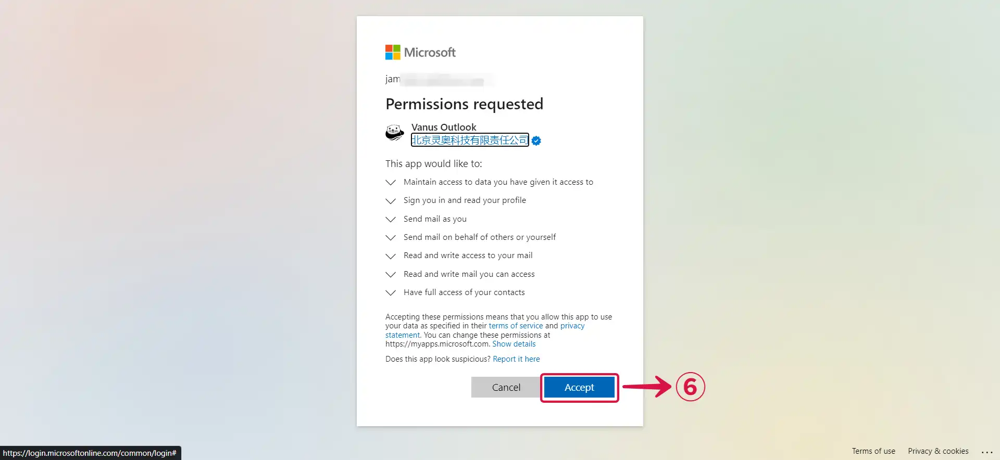
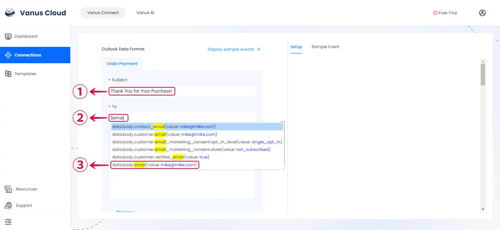
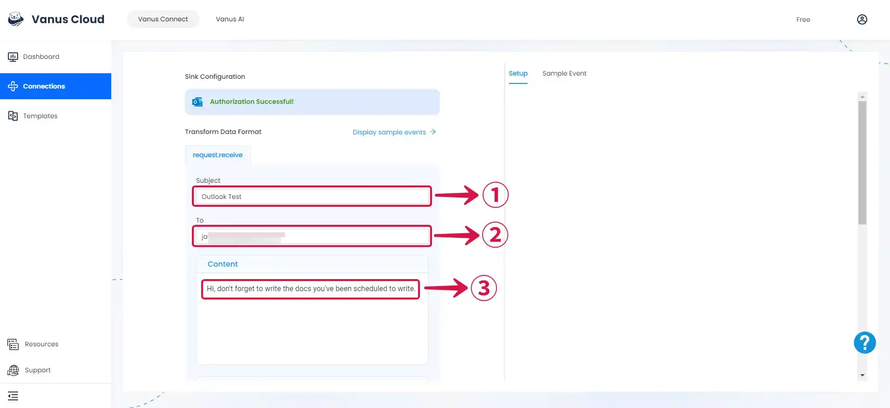
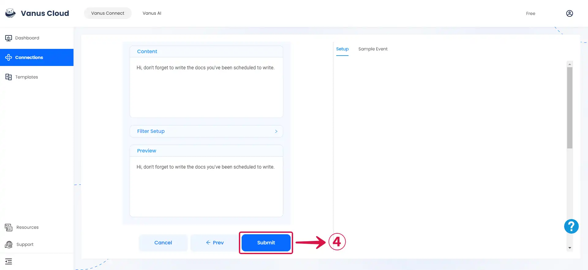
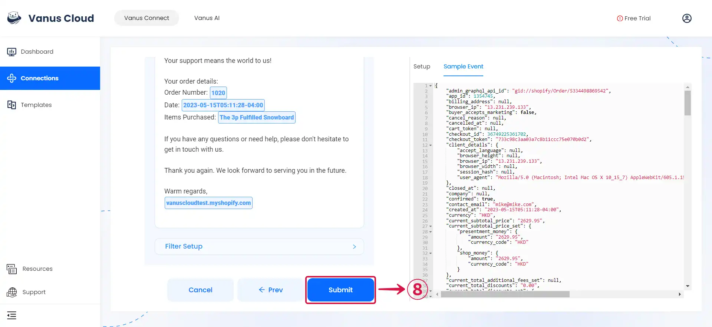
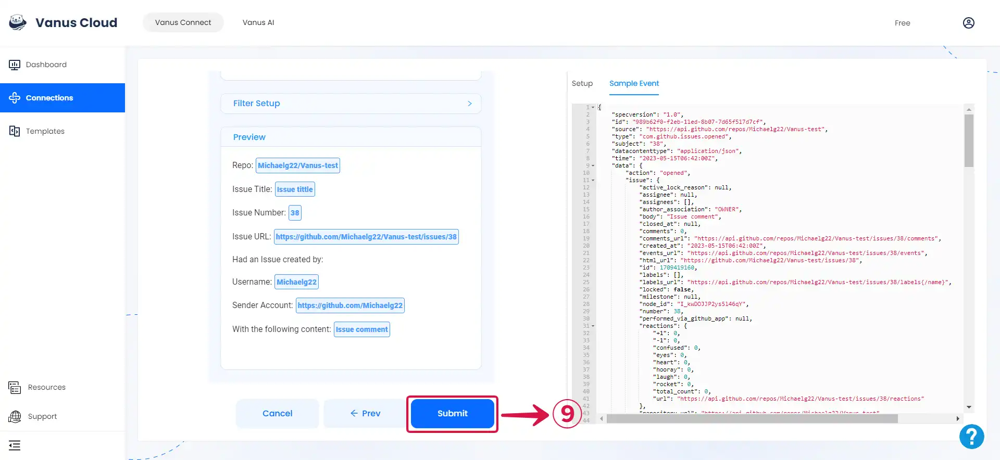

# Outlook

This guide contains information to set up an Outlook Sink in Vanus Connect.

## Introduction

Outlook is a Microsoft email application and productivity tool that helps users manage their emails and offers additional features such as calendar management, contact organization, task tracking, note-taking, and web browsing. It's widely used for efficient communication and time management in both personal and professional settings.

The Outlook Sink Connector allows you to send events from your Outlook account to external sources.

## Prerequisites

Before forwarding events to Outlook, you must have:

- An [**Outlook Account**](https://www.microsoft.com/en-us/microsoft-365/outlook/email-and-calendar-software-microsoft-outlook?deeplink=%2fowa%2f&sdf=0)

- A [**Vanus Cloud Account**](https://cloud.vanus.ai).

---

**Perform the following steps to configure your Outlook Sink.**

### Outlook Connection Settings

1. Click **Authorize**① to establish a connection with your Outlook account.

2. Pick an **Account**② or **Use another account**③.

3. Type in your **Password**④ and click **Next**⑤.

4. Click on **Accept**⑥ to grant Vanus Connect access to your Outlook account.

5. Return to **Vanus Connect**⑦ and complete your configuration.

### Complete SetUp Based On Source Connector

import Tabs from '@theme/Tabs';
import TabItem from '@theme/TabItem';

<Tabs>

<TabItem label="Schedule" value="schedule">

1. Compose your **Subject**①, specify the recipient's **email address**②, and type in the **Content**③ you want to send.

2. Preview and click on **Submit**④.

3. At the appointed time, a message would be sent from your outlook account to the specified email address.

:::note
You can structure your events to suit your specific requirements, create connections for different scenarios, or take advantage of our pre-existing connection templates for a more organized approach to sending events.
:::

</TabItem>

<TabItem label="Github" value="github">

1. Compose your **Subject**①, specify the recipient's **email address**②, and type in the **Content**③ you want to send.

2. Click **Display sample events**④ to see a **Sample Event**⑤ for reference. Then input **`$` followed by the desired event⑥** to access a **list of corresponding events and values**⑦.

3. You can structure the content as you prefer and fill in as many **values**⑧ as you wish to receive.

4. Click **Submit**⑨ to finish the configuration process.

5. When the chosen event is activated, a message will be sent from your Outlook account to the designated email address.

:::note
You can structure your events to suit your specific requirements, create connections for different scenarios, or take advantage of our pre-existing connection templates for a more organized approach to sending events.
:::

</TabItem>

</Tabs>

---

Learn more about Vanus and Vanus Connect in our [**documentation**](https://docs.vanus.ai).
