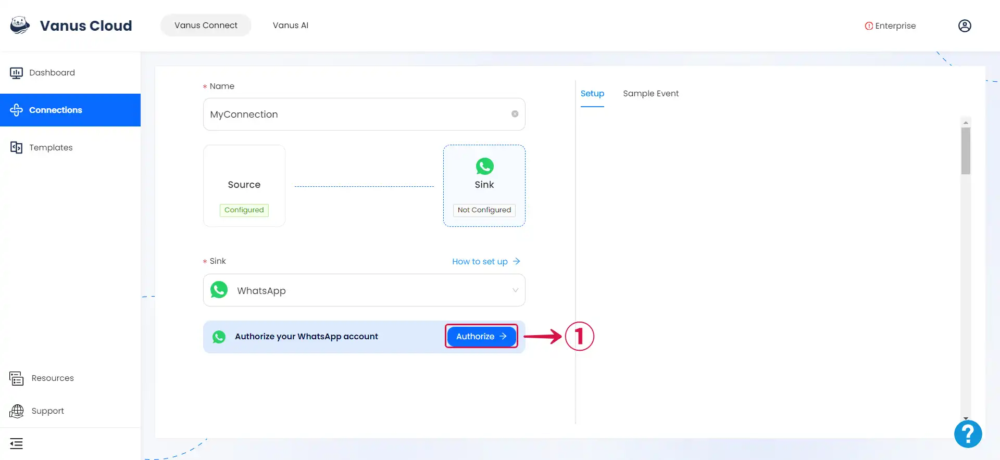
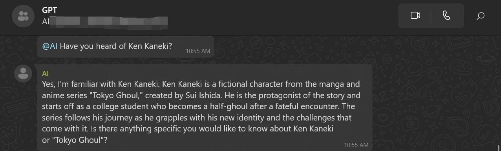

# WhatsApp

This guide contains information to set up a WhatsApp Sink in Vanus Connect.

## Introduction

WhatsApp is a widely-used messaging application that allows users to send messages, make calls, share files, and participate in group chats. It offers a user-friendly interface, cross-platform compatibility, and features like end-to-end encryption. With its popularity and regular updates, WhatsApp has become a primary communication tool for individuals, families, friends, and businesses worldwide.

The WhatsApp sink connector facilitates the reception of events from external sources to your WhatsApp account. It further enables the integration of ChatGPT with WhatsApp, enabling seamless communication with ChatGPT directly from your WhatsApp account.

## Prerequisites

- A [**Vanus Cloud Account**](https://cloud.vanus.ai)
- A [**WhatsApp account**](https://www.whatsapp.com)

**Perform the following steps to configure your WhatsApp Sink.**

### Step 1: WhatsApp Connection Settings

1. Click **Authorize**①  to create a QR code to establish a connection with your WhatsApp account.

2. On your phone go to **Settings**② and click **Linked Devices**③.

3. Click **Link a Device**④

4. Scan the **QR Code**⑤ ⑥ with your mobile WhatsApp.

### Step 2: Personalize Event Structure

:::note
This is a general instruction on how to personalize your event structure. You can structure your events to suit your specific requirements and create connections for different scenarios.
:::

1. Click **Display sample events**① for reference, and type in the **number**② you want to send the event to.

2. Type your message and **input `$` followed by the desired event**③ to access a **list of corresponding event values**④.

3. You can structure the content as you prefer and fill in as many **values**⑤ as you wish to receive.

4. Click **Submit**⑥ to finish the configuration process.

### Step 3: How to use ChatGPT

**Note**: *If you haven't activated the "Enable Chat AI" option within the WhatsApp Source Connector, the WhatsApp connection won't utilize the capabilities of ChatGPT.*

If you wish to utilize ChatGPT in WhatsApp, you can go back to the template tab and select one of the two ChatGPT template.

import Tabs from '@theme/Tabs';
import TabItem from '@theme/TabItem';

<Tabs>

<TabItem label="Android" value="android">

1. Tap on the 💬① icon at the bottom-right corner to display the contact list.

2. Within the contact list, select the **contact**② with your profile display. It's typically the first contact on the list and has the word `You` attached to it.

3.  Send a message or pose a question and you'll receive a response.

</TabItem>

<TabItem label="iOS" value="ios">

1. Tap the 💬①  icon at the bottom menu and tap the 📝② icon at the top.

2. Within the contact list, select the **contact**③ with your profile display. It's typically the first contact on the list and has the word `You` attached to it.

3. Send a message or pose a question and you'll receive a response.

</TabItem>

</Tabs>

To use in WhatsApp groups just tag the AI account using `@`.

---

Learn more about Vanus and Vanus Connect in our [**documentation**](https://docs.vanus.ai).
