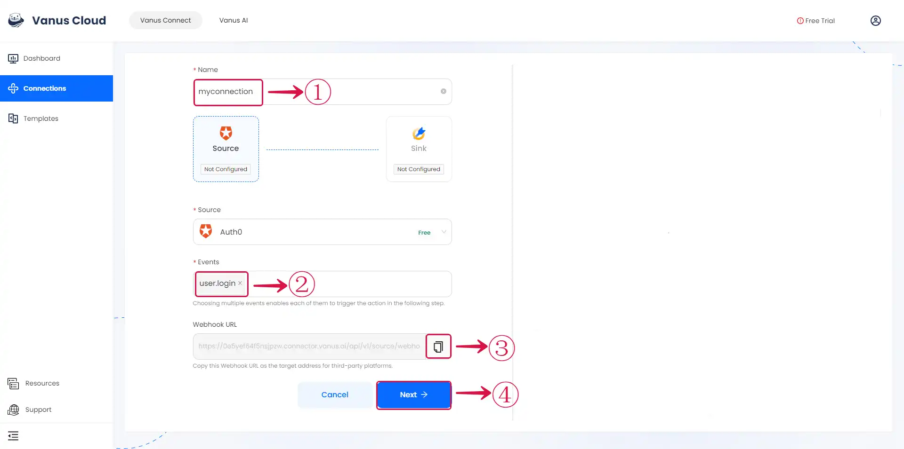

# Auth0

This guide contains information to set up a Auth0 Source in Vanus Connect.

## Introduction

Auth0 is an authentication and authorization platform that provides security solutions for applications, websites, and APIs. It offers features such as single sign-on, multi-factor authentication, and social logins, among others.

The Auth0 Source is a webhook server that enables you to establish an endpoint for receiving events from your Auth0 application. To achieve this, it is necessary to establish a connection within Auth0.

## Prerequisites

Before obtaining Auth0 events, you must have:

- An Auth0 account with administrative privileges
- A [Vanus Cloud account](https://cloud.vanus.ai)

## Getting Started

### Create your connection in Vanus Connect

- Write a **Name**① for your connection.

- Select the **Events**② you want to receive.

- Click on the **copy**③ icon to copy the Webhook URL. Use the Webhook URL to receive events.

- Click **Next**④ and continue the configuration.

Learn more about Vanus and Vanus Connect in our [documentation](https://docs.vanus.ai).
