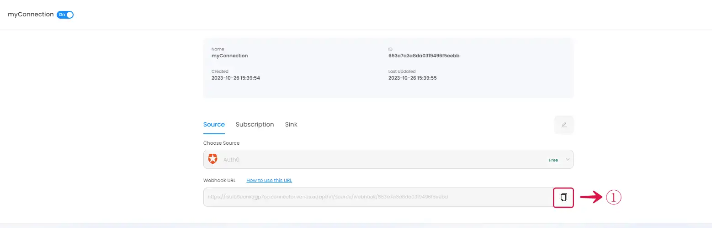
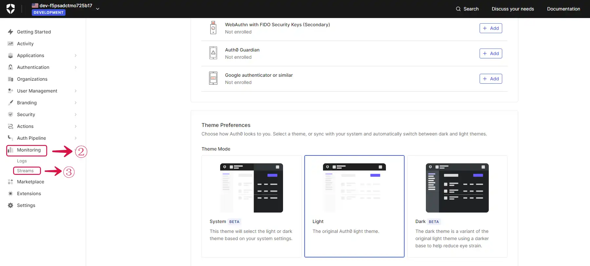
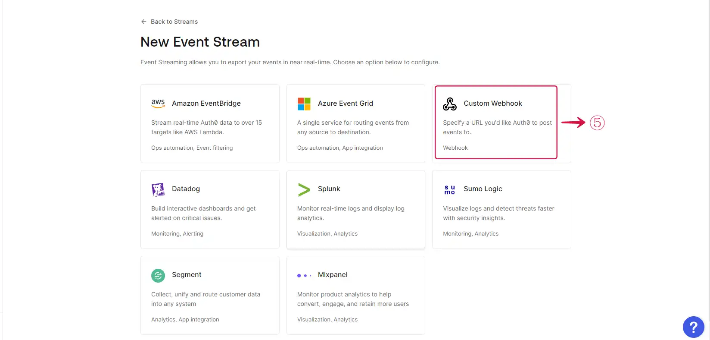
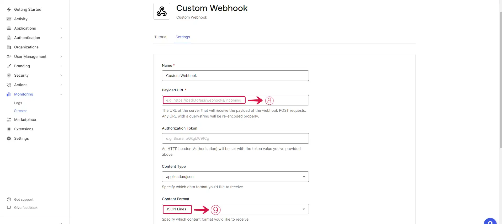

# **Configuring Auth0 to Send Webhook Events**

1. Click the **copy**① icon to copy the webhook url.

2. Log in to your Auth0 account.

3. Navigate to the **Streams**② menu under **Monitoring**③.

4. Click on the **Create Log Stream**④ button.

5. Select the **Custom Webhook**⑤ option.

6. Write a **Name**⑥ for your webhook stream and click on the **Create**⑦ button.

7. Provide the **Payload URL**⑧ of your Auth0 source connector in Vanus Connect, and select **Json Lines**⑨ under **Content Format**.

8. **Select**⑩ the event you want to receive notifications for and click the **Apply**⑪ button. Save your settings.

>  **Caution**  
At this time you can only select one event. 

