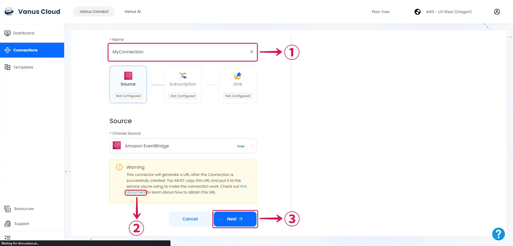

# Amazon Eventbridge

This guide contains information to set up a Amazon Eventbridge Source in Vanus Connect.

## Introduction

Amazon EventBridge is a serverless service that uses events to connect application components together, making it easier for you to build scalable event-driven applications.

The Amazon EventBridge Source is a webhook server that enables you to establish an endpoint for receiving events from Amazon EventBridge. To achieve this, it is necessary to establish a connection within Amazon EventBridge.

## Prerequisites

- A [**Vanus Cloud account**](https://cloud.vanus.ai)
- An AWS Account with Administrative Privileges

## Getting Started

### Create your connection in Vanus Connect

To obtain all Amazon Eventbridge events in Vanus Connect, follow these steps:

- Write a **Name**① for your connection in Vanus Connect.

- Click on the **copy**② icon to copy the Webhook URL. Use the Webhook URL to receive events.

- Click **Next**③ and continue the configuration.

Learn more about Vanus and Vanus Connect in our [**documentation**](https://docs.vanus.ai).
