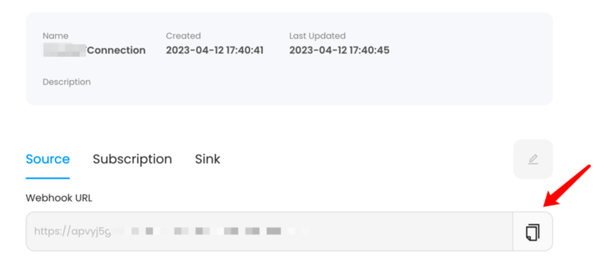
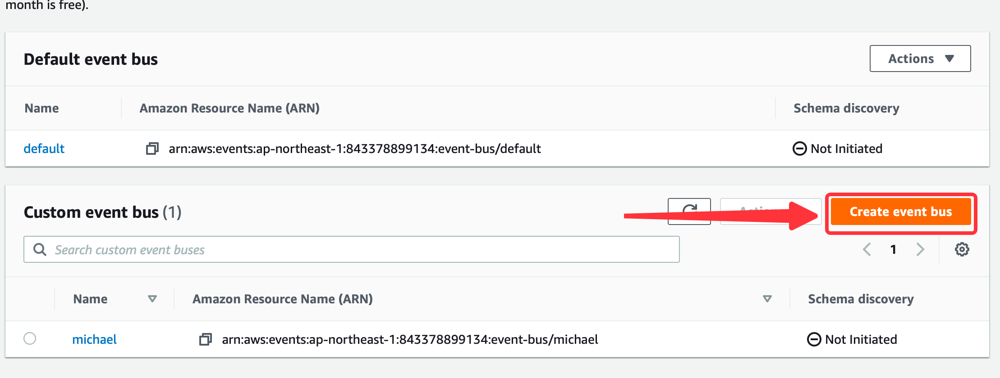
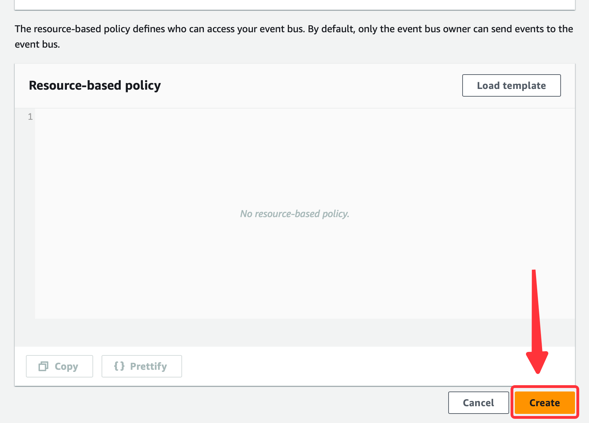
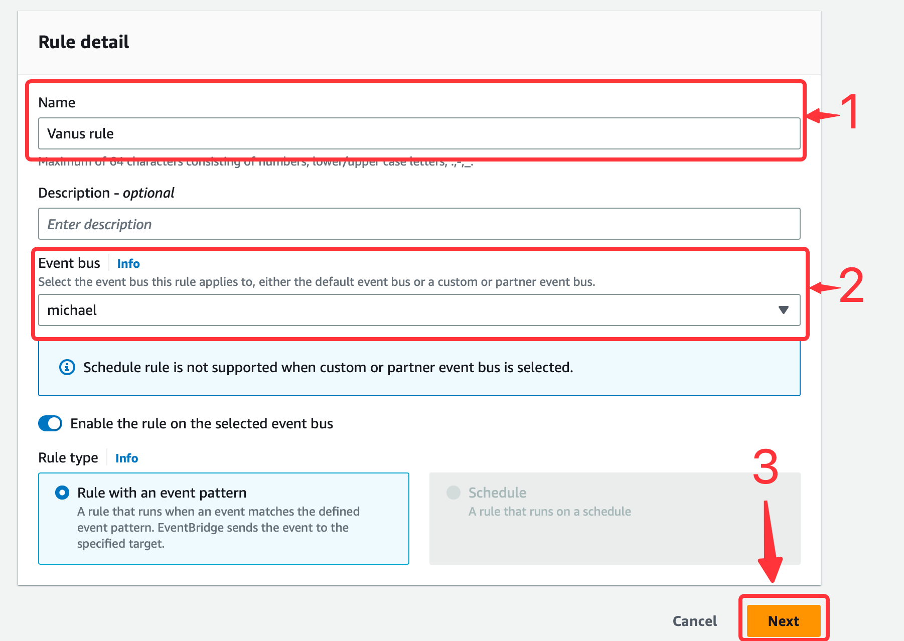
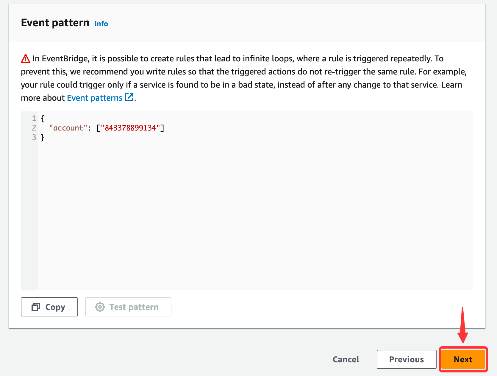
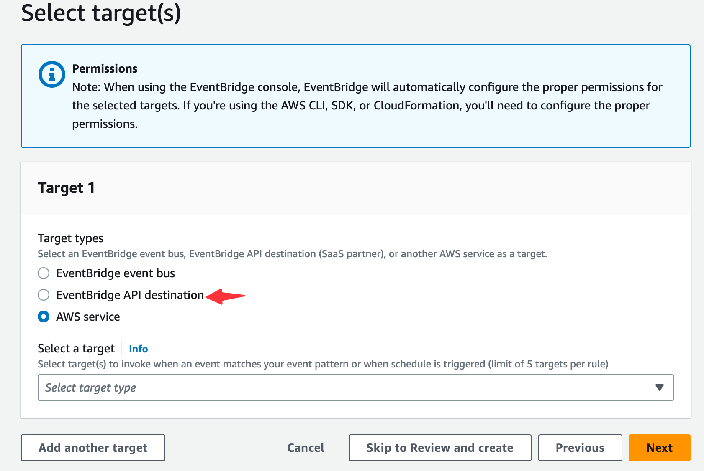
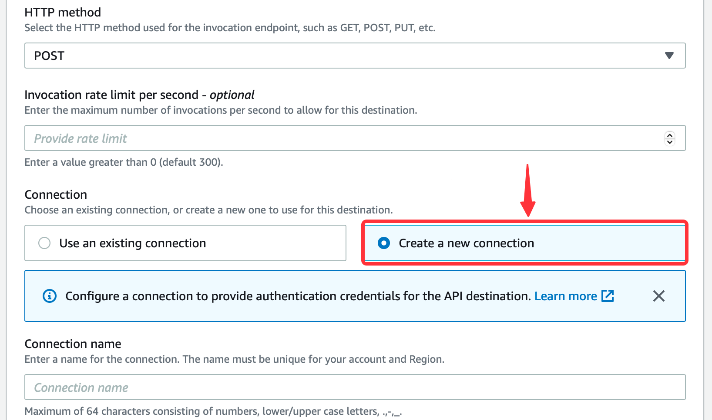
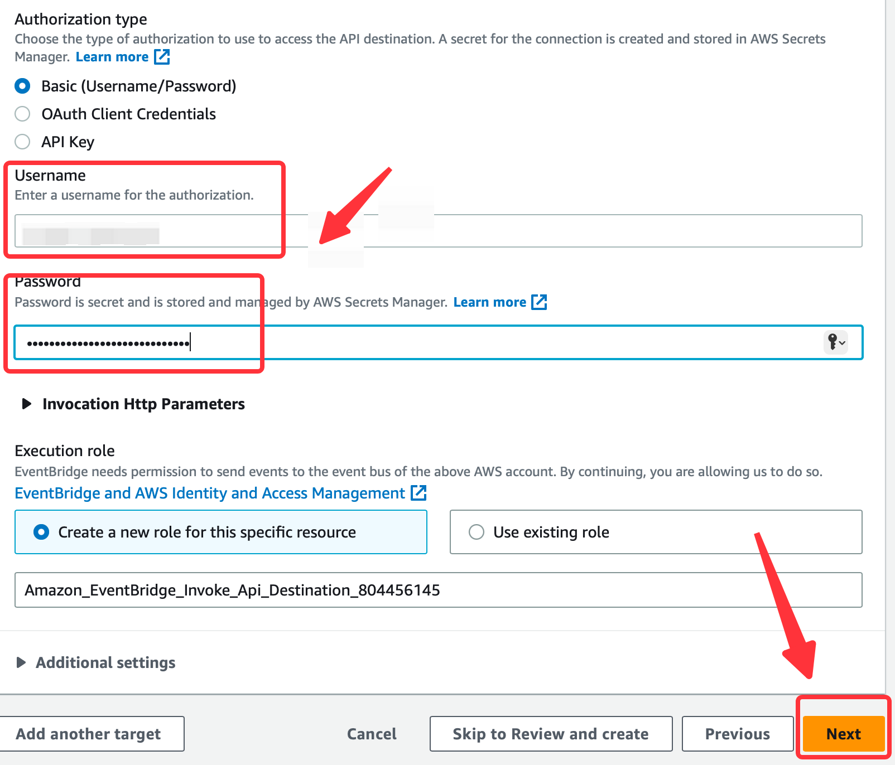
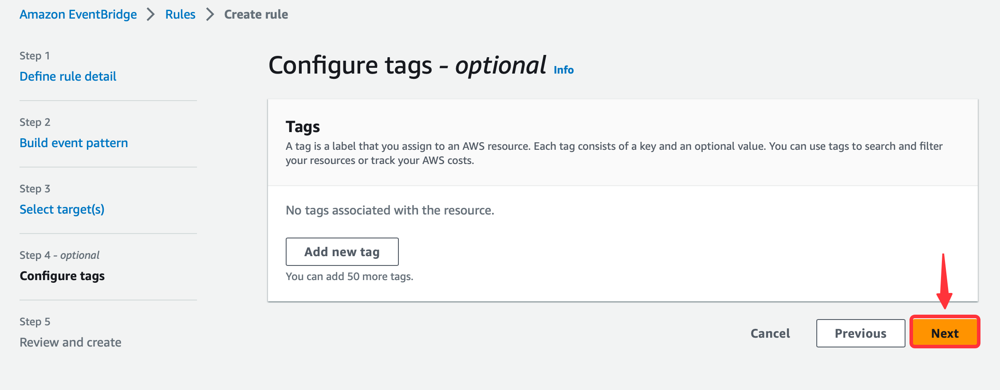

# **Configuring Amazon Eventbridge**

1. Click the **copy icon** to copy the webhook url.
   
2. Navigate to the [EventBridge console](https://console.aws.amazon.com/events/home).

## Step 1: Create an Event Bus

1. In the side menu click **Event buses**.
   
2. Create a **new event bus** if you haven't already.
   
3. Write a name and press **create**.
   

## Step 2: Create a Rule.
1. Go to **Rules** from the side menu and click **Create rule**.
   
2. Name your rule, select your **Event bus** and press **Next**.
   
3. Select **all events**.
   
4. Press **Next** to continue.

## Step 3: Create an API Destination and Connection
1. Select EventBridge API destination.
    
2. Now select create new **Create a new API destination** under API destination.
   - Write a connection **Name**.
   - Set the **API destination endpoint** to the URL from Vanus Connect from **[step 1](#configuring-amazon-eventbridge)**.
   - Set the **HTTP method** as `POST`.
       
3. Next, select **Create a new connection**.

4. Write a name for you connection and select **Basic (Username/Password)** under Authorization type.
    
5. Create a **Username** and a **Password** of your choice, this won't be needed in this scenario but it is required and press **Next**.
    
6. Under Configure tags - optional press **Next**.

7. Review and press **Create rule**.

Now every event sent to your Event Bus will be send to your Vanus connection.
