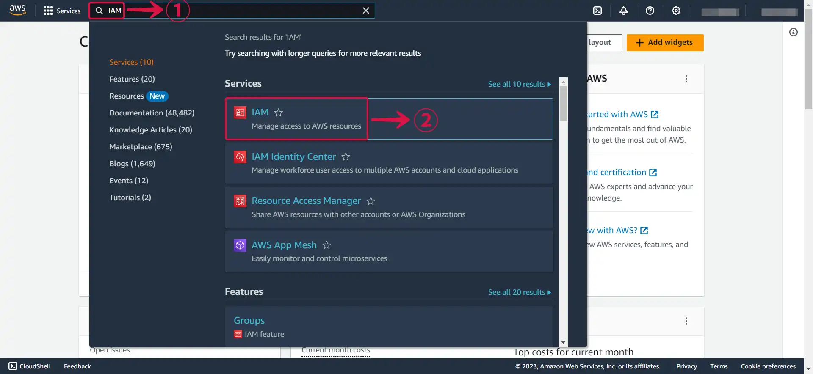
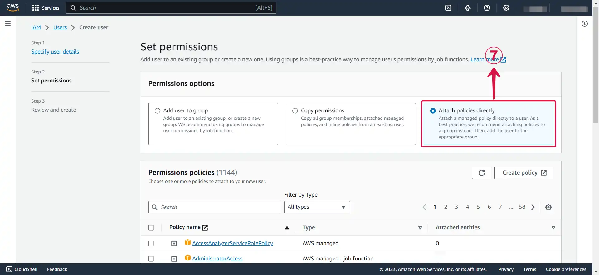
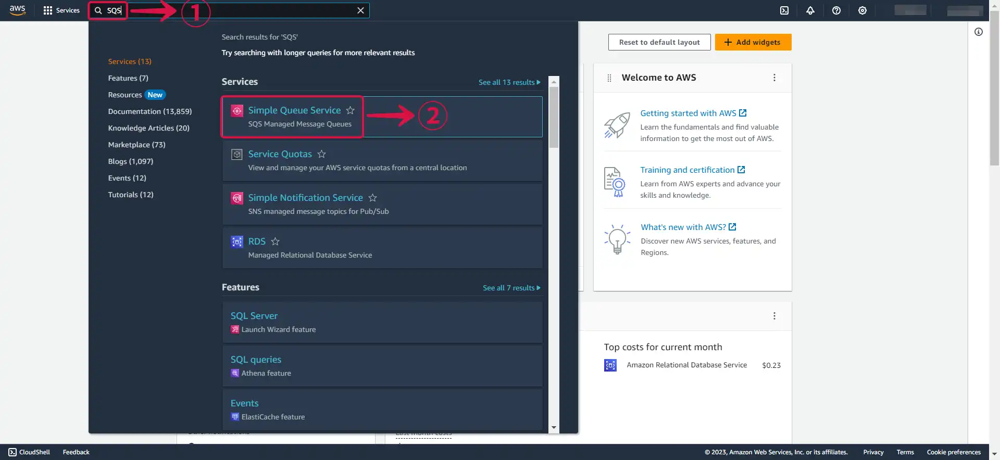
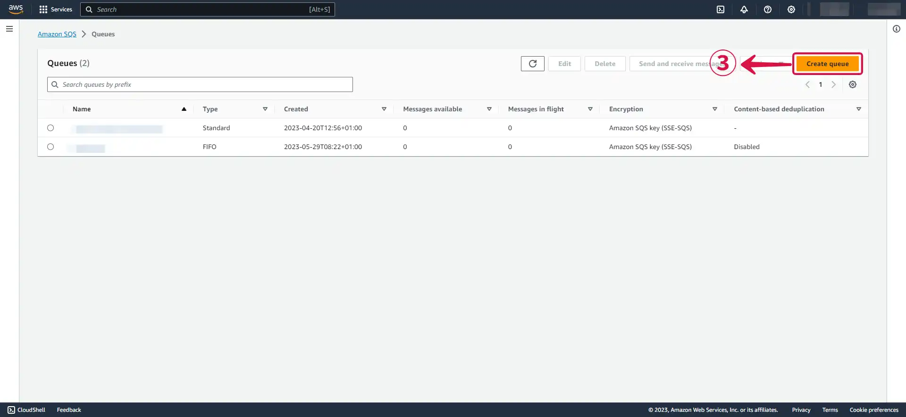
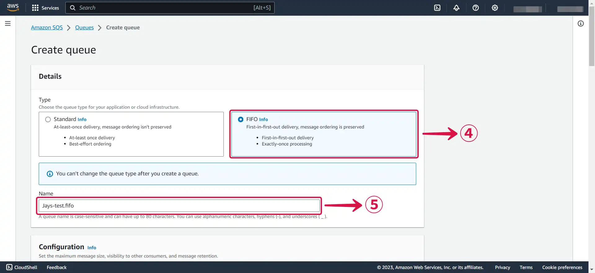
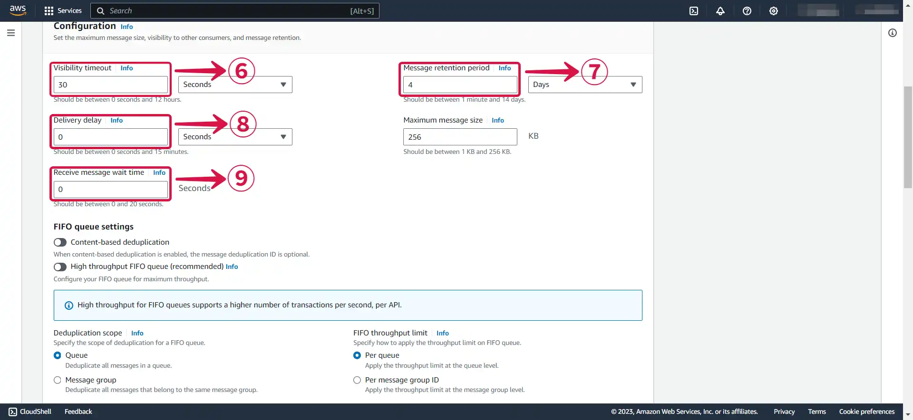
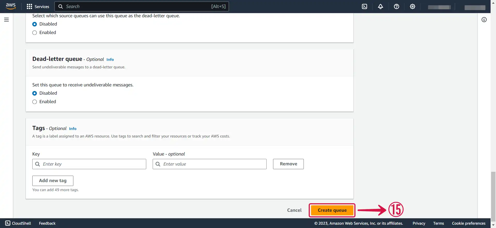
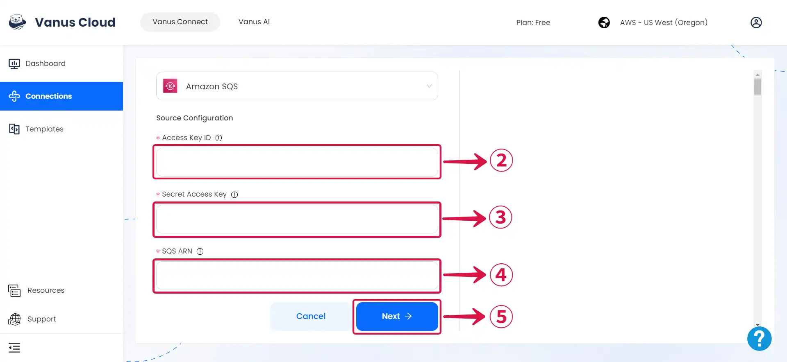

# Amazon SQS

This guide contains information to set up a SQS Source in Vanus Connect.

## Introduction

Amazon Simple Queue Service (Amazon SQS) is a fully-managed message queuing service provided by Amazon Web Services (AWS).

It is designed to help developers build distributed systems and applications that need to communicate asynchronously by reliably sending, storing, and receiving messages between software components.

Vanus Connect provides the Amazon SNS Source connector, which retrieves SNS events and converts them into CloudEvents.

## Prerequisites

Before obtaining SQS events, you must have:

- An [**AWS Account**](https://aws.amazon.com)
- A [**Vanus Cloud account**](https://cloud.vanus.ai)

## Getting Started

### Step 1: Create a new AWS user

1. Log in to the AWS [**Management Console**](https://aws.amazon.com) using your root account credentials.

2. Navigate to the [**IAM**](https://console.aws.amazon.com/iam/) service by searching for **IAM**① and click the **IAM**② service.

3. Click the **Users**③ tab in the left navigation menu, then click the **Create user**④ button.

4. Write your **User name**⑤ and click **Next**⑥.

5. Select **Attach policies directly**⑦.

6. Search for **`AmazonSQSFullAccess`⑧**, **select it**⑨ and click **Next**⑩.

7. Review and click on **Create user**⑪.

### Step 2: Create an Access key and Secret access Key

1. Now click on the **user**① you just created.

2. Under **Security credentials**② scroll down the page to `Access Keys`, and Click **Create access key**③.

3. Select **Command line interface (CLI)④**, tick the **confirmation box**⑤ and click **Next**⑥.

4. Click **Create access key**⑦.

5. Download your **`Access key`** and **`Secret access key`** by clicking the **Download .csv file**⑧ button, and then click **Done**⑨.

---

### Step 3: Create an SQS Queue on AWS

1. Navigate to the Simple Queue Service page by typing **SQS**① in the search bar and selecting **Simple Queue Service**② from the drop-down menu.

  

2. Click on **Create queue**③.

3. Select **FIFO**④ and **Name**⑤ your queue.

4. Leave the configuration on the default setting, or change them to suit your needs.

- **Visibility timeout⑥:** This is a setting that determines how long a message received from a queue will remain hidden from other consumers. When a message is received from an Amazon SQS queue by a consumer, the visibility timeout starts. If the consumer fails to process and delete the message before the visibility timeout expires, the message becomes visible to other consumers.

- **Message retention period⑦ :** This refers to the length of time a message is kept in a queue if it is not deleted. Messages that exceed the maximum message retention period are automatically deleted by Amazon SQS.

- **Delivery delay⑧:** This determines the amount of time before the first delivery of each message added to the queue. During the delay period, any messages sent to the queue are not visible to consumers.

- **Receive message wait time⑨:** This refers to the maximum duration that polling will wait for messages to become available for receiving.

5. **Enable encryption**⑩ and select your preferred **Encryption key type**⑪.

 

6. Choose your preferred Access Policy **method**⑫, **Define who can send messages to the queue**⑬, and **Define who can receive messages from the queue**⑭.

7. Click on **Create queue**⑮.

8. **Copy your SQS ARN**⑯, it will be needed when creating your connection in Vanus.

 

---

### Step 4: Amazon SQS Connection Settings

1. Write a connection **Name**① without any spaces.

2. Enter your **Access Key ID**②, **Secret Access key**③ and **SQS ARN**④, and click **Next**⑤ to continue the configuration.

---

Learn more about Vanus and Vanus Connect in our [**documentation**](https://docs.vanus.ai).
