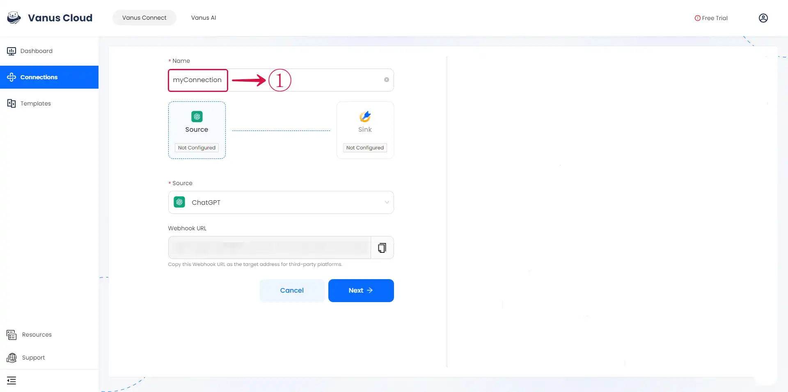

# ChatGPT

This guide contains information to set up a ChatGPT Source in Vanus Connect.

## Introduction

ChatGPT is a large language model developed by OpenAI, based on the GPT-3.5 architecture.

ChatGPT Source is a Vanus-hosted ChatGPT service which works as an HTTP server to generate human-like responses to textual content from incoming HTTP requests,
and deliver responses to endpoints in the CloudEvents HTTP format.

## Prerequisites

Before obtaining ChatGPT events, you must have:

- A [Vanus Cloud account](https://cloud.vanus.ai)

## Getting Started

### Create a Connection

- Write a **Name**① for your connection in Vanus Connect.

- Click on the **copy**② icon to copy the Webhook URL. Use the Webhook URL to receive events.

-  Click **Next**③ and continue the configuration.

Learn more about Vanus and Vanus Connect in our [documentation](https://docs.vanus.ai).
