# **How to setup ChatGPT in Feishu**

1.  Click the copy icon to copy the **Webhook URL**❶.
    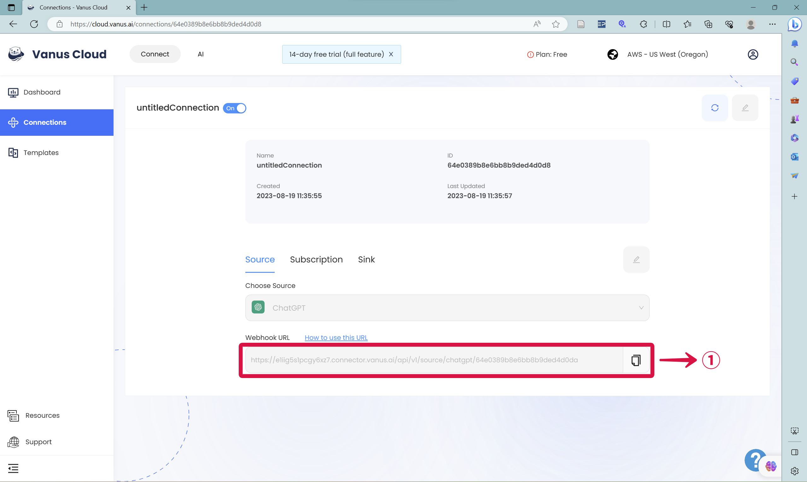
2.  Return into Feishu and search for **Feishu Flow**❷❸ or **飞书捷径** and click on it.
    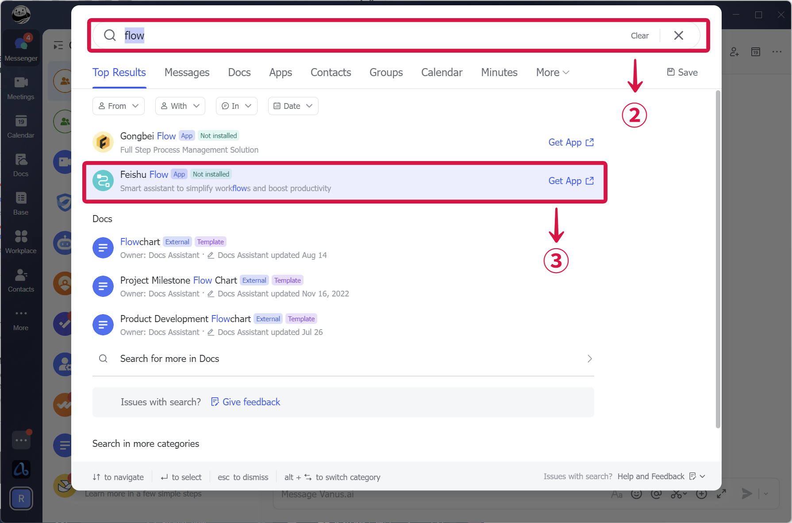
3.  Press **Create** **Bot Command**❹.
    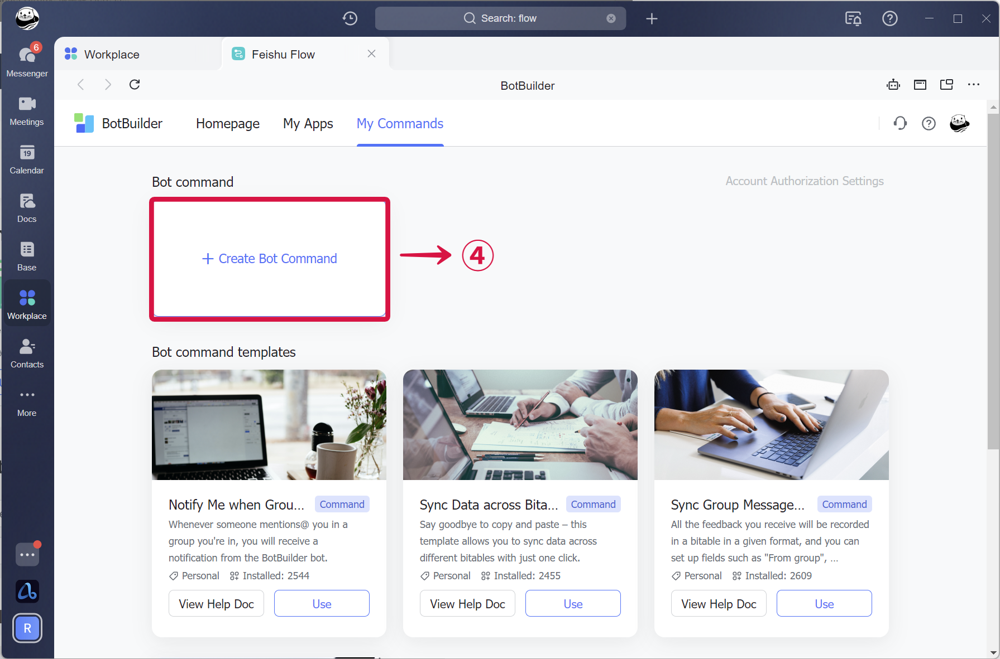
4.  **Select a Trigger**❺.
    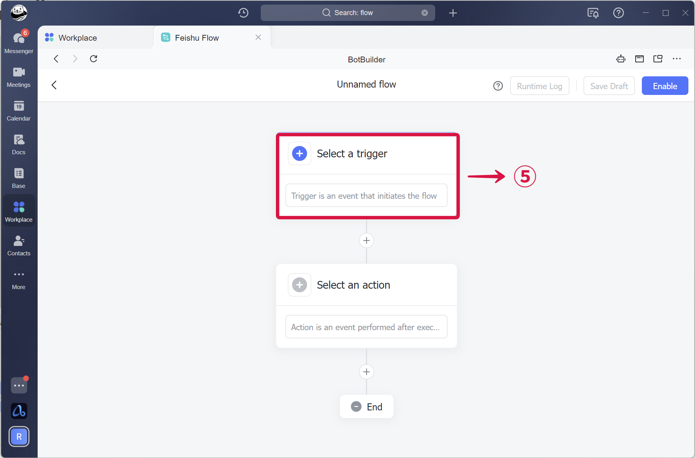
5.  **Select** `When a New message that mentioned BOT in the group chat`❻.
    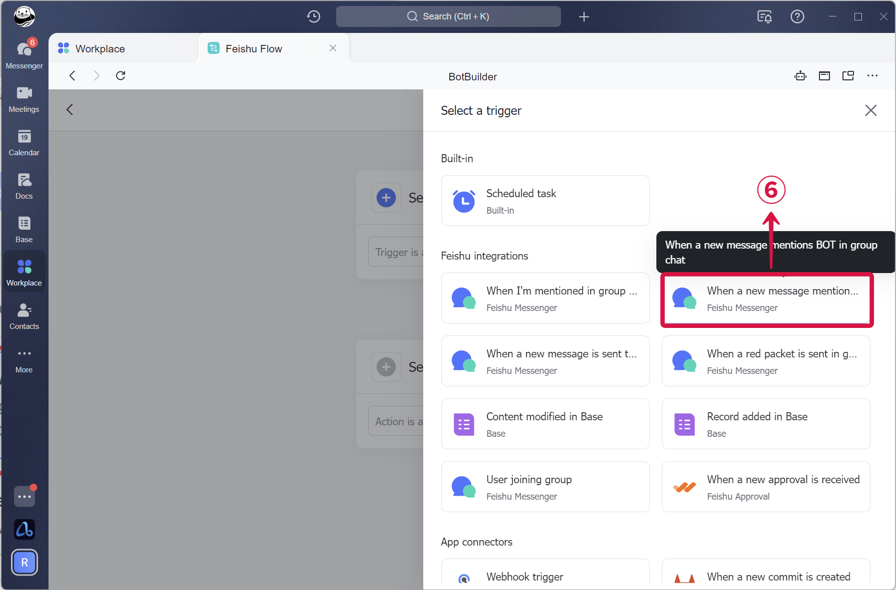
6.  In group select **Specific groups**❼ Search for the group you've previously created, select your ChatGPT bot under **Bot**❽ , select **All of my contacts**❾ and click the **Done**❿.
    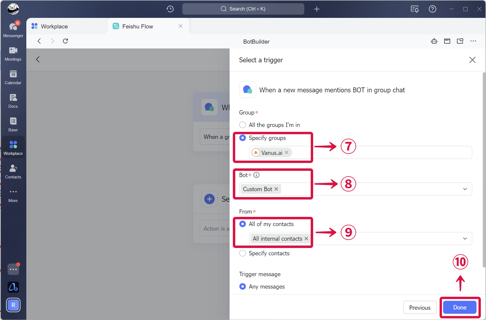
7.  **Select an action**⓫ and choose `Webhook(Send HTTP request)`⓬ as the action.
    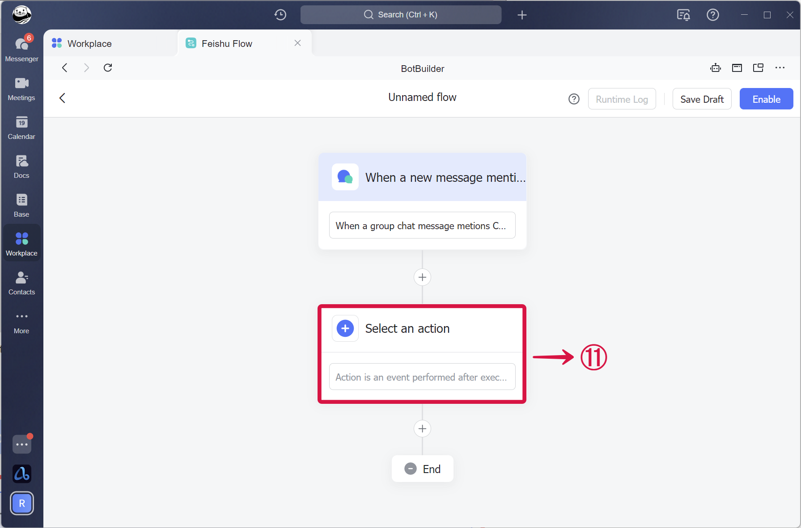
    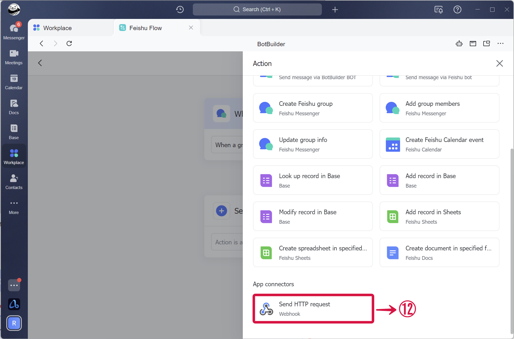
8.  Select the **Method** `POST`⓭. Set the URL⓮ using the URL from step 1❶. Select the **Data type** `plain`⓯, Select the **Body** `When a new message mentions BOT in group chat/Source content(mention @ part remove)`⓰, and press **Done**⓱.&#x20;
    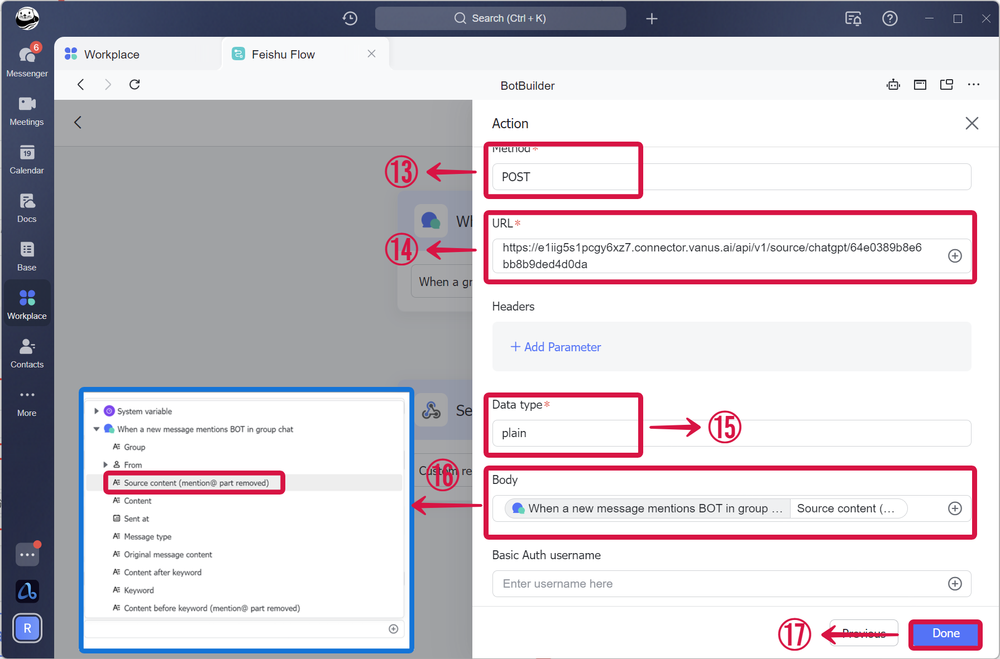
9.  Press **Enable**⓲, And name your flow and **Confirm**⓳.
    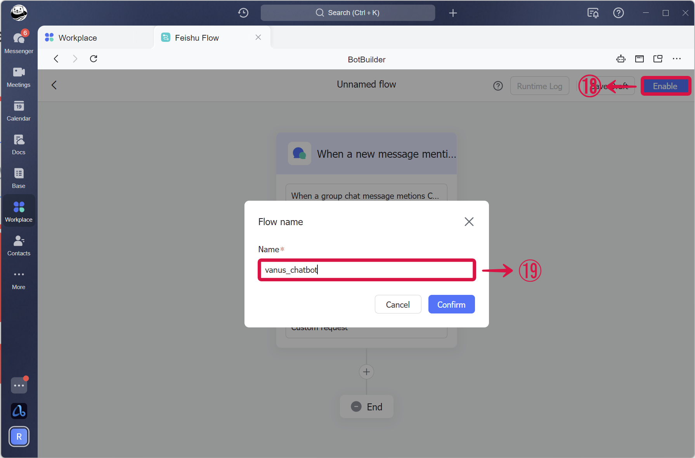
10. Press **My commands**⓴, and make sure your bot is open.
    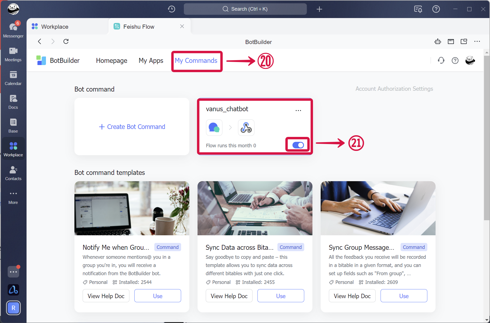
11. Now send a message in the group tagging the bot.
    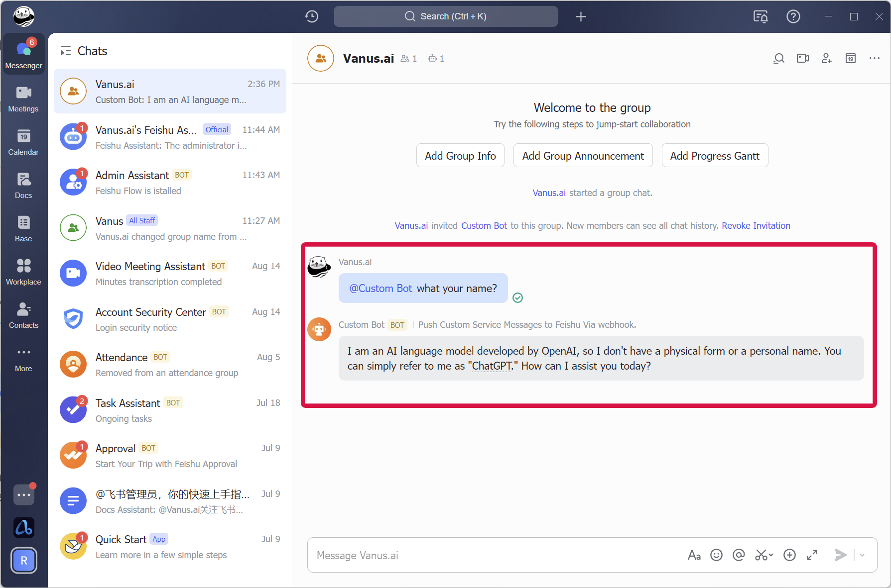
