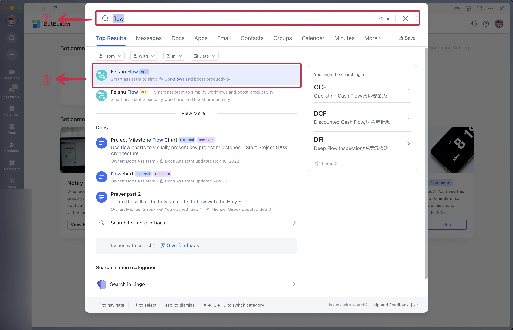
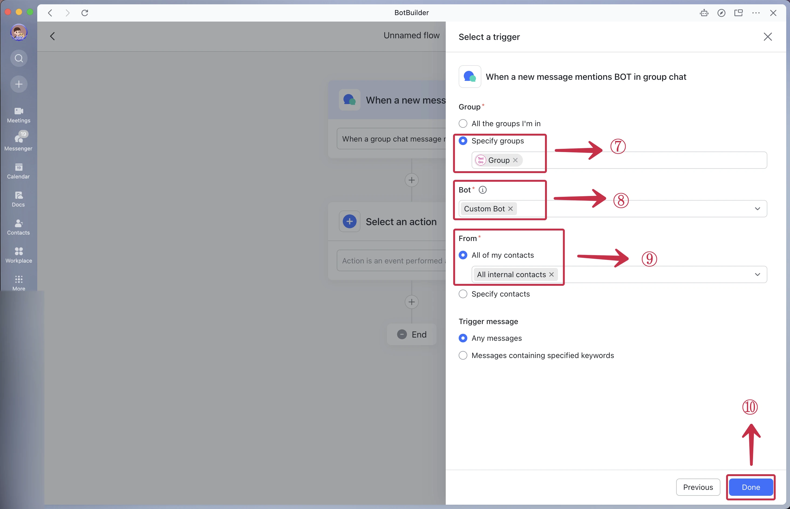
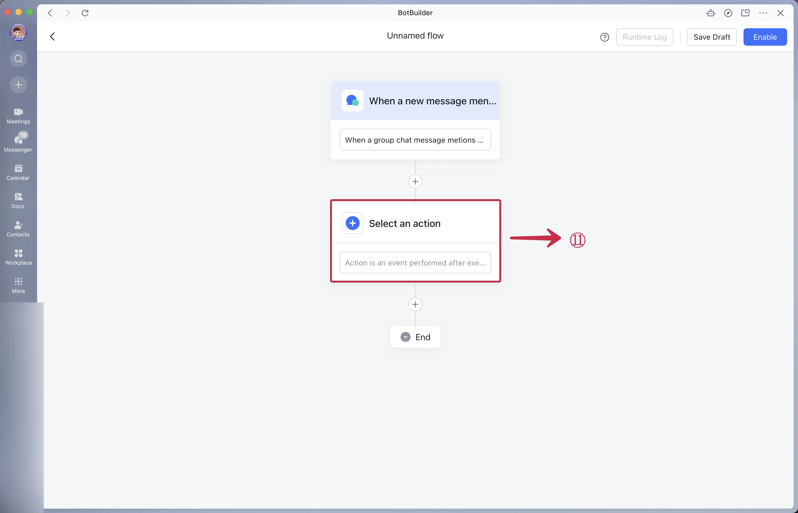

# **How to setup ChatGPT in Feishu**

1.  Click the copy icon to copy the **Webhook URL**①.

2.  Return into Feishu and search for **Feishu Flow**② ③ or **飞书捷径** and click on it.

3.  Press **Create** **Bot Command**④.

4.  **Select a Trigger**⑤.

5.  **Select** `When a New message that mentioned BOT in the group chat`⑥.

6.  In group select **Specific groups**⑦ Search for the group you've previously created, select your ChatGPT bot under **Bot**⑧ , select **All of my contacts**⑨ and click the **Done**⑩.

7.  **Select an action**⑪  and choose `Webhook(Send HTTP request)`⑫ as the action.

8.  Select the **Method** `POST`⑬. Set the URL⑭ using the URL from step 1❶. Select the **Data type** `plain`⑮, Select the **Body** `When a new message mentions BOT in group chat/Source content(mention @ part remove)`⑯, and press **Done**⑰.&#x20;

9.  Press **Enable**⑱, And name your flow and **Confirm**⑲.

10. Press **My commands**⑳, and make sure your bot is **open**㉑.

11. Now send a message in the group tagging the bot.

