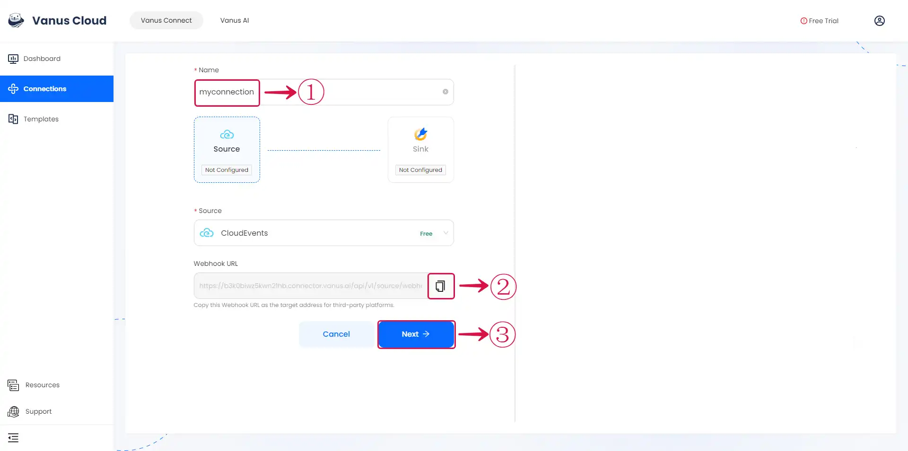

# CloudEvents

This guide contains information to set up a CloudEvents Source in Vanus Connect.

## Introduction

CloudEvents is a vendor-neutral specification for describing event data in a common way, allowing for interoperability between different cloud platforms and event-driven systems.

The CloudEvent Source allows receiving CloudEvents via a payload URL.

## Prerequisites

Before obtaining Payload URL to receive events, you must have:

- A [Vanus Cloud account](https://cloud.vanus.ai)

## Getting Started

### Create your connection in Vanus Connect

To set up CloudEvents in Vanus Connect, follow these steps:

- Write a **Name**① for your connection in Vanus Connect. 

- Click on the **copy**② icon to copy the Webhook URL. Use the Webhook URL to receive events. 

- Click **Next**③ and continue the configuration.

Learn more about Vanus and Vanus Connect in our [documentation](https://docs.vanus.ai).
