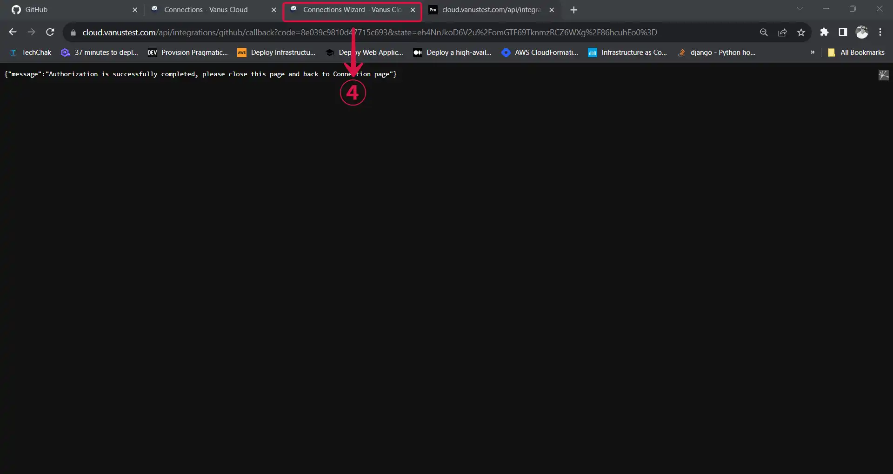
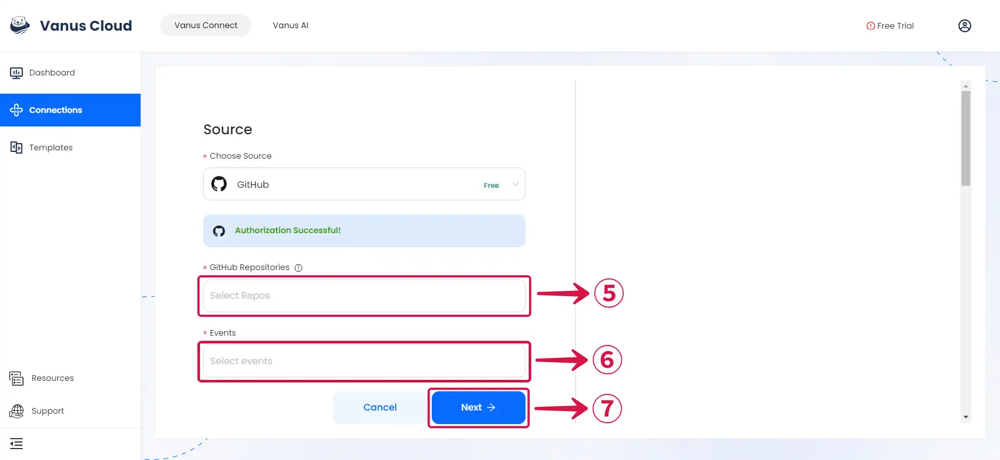

# GitHub

This guide contains information to set up a GitHub Source in Vanus Connect.

## Introduction

GitHub is the largest web-based platform that provides developers with a place to host and manage their software projects.

The GitHub Source enables you to get specific CloudEvents when particular events take place on your repositories.

## Prerequisites

- A [**Vanus Cloud account**](https://cloud.vanus.ai)
- GitHub Account with proper permissions(`Admin` or `Owner`) to your repository
- GitHub Repositories

---

## Getting Started

1. Write a connection **Name**① without any spaces and click **`Authorize`②** to authorize to your GitHub account.

2. Click on **Authorize vanus-labs**③ to grant Vanus permission to access repositories and create webhooks.

3. Return to the **Vanus Connect**④ page.

4. Choose a **GitHub Repository**⑤, select the Event or **Events**⑥ you want to receive, and then press **`Next`⑦** to save the GitHub Source.

---

Learn more about Vanus and Vanus Connect in our [**documentation**](https://docs.vanus.ai).
