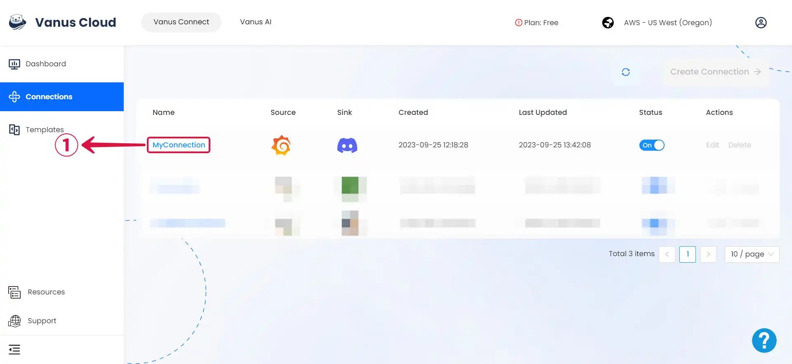

# Configuring Grafana to send Events

1. Click on your **created connection**①.

2. Click the **copy**② icon to copy the Webhook URL.

3. Log in to your [**Grafana Account**](https://grafana.com).

4. Click on the **hamburger button**③, navigate to **Alerts & IRM**④, and select **Alerting**⑤.

5. Select **Contact points**⑥, and click on **Add contact point**⑦.

6. **Name**⑧ your contact point, click on integration and select **webhook**⑨, provide the payload **URL**⑩ from Vanus Connect, and **Save contact point**⑪.

