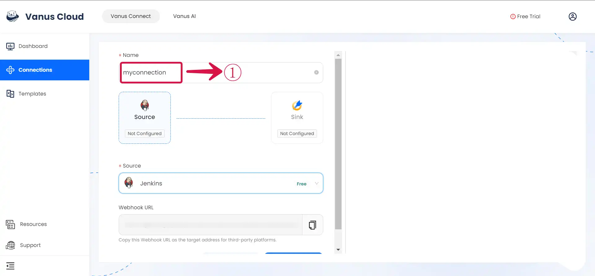

# Jenkins

This guide contains information to set up a Jenkins Source in Vanus Connect.

## Introduction

Jenkins is a widely-used automation server that simplifies software development. It enables continuous integration and delivery, streamlining tasks like building, testing, and deploying code. With its extensive plugin ecosystem and active community support, Jenkins is a reliable choice for creating efficient automation solutions.

The Jenkins source connector enables the retrieval of build information through a payload URL. To achieve this, it is necessary to establish a connection within Jenkins.

## Prerequisites

- A Jenkins account
- A [**Vanus Cloud account**](https://cloud.vanus.ai).

---

**Perform the following steps to configure your Jenkins Source**

### Jenkins Connection Settings

To obtain all Jenkins events in Vanus Connect, follow these steps:

- Write a **Name**① for your connection in Vanus Connect.

- After creating the connection, there are a few more steps. Simply click the **document**② link to open a new page with all the details on how to complete the connection.

- Click **Next**③ and continue the configuration.

---

Learn more about Vanus and Vanus Connect in our [***documentation**](https://docs.vanus.ai).
