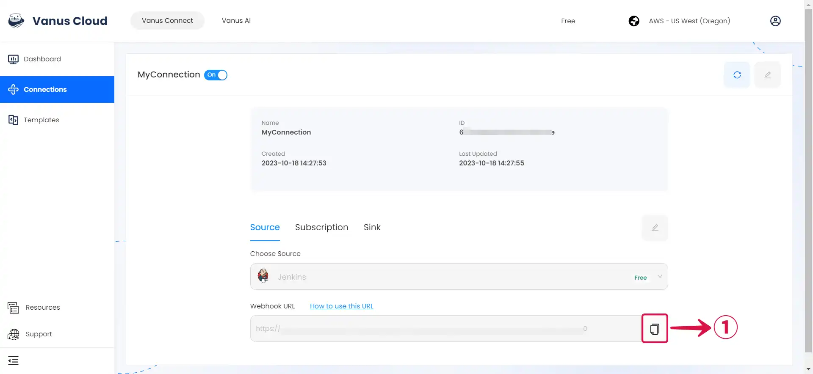
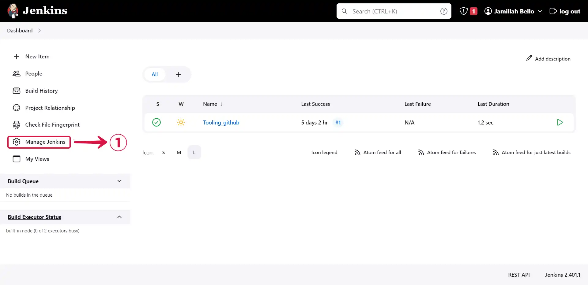
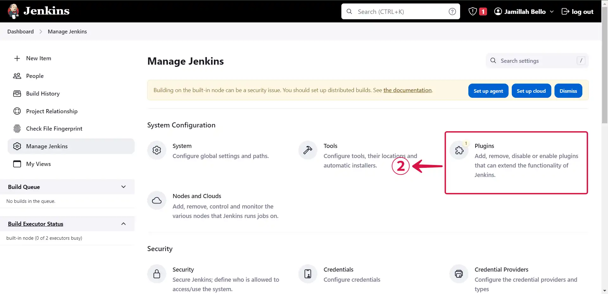
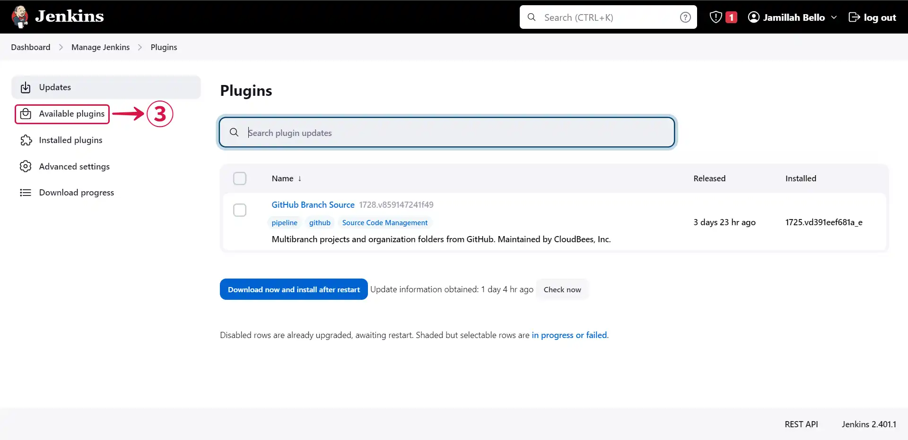
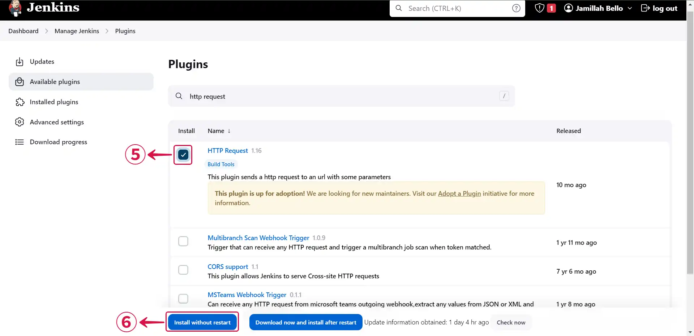
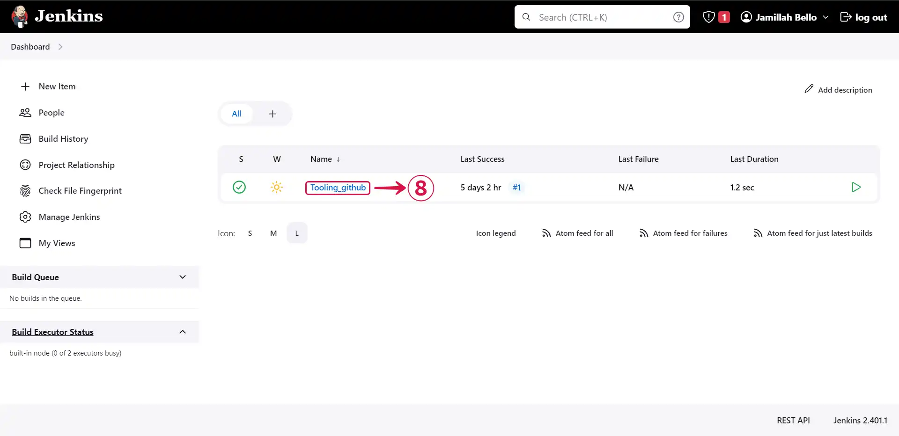
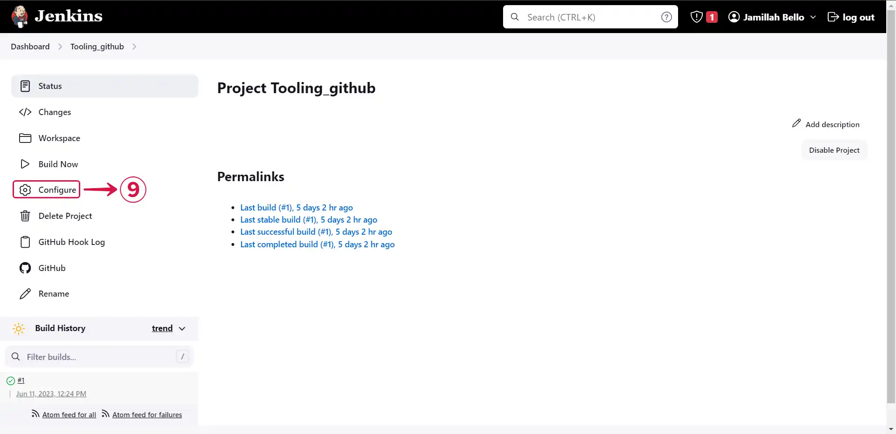
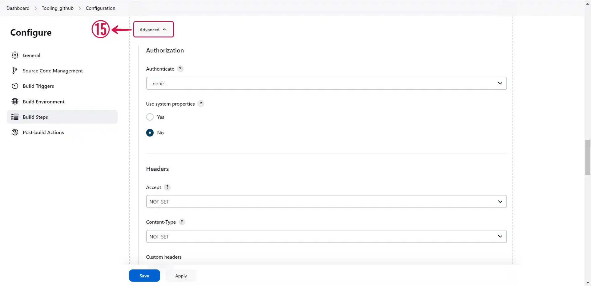
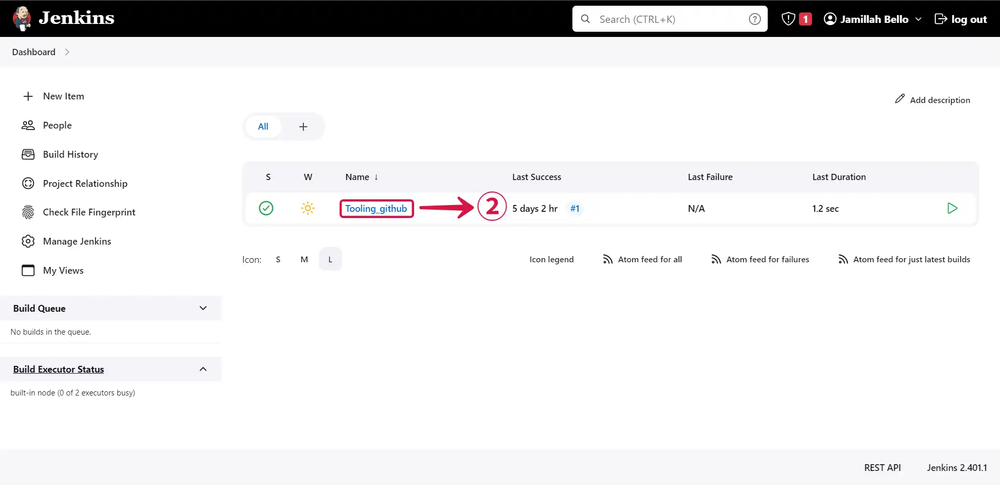
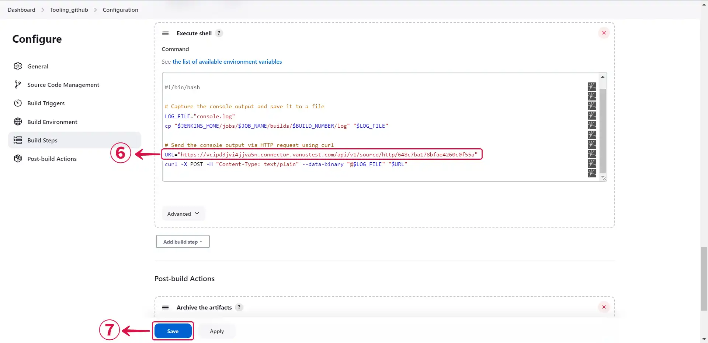

# Configuring Jenkins to Send Webhook Events

import Tabs from '@theme/Tabs';
import TabItem from '@theme/TabItem';

## Step 1: Configure webhook

1. Click the **copy icon**① to copy the webhook url

2. Log in to your Jenkins account.

## Step 2: Send Jenkins Event

<Tabs>

<TabItem label="Plugin" value="plugin">

1. Click on **Manage Jenkins**①.

2. Navigate to the **Plugins**② section.

3. Click on **Available plugins**③.

4. Search for **http request**④.

5. **Select**⑤ the plugin and click on **Install without restart**⑥.

6. Click on **Go back to the top page**⑦.

7. Access your **project**⑧ by clicking on it.

8. Click on **Configure**⑨.

9. Scroll down to **Build Steps**⑩ and click on **Add build step**⑪.

10. Select **HTTP Request**⑫.

11. Provide the payload **URL**⑬ copied from your Jenkins source connector in Vanus Connect and choose **POST**⑭ as the HTTP mode.

12. Click on **Advanced**⑮ to see more settings.

13. Set your desired parameters and click on **Save**⑯.

</TabItem>

<TabItem label="Script" value="script">

1. Click on **Manage Jenkins**①.

2. Click into your **project**②.

3. Scroll down to **Build Steps**③ and click on **Add build step**④.

4. Click on **Execute shell**⑤.

5. Compose your code in the command field, including the Jenkins source connector's copied payload **URL**⑥, and click on **save**⑦.

</TabItem>

</Tabs>

:::note
If you are employing a custom script to transmit events, there is no requirement to install the HTTP Request plugin.
:::
