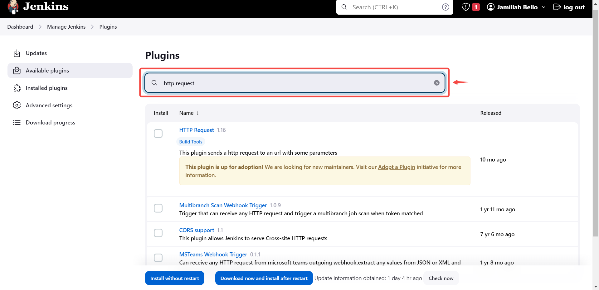
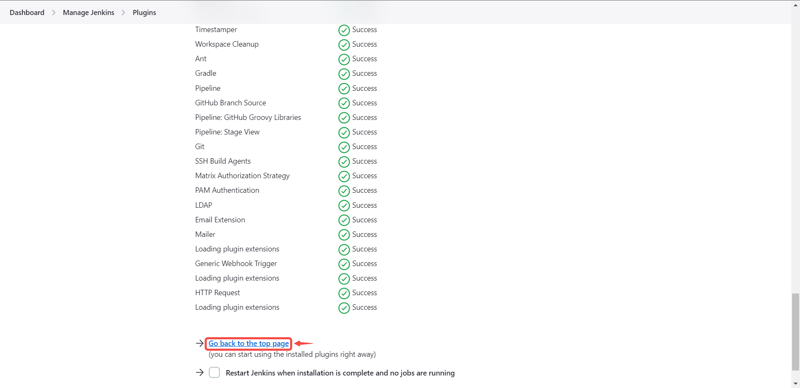
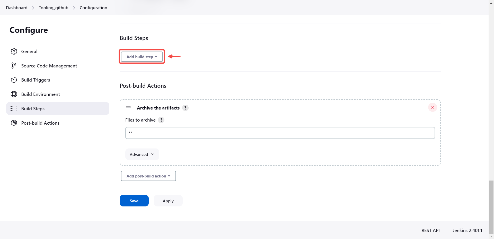
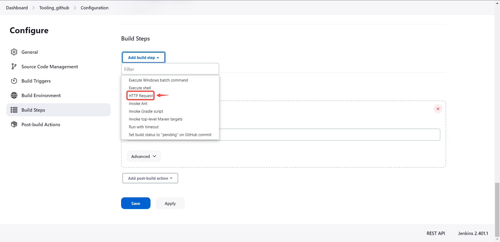
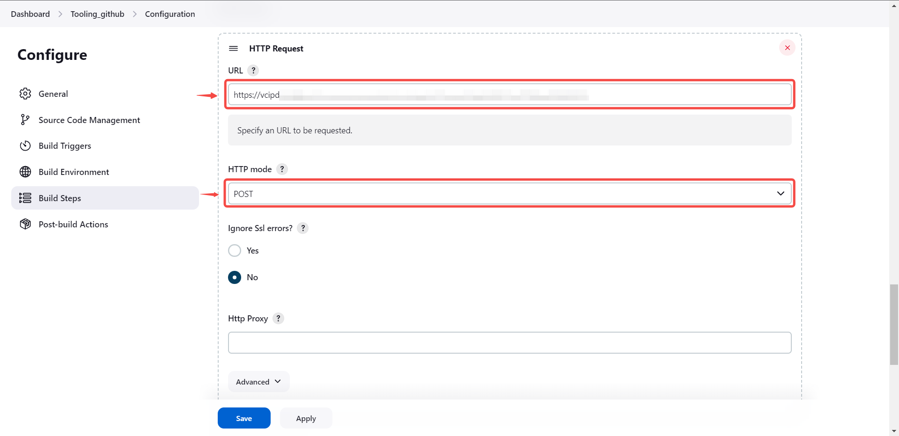
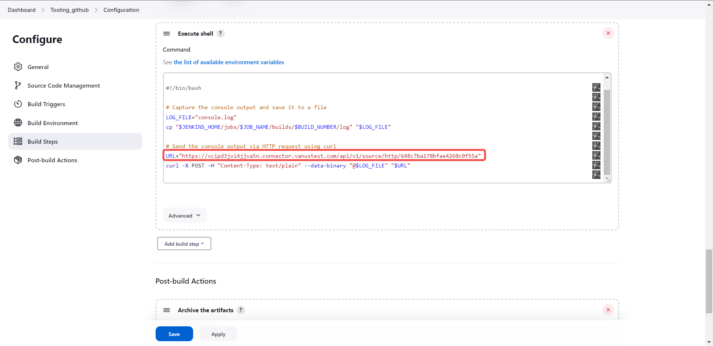

### Configuring Jenkins to Send Webhook Events 

### Step 1: Configure webhook

1. Click the copy icon to copy the webhook url

2. Log in to your Jenkins account.

#### Sending events using http request plugin

1. Click on **Manage Jenkins**.

2. Navigate to the **Plugins** section.

3. Click on **Available plugins**.

4. Search for **HTTP request**.

5. Select the plugin and click on **Install without restart**.

6. Click on **Go back to the top page**.

7. Access your project by clicking on it.

8. Click on **Configure**.

9. Scroll down to **Build Steps** and click on **Add build steps**.

10. Select **HTTP Request**.

11. Provide the payload URL copied from your Jenkins source connector in Vanus Connect and select HTTP mode.

12. Click on **Advanced** to see more settings.

13. Set your desired parameters and click on **Save**.

#### Sending events using a simple script

1. Click on **Manage Jenkins**.

2. Click into your project.

3. Scroll down to **Build Step** and click on **Add build steps**.

4. Click on **Execute Shell**.

5. Write your code in the command field; ensure you include the payload URL copied from your Jenkins source connector in Vanus Connect.

6. Click on save.

:::note
If you are employing a custom script to transmit events, there is no requirement to install the HTTP Request plugin.
:::