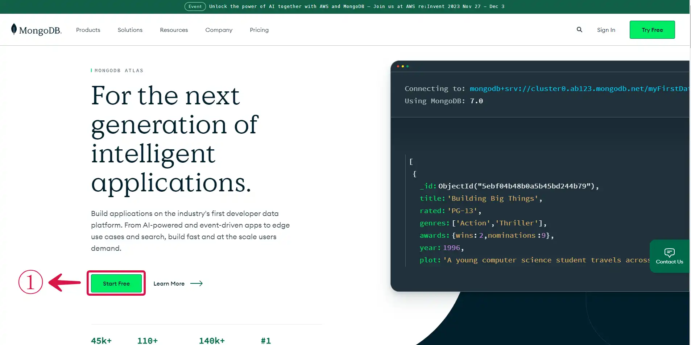
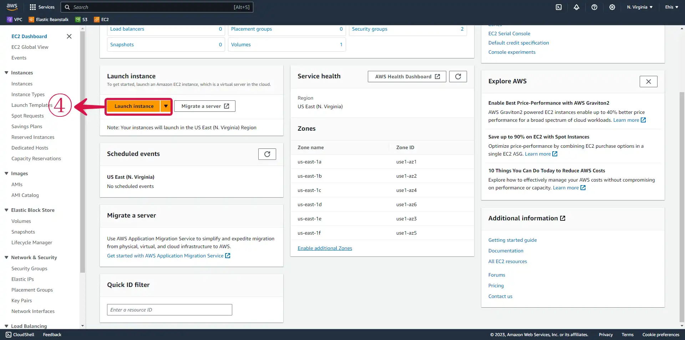
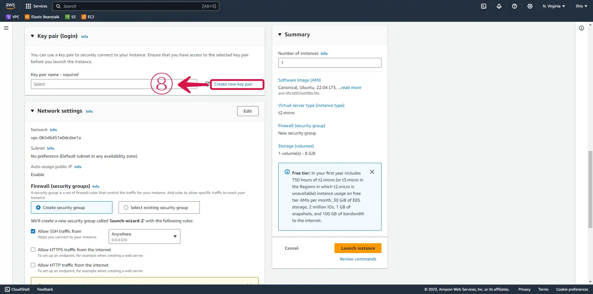
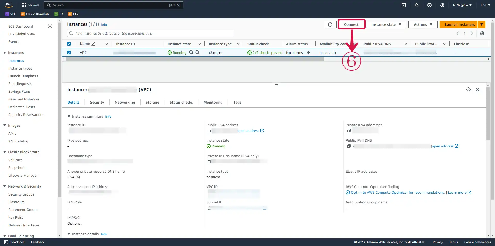
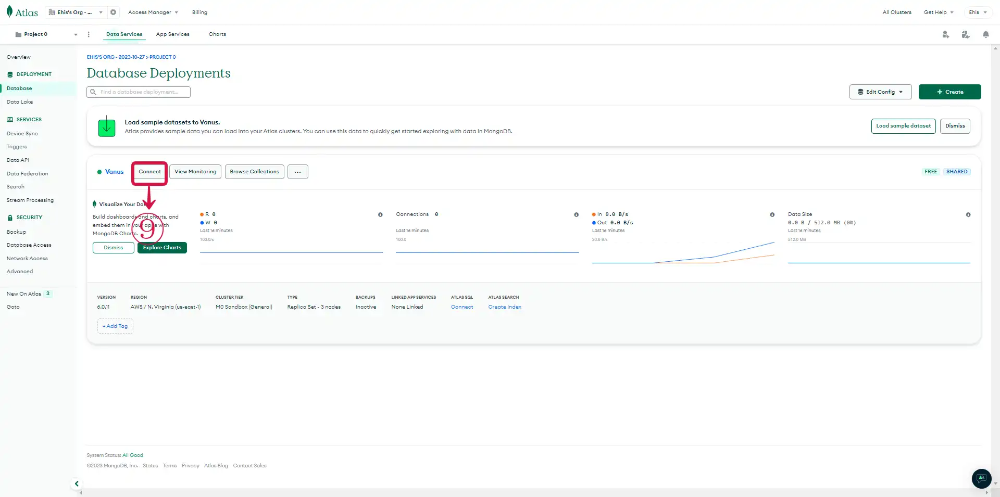
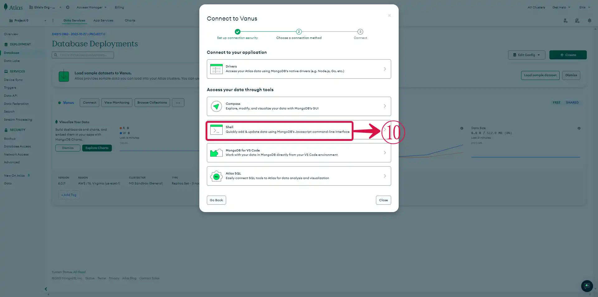
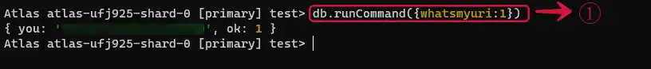
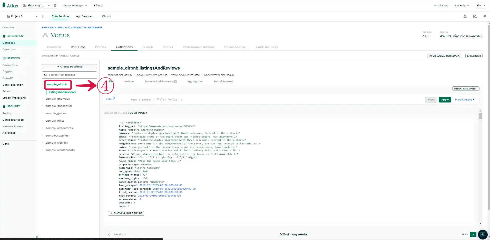
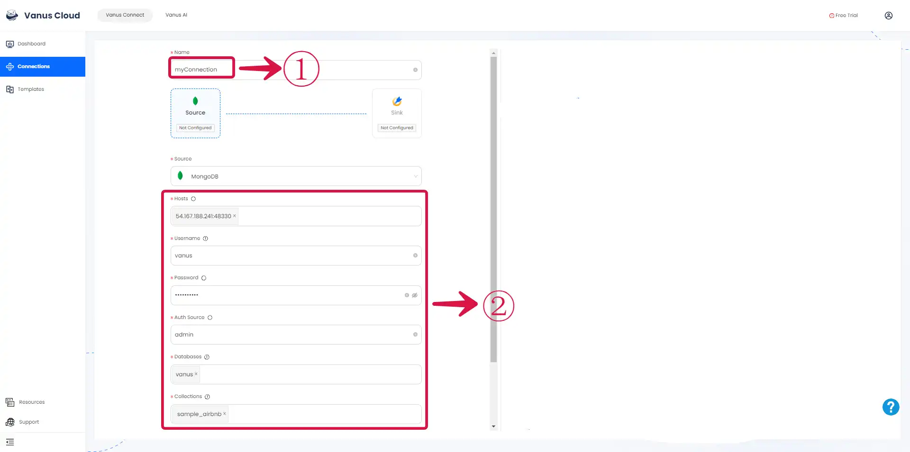

# MongoDB  

This guide contains information to set up a MongoDB Source in Vanus Connect.  

## Introduction  

MongoDB is a popular open-source document-oriented database that is designed to be scalable and flexible. Unlike traditional relational databases, which store data in tables with predefined schemas, MongoDB stores data in flexible documents that can have varying fields and structures.
This makes MongoDB particularly well-suited for use cases where the data being stored is constantly changing or has a complex structure. Additionally, MongoDB is designed to work well with large amounts of data and can easily scale horizontally across multiple servers.
One of the key features of MongoDB is its support for dynamic queries and indexing. This allows developers to easily query their data using a variety of different criteria and indexes, which can significantly improve performance.
MongoDB is also designed to be easy to use and developer-friendly. It has a powerful query language and a variety of APIs for interacting with the database, and it is often used in conjunction with popular programming languages like JavaScript and Python.

The Vanus MongoDB source connector is a connector provided by Vanus, that extracts data from the users MongoDB database, converts it into CloudEvents, and streams it to their selected system/sink connector. The connector continuously monitors the MongoDB database for changes and captures those changes in real-time. To use the Vanus Connect mongodb source connector, you need to provide a host, username, password, Auth Source, Database, and Collection, which are required to authenticate and authorize access to your MongoDB account. 

## Prerequisites   
- A [MongoDB account](https://account.mongodb.com/account/register)   
- Host  
- Username  
- Password  
- Auth Source  
- Databases  
- Collections  

## Getting Started

### Step 1: Setup a MongoDB database  

#### Create a MongoDB account(for 1st time users without an account)

1. Go to the [official MongoDB website](https://www.mongodb.com/) and click on **Start free**① to create a free account. 

   


2. Sign up with your preferred **authentication method**②.   

   


>**Note** MongoDB Atlas is a cloud-based and fully-managed version of the MongoDB database. It is designed to simplify the process of deploying and managing MongoDB in the cloud. It includes features such as automatic scaling, backup and recovery, and performance optimization. The MongoDB website refers to Atlas as it is one of the primary ways to use the MongoDB database in a cloud environment.

##### Project details information   

Answer some few questions like:

- **What is your goal today?:**③ These are questions designed to help MongoDB Inc understand the users goals and requirements for using the MongoDB database in the cloud. The questions are designed to understand the user's specific needs and use case. Based on their responses, MongoDB Inc. can provide personalized guidance and resources to maximize the benefits of their MongoDB deployment, ensuring a successful implementation in the cloud.


- **What is your preferred language?:**④ This section is a way for MongoDB Inc. to gather information about the user's technical skills and preferences, and to provide customized support to ensure a successful MongoDB deployment. Select your preferred programming language.

- Click the **Finish**⑤ button.


#### Setting up your MongoDB database      

- Select the **M0**⑥ template for a free deployment.  

- **Select**⑦ your preferred cloud provider, we selected AWS, but you have the option to go with google cloud or azure.  


>**Note** Atlas MongoDB asks users to choose a cloud provider to host their MongoDB deployment. This is because Atlas is a cloud-based database service that needs to know which provider the user wants to use to optimize performance, security, and cost-effectiveness within that provider's environment. Different cloud providers offer different features and capabilities, so Atlas MongoDB can provide customized recommendations and resources based on the user's chosen provider. Choosing a cloud provider is an essential step to set up the MongoDB deployment properly and ensure optimal performance and security.

- Select your preferred **Region**⑧. The region you want your resources to be deployed in.   

- Choose a **Name**⑨ for your Cluster.  

>**Note** A cluster in MongoDB is a group of servers or nodes that work together to store and manage data. It typically consists of multiple instances of the MongoDB database, which communicate with each other to ensure data consistency and availability.
A cluster provides high availability and scalability to a MongoDB deployment, enabling it to handle large amounts of data and traffic. By distributing data across multiple nodes, it ensures that data remains accessible even if some nodes fail

- Click on **Create**⑩ to create your database.  


##### Security Setup   

- **Select**⑪ your preferred means of authentication. 

- For the users who chose **Username and Password**⑫, type your username in the username field. You can choose to either type your password or have Atlas autogenerate a secure password for you.  

- Click on **Create User**⑬ to create the user.  


##### Setting up the host

We are going to be using an EC2 instance running the Ubuntu AMI to connect to our DynamoDB database. We need to set that up before moving to the next step.  

1. Log in to the [AWS Management Console](https://aws.amazon.com/)   

2. Click on the left navigation pane called **Services**① and select **Compute**②. A list of all compute services would be listed out, select **EC2**③.

   


3. Click on the **Launch Instance**④ button.

   

###### Name and AMI setting

4. Give your instance a **Name**⑤ and **Select**⑥ an Amazon machine image for the instance. Click on the AMI button to select your preferred server. Select a server that is **free tier eligible**⑦ to prevent extra cost.

   

5. **Create new key pair**⑧, to enable you SSH into your server. 



6. Provide the **Key pair name**⑨. Leave the **key pair type**⑩ on the default selection. For the Private key file format, select the **.pem**⑪ if you plan on using your terminal to SSH into your instance, or select **.ppk**⑫ if you want to use putty. Click on **Create key pair**⑬ to finish the creation of the key pair. 

    

7. Leave the default VPC and subnet.  

8. **Create Security group**⑭. We allowed SSH traffic from **Anywhere**⑮ because we intend to terminate the instance immediately after the test, it's best practice to set the specific IP you want to have access to your instance. Leave the storage section in its default setting. Click on **Launch Instance**⑯ when you're done with the required settings.  

 

9. Check the box before the instance name, to see the drop down menu. **Copy**⑰ your public IP, it would be needed to set a host for MongoDb.

   


#### MongoDB connection setting.

1. Choose a connection point, select **Cloud Environment**①.  

2. Set your network security and input the **IP Address**② of the created EC2 instance.  

3. Click **Add Entry**③ to save the IP.  

4. Click **Finish and Close**④ to complete setup.  

      

5. Your database is ready to be used. Click on **Go to Overview**⑤ to access to your database page.  

      

###### SSH Into your EC2 Instance

Now we want to SSH into our EC2 instance to enable us connect to our database host.  

1. Click the **Connect button**⑥.

      


2. On the Connect to instance page, select **SSH Client**⑦ and **Copy**⑧ the example command given.

      


3. Open up your terminal and paste the code in the same folder/directory your key pair was downloaded into. You have successfully connected to your instance.

  


#### MongoDB cluster Connection 

1. Go to your MongoDB Database page and click on the **Connect**⑨ button.

   

2. Select the means through which you would connect to your database. We chose the **Shell**⑩.  

  

3. Select your **operating system**⑪ and **copy download URL**⑫. 


4. **Paste**⑬ it in our terminal with the download command.

```
wget https://downloads.mongodb.com/compass/mongodb-mongosh_1.10.6_amd64.deb
```

   
   
5. Return to the Atlas page, click on the **[How to](https://www.mongodb.com/docs/mongodb-shell/install/)**⑭ link to get step by step instructions on how to add your mongosh directory to your $PATH variable. **Copy**⑮ the connection string provided in **Step 3** of the **Connect to Cluster** page. 

   

6. Paste the command in your terminal, you would be prompted for your password. Type the password you set for database authentication.  

  

You are now connected to your MongoDB database.  

#### Get the information needed for the Vanus source connection.

1. To find your Host, run the command **db.runCommand({whatsmyuri:1})**① and it'll be outputed to the terminal.  

  


2. To find your **AuthSource**, run **db.runCommand({connectionStatus: 1})**② on your terminal and it'll output your AuthSource. It's usually **admin**, but can be changed by users, so it's better to confirm it. 

  


3. Go to Atlas Database page and click on **Browse collections**③ to see your collections. 

 

4. **Copy**④ the name of the one you plan on making the Vanus Connect Source connection with.  

     

### Step 2: Configure your MongoDB Vanus Connect Source Connection 

1. Return to your Vanus Connection page.  

2. Give the connection a **Name**①, and **input**② the required details in the source configuration.

  

3. Click on the **Fetch Schema**③ button to fetch the schema of your MongoDb and click **Next**④.  

   


Learn more about Vanus and Vanus Connect in our [documentation](https://docs.vanus.ai/getting-started/what-is-vanus)
