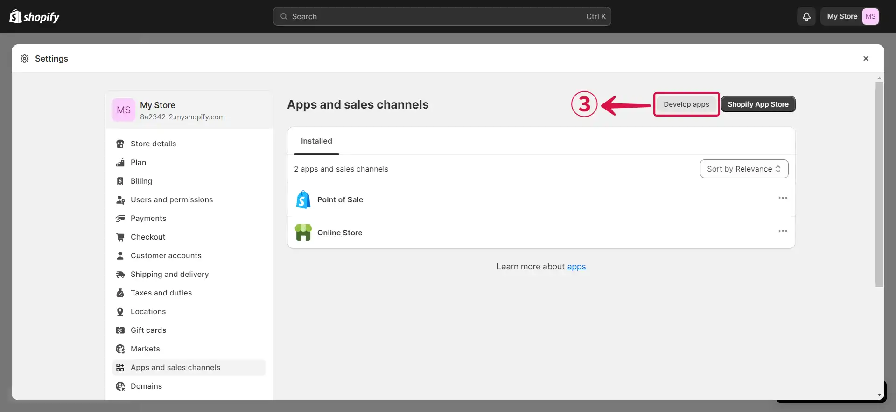
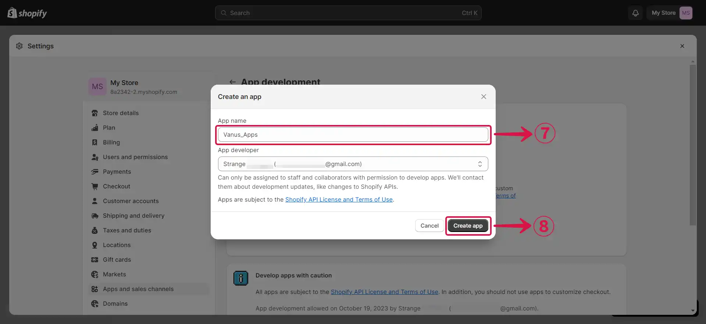
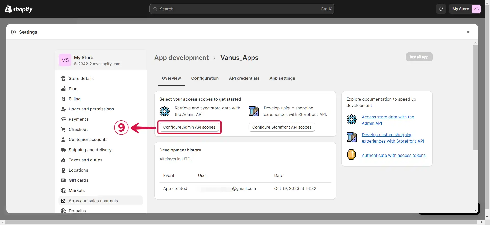
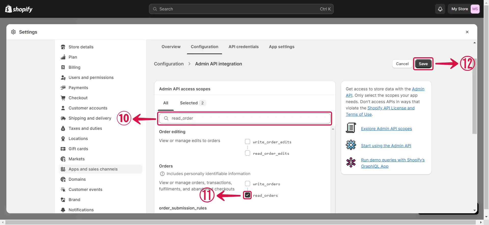
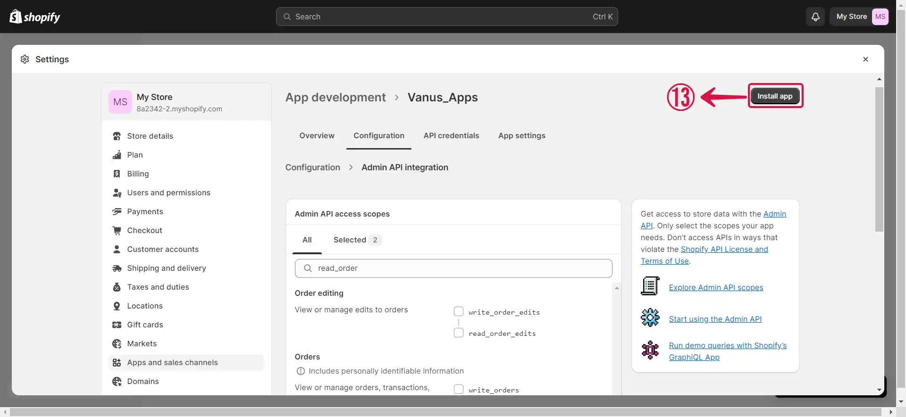
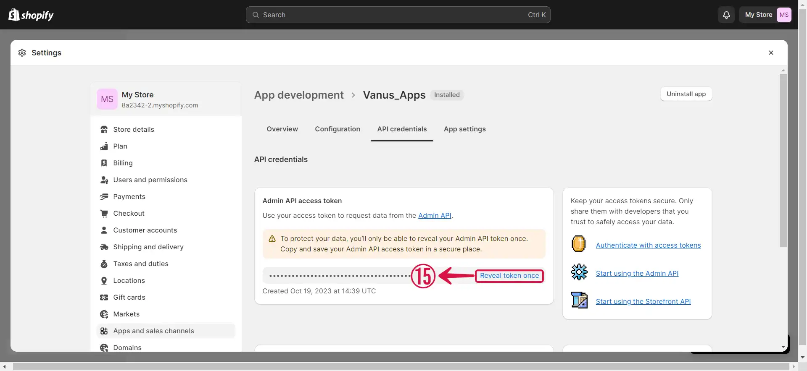
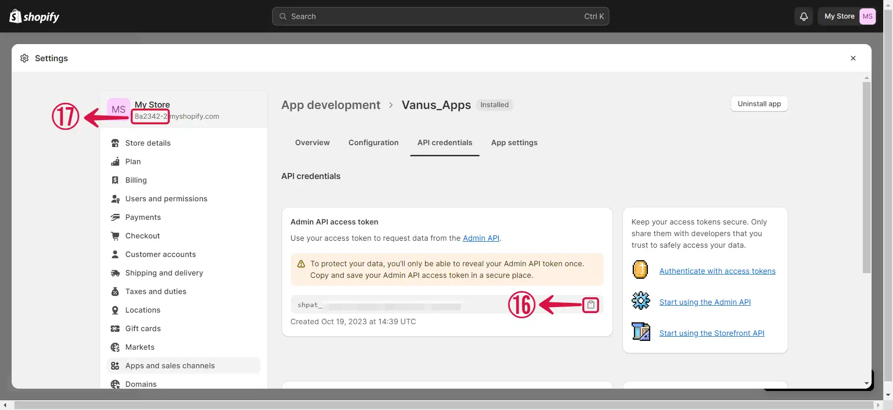
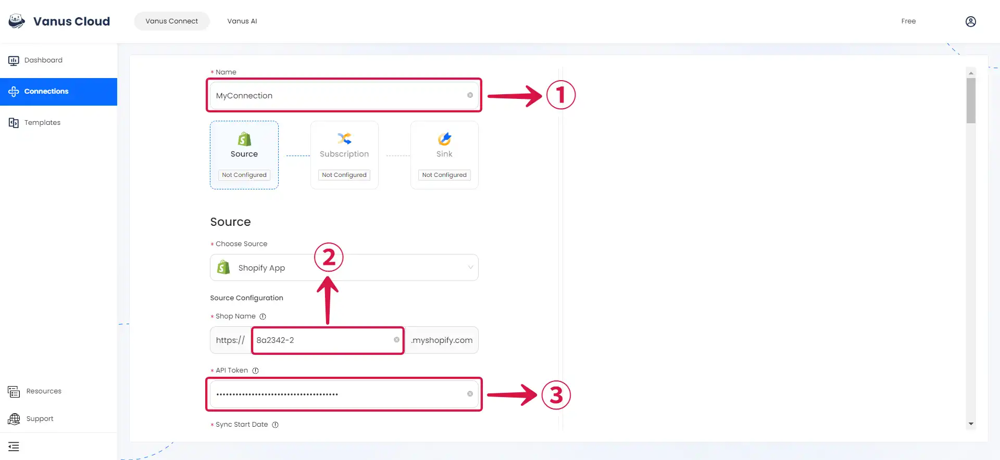
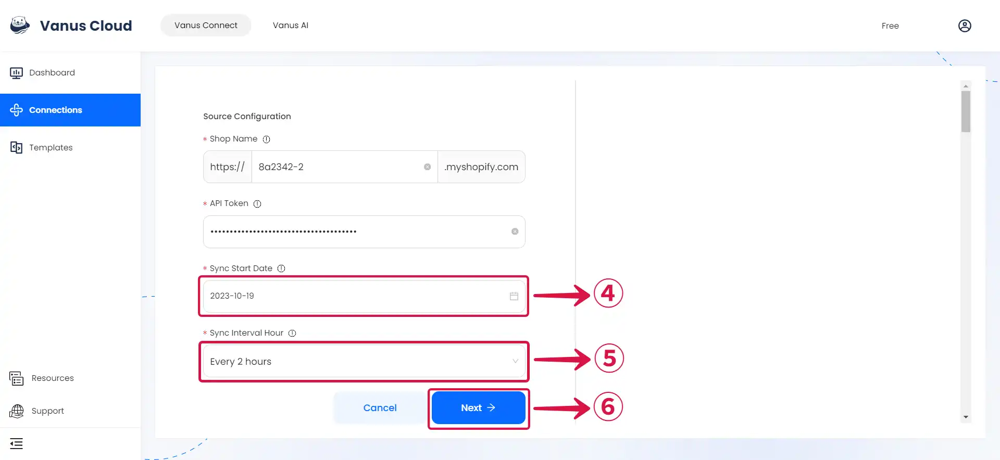

# Shopify App

This guide contains information to set up a Shopify App Source in Vanus Connect.

## Introduction

Shopify is a popular e-commerce platform that allows businesses to sell their products online.

With the Shopify App source connector in Vanus Connect, you can create a Shopify App to obtain real-time updates on all customer and order activity in your Shopify store.

## Prerequisites

Before obtaining Shopify events, you must have:

- A [**Vanus Cloud account**](https://cloud.vanus.ai)
- A Shopify shop with administrative privileges.

---

## Getting Started

### Step 1: Create an App

1. Go to [**Shopify**](https://shopify.com) and sign in to your account to access the shopify dashboard.

2. After signing in, navigate to **`Apps  >`①** in the side menu, where a list will appear at the top of the page. Click on **App and sales channel settings**②.

3. Select **Develop apps**③ to create a new app.

4. Click on **Allow custom app development**④.

5. Click on **Allow custom app development**⑤ once more.

6. Let's create a new app by clicking **Create an app**⑥ now.

7. Provide an **App name**⑦ and then click **Create app**⑧.

8. Now, we need to click on **Configure Admin API scopes**⑨.

9. **Search**⑩ for the specific event type you wish to receive, such as `read_orders` and `read_products`. Once found, **select**⑪ them and then click on the **Save**⑫ button.

10. Press **Install app**⑬.

11. Click **Install**⑭ to proceed.

12. Click on **Reveal token once**⑮ to display the Admin API access token.

13. **Copy**⑯ your token, and take note of your **Shop Name**⑰.

---

### Step 2: Finish the connection in Vanus Connect

1. Write a connection **Name**① without any spaces, input your **Shop Name**② and paste the **API Token**③ into Vanus Connect.

2. Select your desired **`Sync Start Date`④** to indicate when you'd like to begin receiving events, choose your **`Sync Interval Hour`⑤** to specify how frequently you want to receive updates, and then click **Next**⑥.

---

Learn more about Vanus and Vanus Connect in our [**documentation**](https://docs.vanus.ai).
