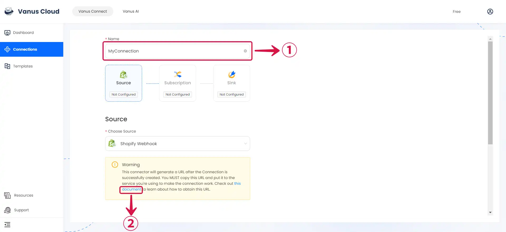

# Shopify Webhook

This guide contains information to set up a Shopify Webhook Source in Vanus Connect.

## Introduction

Shopify is a popular e-commerce platform that allows businesses to sell their products online.

The Shopify webhook Source is a webhook server that enables you to establish an endpoint for receiving events from Shopify. To achieve this, it is necessary to establish a connection within Shopify.

## Prerequisites

- A [**Vanus Cloud account**](https://cloud.vanus.ai)
- A Shopify Account

## Getting Started

### Create a Connection

To obtain all Shopify Webhook events in Vanus Connect, follow these steps:

- Write a **Name**① for your connection in Vanus Connect, select the Event or **Events**② you wish to forward and click on the **copy icon**③ to copy the Webhook URL.

---

Learn more about Vanus and Vanus Connect in our [**documentation**](https://docs.vanus.ai).
