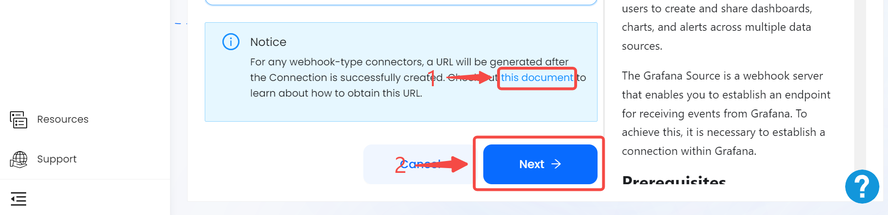

# Stripe

This guide contains information to set up a Stripe Source in Vanus Connect.

## Introduction

Shopify is a popular e-commerce platform that allows businesses to sell their products online.

The Shopify webhook Source is a webhook server that enables you to establish an endpoint for receiving events from Shopify. To achieve this, it is necessary to establish a connection within Shopify.

## Prerequisites

- A [Vanus Cloud account](https://cloud.vanus.ai)
- A Stripe Account

## Getting Started

### Create a Connection

1. Write a name for your connection.
   
2. After you finish creating the connection, there will be more steps. Please click the link to open a new tab with the following instruction.
   
3. Click **next** and finish the configurations.

Learn more about Vanus and Vanus Connect in our [documentation](https://docs.vanus.ai).
