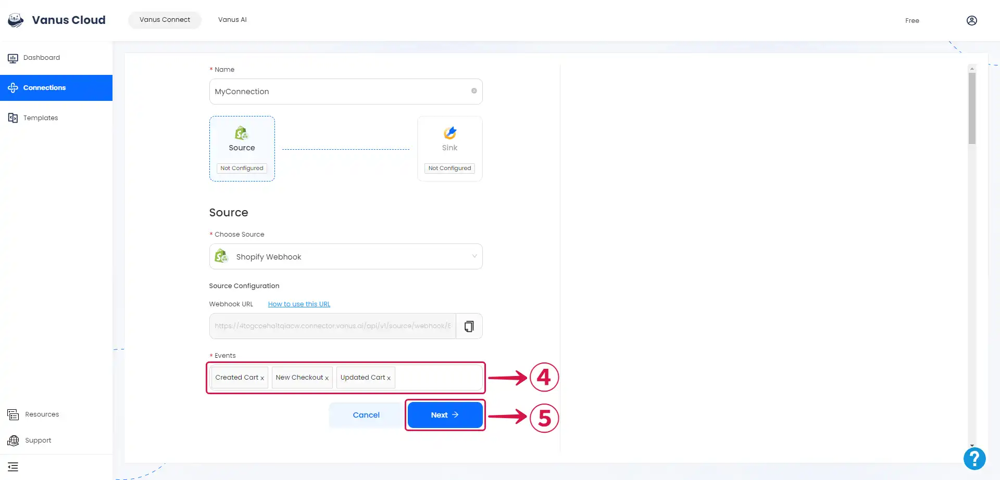

# **Configuring Shopify to Send Webhook Events**

1. go to the [**Shopify**](https://shopify.com) website, sign in to your shop dashboard, and click **Settings**①.

2. From the side menu click on **Notifications**②.

3. Now scroll down to the very bottom of the page and click on **Create webhook**③.

4. Click on the **Event field**④ and select the **Event**⑤ you'd like to send to Vanus Connect.

5. Confirm that the Format is configured as **`JSON`⑥**, paste the Webhook **URL**⑦ that was initially copied from Vanus Connect, choose the **Latest Webhook API version**⑧, and then press **Save**⑨.

:::note
If you'd like to receive multiple events you can create more webhooks using the same URL.
:::

6. Return to vanus connect and click **Next**⑩ to complete the configuration.

