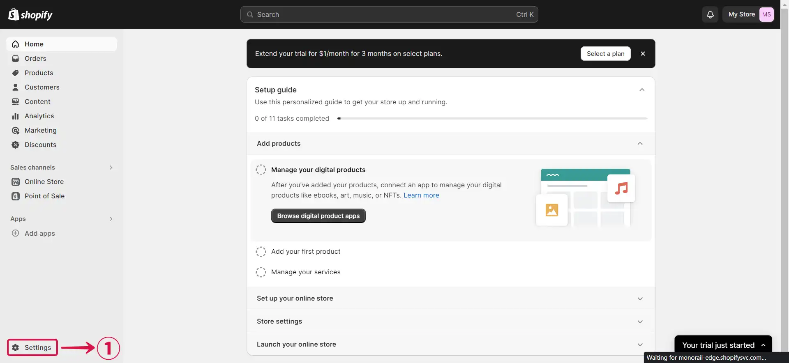
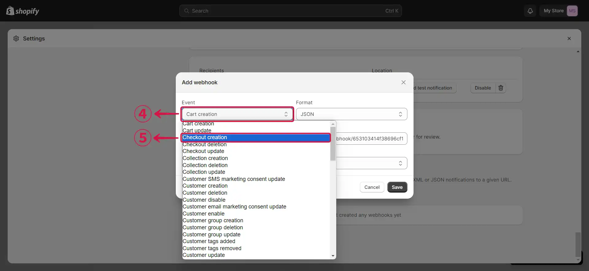

# **Configuring Shopify to Send Webhook Events**

1. Click the **copy icon**① to copy the webhook url.

2. go to the [**Shopify**](https://shopify.com) website, sign in to your shop dashboard, and click **Settings**②.

3. From the side menu click on **Notifications**③.

4. Now scroll down to the very bottom of the page and click on **Create webhook**④.

5. Click on the **Event field**⑤ and select the **Event**⑥ you'd like to send to Vanus Connect.

6. Confirm that the Format is configured as **`JSON`⑦**, paste the Webhook **URL**⑧ that was initially copied from Vanus Connect, choose the **Latest Webhook API version**⑨, and then press **Save**⑩.

:::note
If you'd like to receive multiple events you can create more webhooks using the same URL.
:::
