import Tabs from '@theme/Tabs';
import TabItem from '@theme/TabItem';

# How to use the webhook URL of a slack source

### Step 1: Configure Event Subscription
1. Click the **copy icon** to copy the webhook URL.

2. Go back to **Slack API**.

3. Now click on **Event Subscriptions** in the side menu.
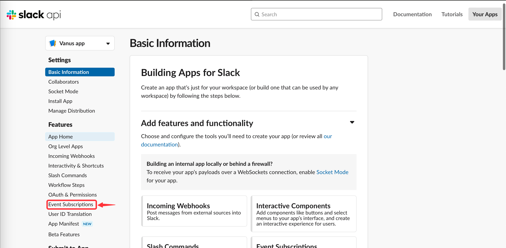
4. **Enable Events** by turning on the switch.
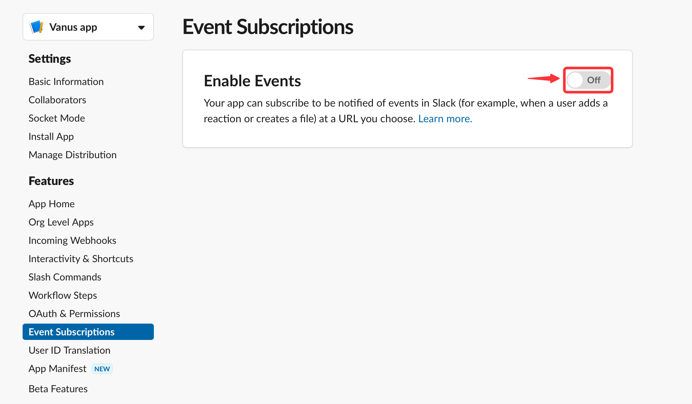
5. Use the URL we've previously copied and paste it into **Request URL**. You should see a green `Verified`, indicating our Source is verified by Slack.

---

### Step 2: Subscribe to bot events

You need to subscribe to specific events based on connection templates you chose.

| Templates                                                                |  Events need to subscribe  |
|--------------------------------------------------------------------------|:--------------------------:|
| Chat with ChatGPT via Slack bot                                          |       `app_mention`        |
| Send a custom greeting message when new members join the Slack channel   |  `member_joined_channel`   |

<Tabs>

<TabItem label="app_mention" value="app_mention">

#### How to subscribe

1. Scroll down, click **Subscribe to bot events** and after, you will be able to click **Add Bot User Event**.
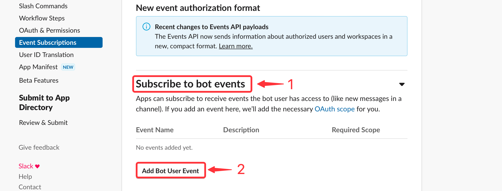
2. Select the events you will like to receive.
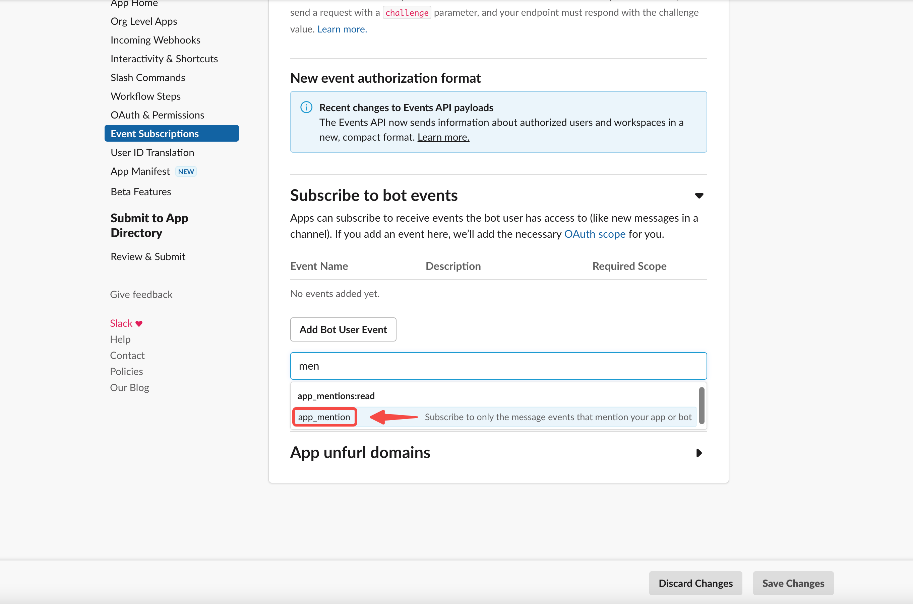
3. Finally, you can **Save Changes** to complete your configuration.
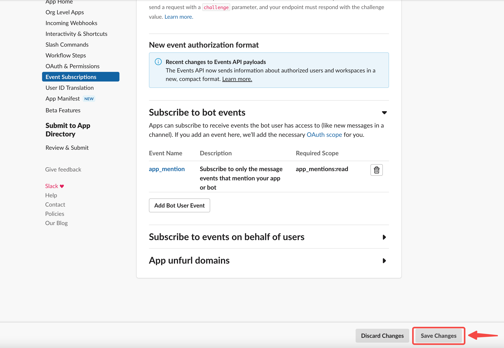

</TabItem>

<TabItem label="member_joined_channel" value="member_joined_channel">

#### How to subscribe

1. Scroll down, click **Subscribe to bot events** and after, you will be able to click **Add Bot User Event**.

2. Select the events you will like to receive.
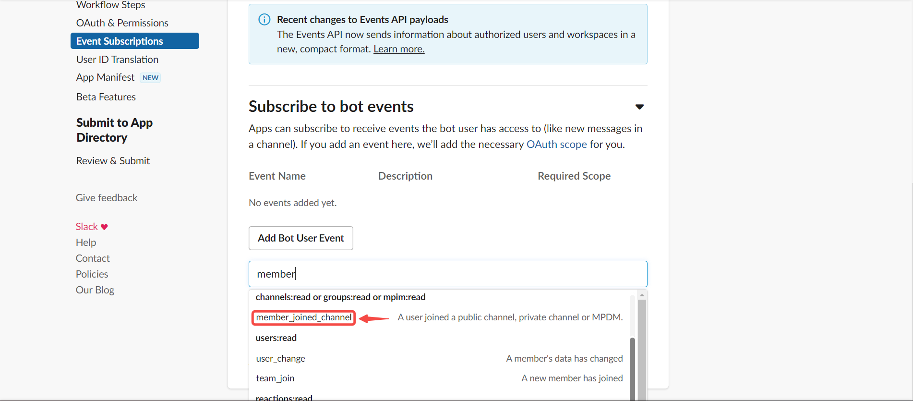
3. Finally, you can **Save Changes** to complete your configuration.

</TabItem>

</Tabs>

---

### Step 3: Install the Slack App to your Slack Workspace

<Tabs>

<TabItem label="app_mention" value="app_mention">

1. Go to **Install Apps** from the side menu and click **Install to Workspace**.
   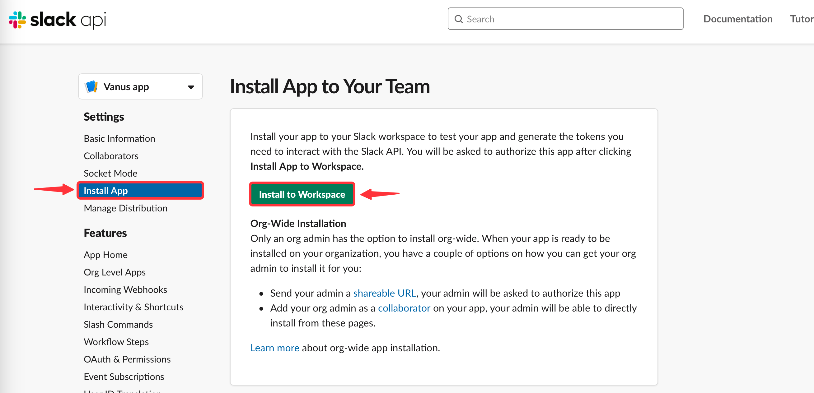
2. Allow it to be installed into your Workspace. You have to specify which channel your bot can send messages to.
      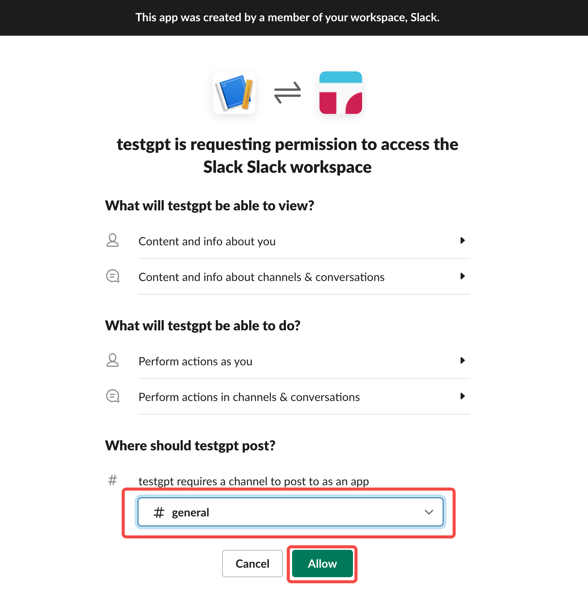
3. Mention your bot in Slack and invite it to the channel.
   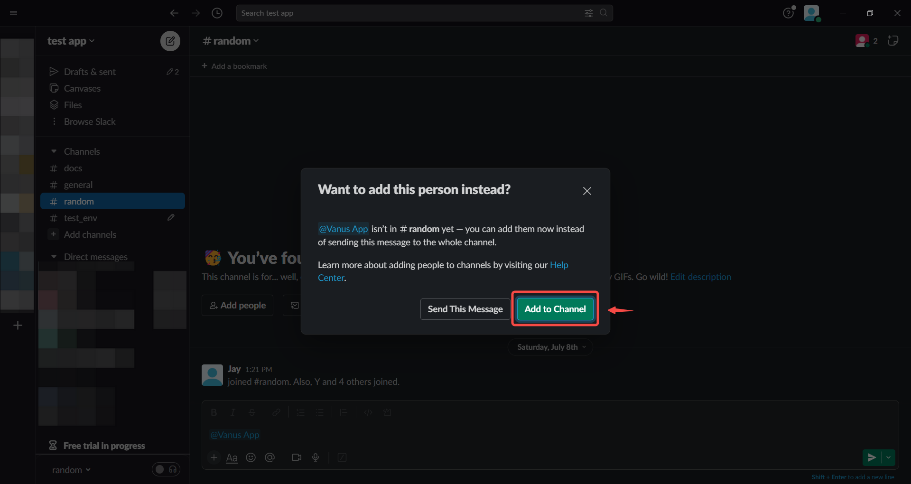
4. Now, you can chat with your gpt bot in the general channel by mentioning the bot.
   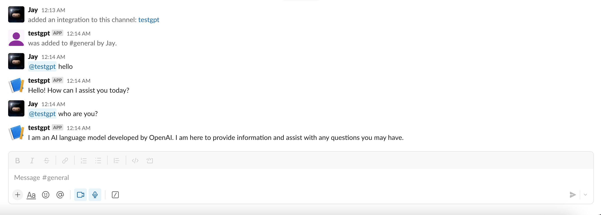

</TabItem>
<TabItem label="member_joined_channel" value="member_joined_channel">

1. Go to **Install Apps** from the side menu and click **Install to Workspace**.
   
2. Allow it to be installed into your Workspace.
      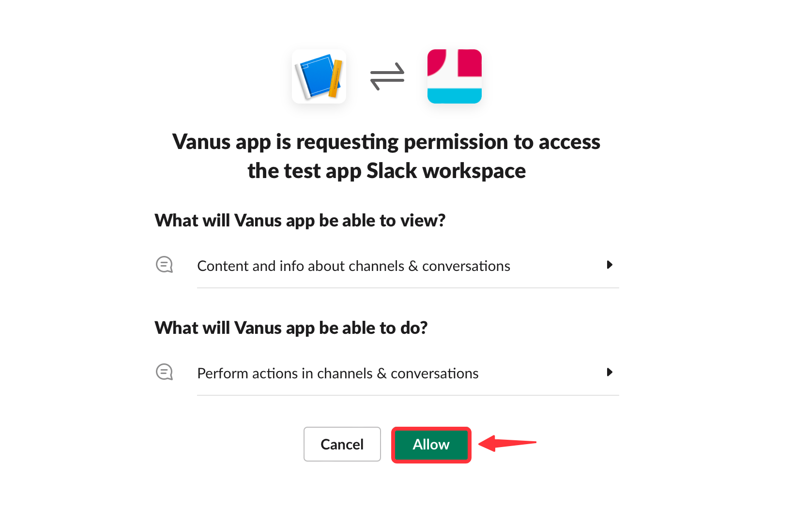
3. Mention your bot in Slack and invite it to the channel.
   

   

</TabItem>
</Tabs>
---

Learn more about Vanus and Vanus Connect in our [documentation](https://docs.vanus.ai).
