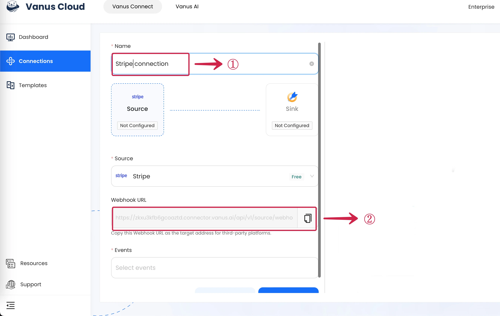
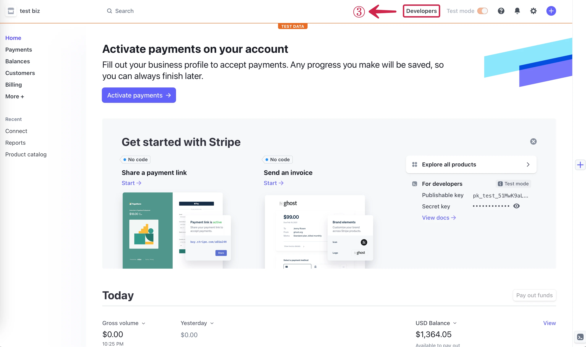
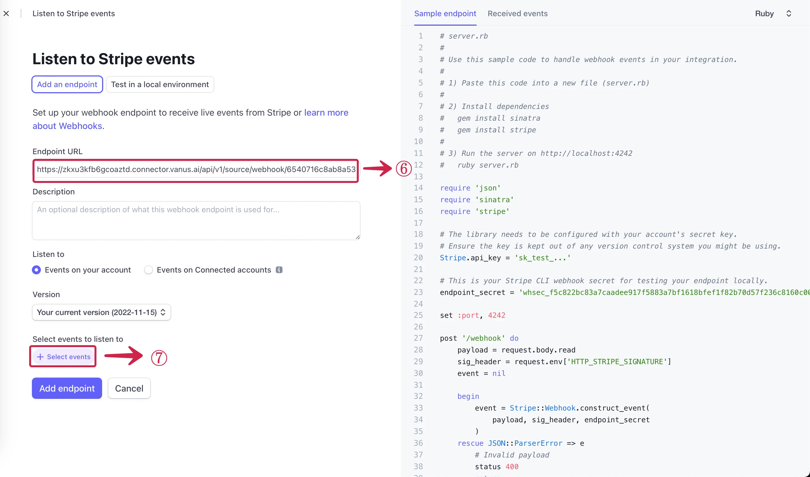
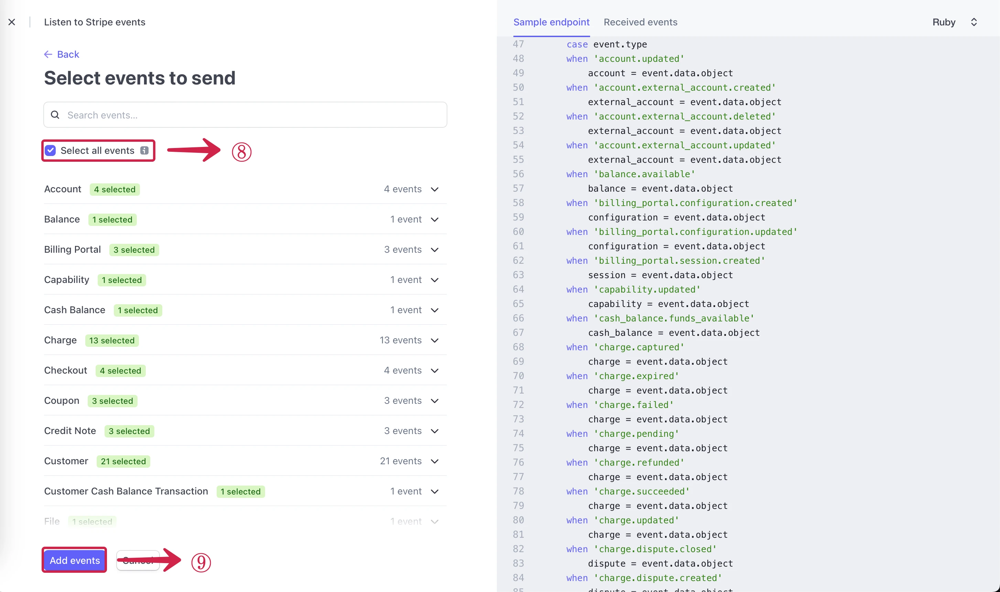
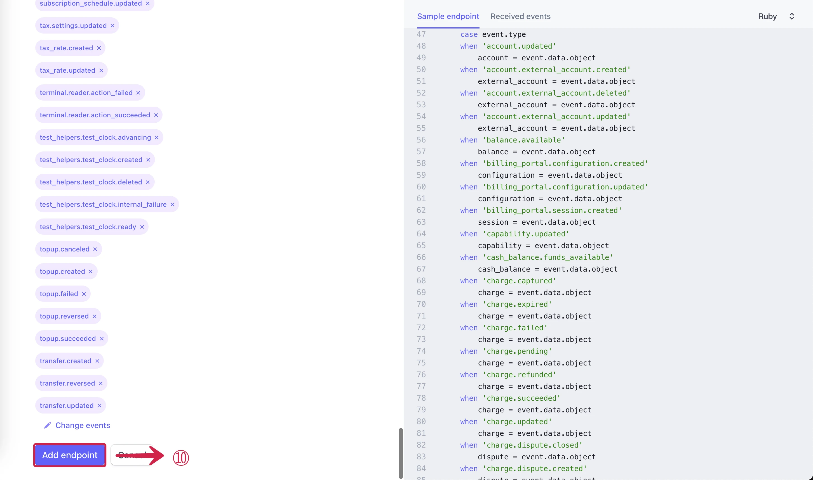
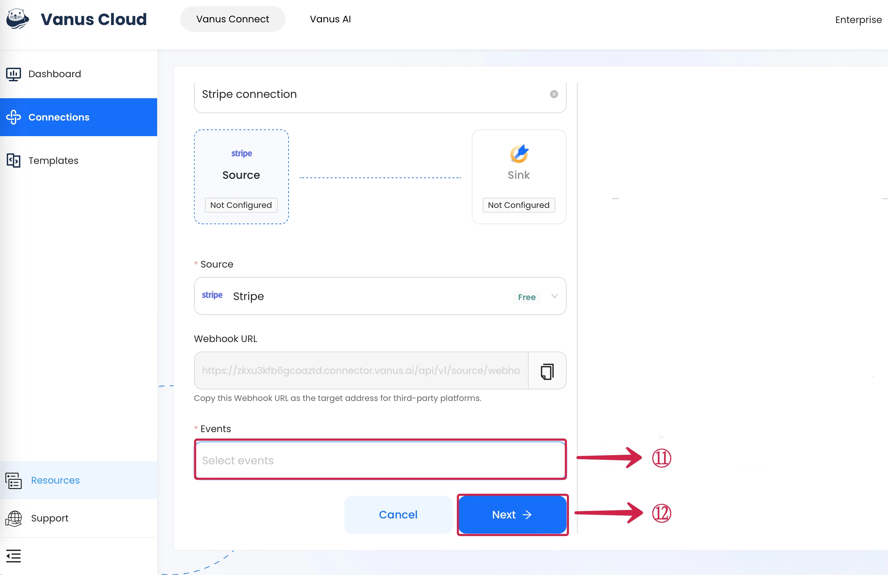

# Stripe

This guide contains information to set up a Stripe Source in Vanus Connect.

## Introduction

Stripe is a technology company that provides a suite of APIs (Application Programming Interfaces) and tools that enable businesses to process online payments and manage their financial transactions.

The Stripe Source is a webhook server that enables you to establish an endpoint for receiving events from Stripe. To achieve this, it is necessary to establish a connection within Stripe.

## Prerequisites

- A [Vanus Cloud account](https://cloud.vanus.ai)
- A [Stripe](https://stripe.com/en-jp?utm_campaign=paid_brand-CA_en_Search_Brand_Stripe-20414540763&utm_medium=cpc&utm_source=google&ad_content=653813322897&utm_term=stripe&utm_matchtype=e&utm_adposition=&utm_device=c&gclid=Cj0KCQjwy4KqBhD0ARIsAEbCt6hGBT5EI7mZFdN4gT_XCM1ZqNgNscgrBcwyVW4b9_td8r44pvOxrSUaAtZhEALw_wcB) Account

## Getting Started

### Create a Connection

1. Write a connection **Name**① and **Copy**② the Webhook URL.

2. Go to your Stripe **Developers**③ Dashboard.

3. Select the **Webhooks**④ tab.

5. Click on **Add an endpoint**⑤.

6. Paste the webhook URL to the **Endpoint URL**⑥ field from Vanus AI, and click on **Select events**⑦.

7. **Select all events**⑧ and click on **Add events**⑨.

8. Now scroll down and click **Add endpoint**⑩.

9. Select the **Events**⑪ you want to receive and Press **Next**⑫ to continue.

Learn more about Vanus and Vanus Connect in our [documentation](https://docs.vanus.ai)
