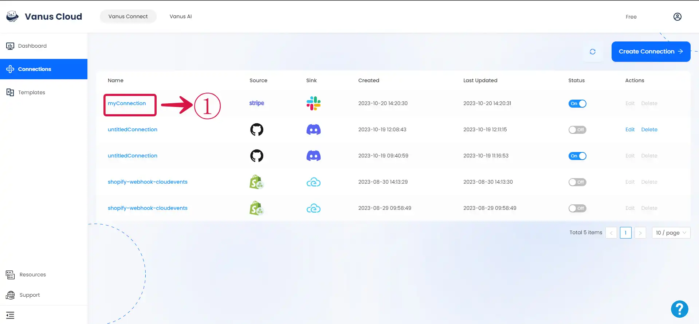
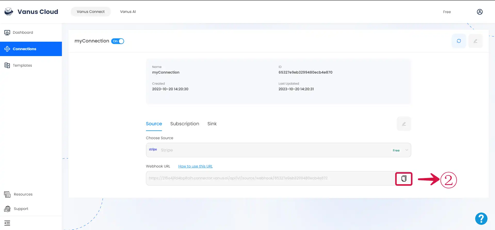
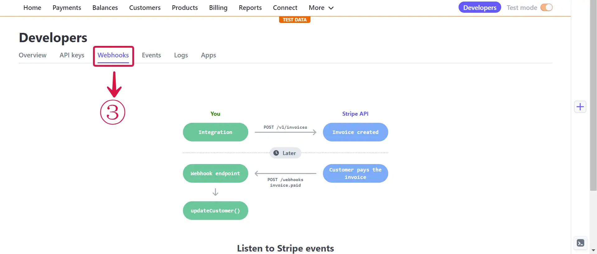
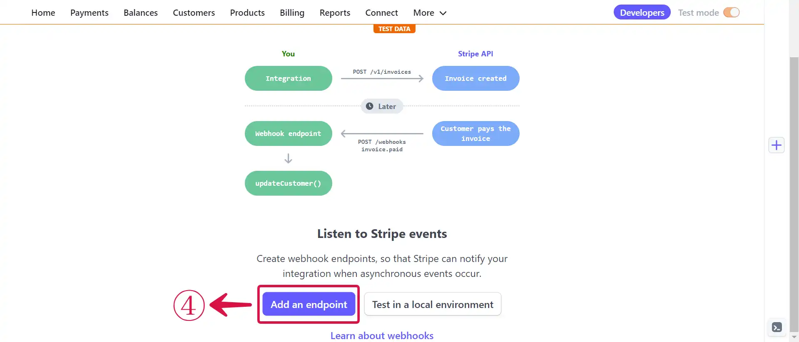
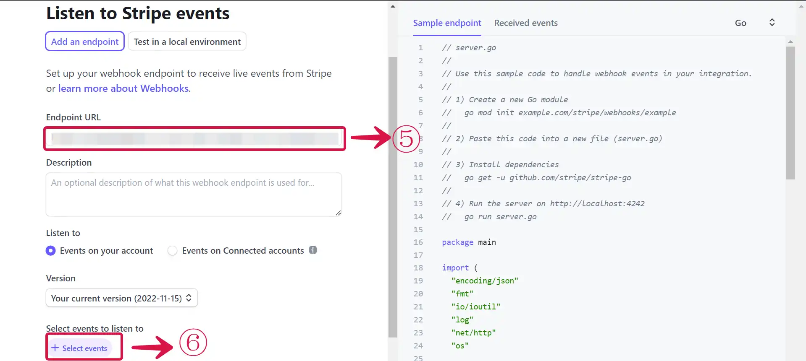
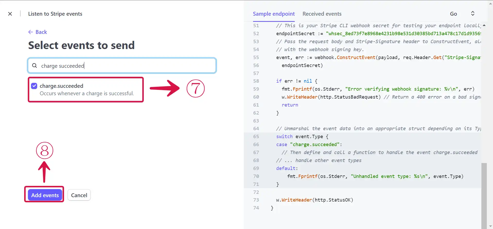

# **Configuring Stripe to Send Webhook Events**

After creating the connection in Vanus Connect, we have to configure our connection to receives events from our Stripe.

1. Click on the **connection name**①.

 

2. **Copy**② the Webhook URL.

 

3. Go to your Stripe Developers Dashboard and select **Webhooks**③ tab.

 

4. Scroll down and click on **Add an endpoint**④.

 

5. Paste the **Endpoint URL**⑤ you copied previously, click on **Select events**⑥.

6. Select **charge.succeeded**⑦ event and click on **Add events**⑧ button.

 

