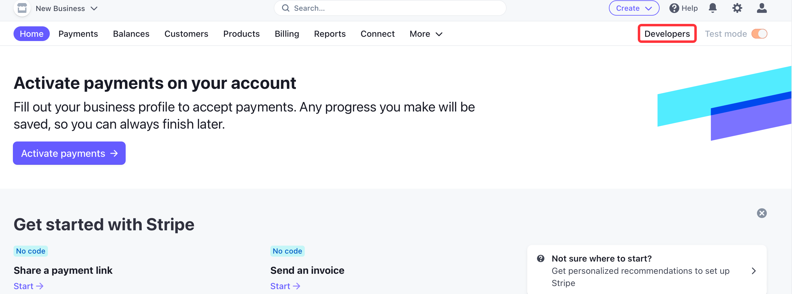
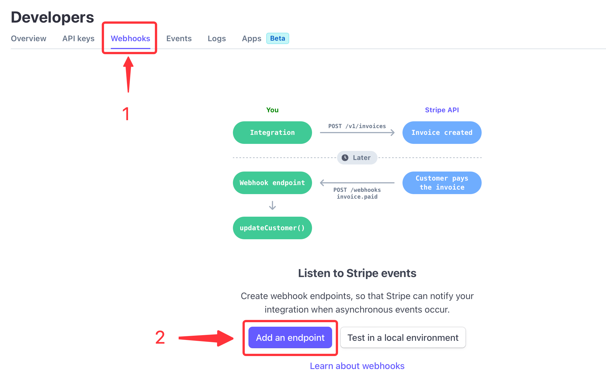
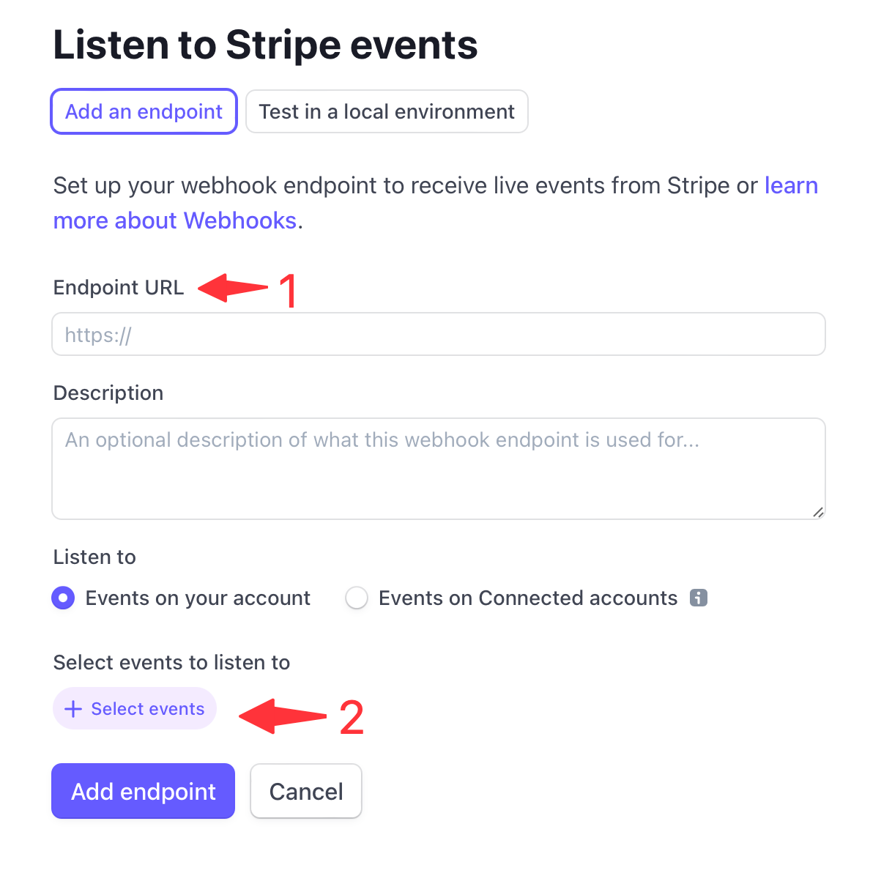

# **Configuring Stripe to Send Webhook Events**

1. Click the copy icon to copy the webhook url.
   
2. Log in to your Stripe account and navigate to the **Developer** section.
   
3. Click on **Webhooks** in the left-hand menu, and click on the **Add endpoint** button to create a new webhook.
   
4. Enter the URL you previously saved for your webhook endpoint from Vanus Connect and select the events you want to receive notifications for. Stripe offers a wide range of events, such as `charge.succeeded`, `invoice.paid`, and `customer.subscription.updated`.
   
5. Click on the **Create endpoint** button to save your webhook.