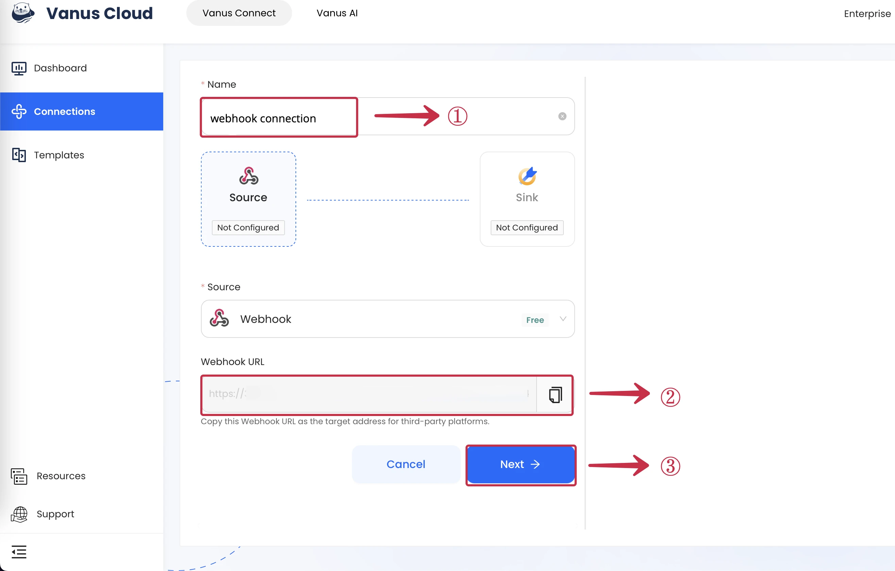

# Webhook server

1. Copy the **Webhook URL**①.



2. Use the Webhook URL to send HTTP request from an app or from a **Command Line**②.


```shell
curl --location --request POST 'YOUR_WEBHOOK_URL' \
--header 'Content-Type: text/plain' \
--data-raw '{
"test":"demo"
}'
```

## 3rd Party Services
A list of application that can send HTTP request to our webhook server.
- Zapier
- IFTTT (If This Then That)
- GitHub
- Bitbucket
- GitLab
- Stripe
- Mailchimp
- Shopify
- Salesforce
- Trello
- more

Vanus Connect webhook can receive any kind of HTTP request.
