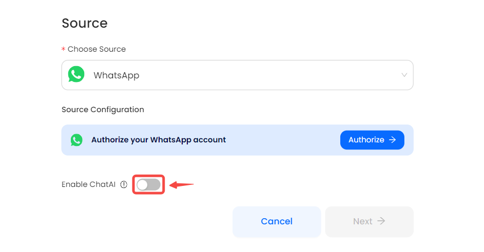

# WhatsApp

This guide contains information to set up a WhatsApp Source in Vanus Connect.

## Introduction

WhatsApp is a widely-used messaging application that allows users to send messages, make calls, share files, and participate in group chats. It offers a user-friendly interface, cross-platform compatibility, and features like end-to-end encryption. With its popularity and regular updates, WhatsApp has become a primary communication tool for individuals, families, friends, and businesses worldwide.

The WhatsApp source connector enables users to transmit events from their WhatsApp account to external sources. Moreover, it facilitates the seamless integration of ChatGPT with WhatsApp, allowing for effortless communication and interaction with ChatGPT directly from your WhatsApp account.

## Prerequisites

- A [WhatsApp account](https://www.whatsapp.com)

---

**Perform the following steps to configure your WhatsApp Source.**

### WhatsApp Connection Settings

1. Write a name for your connection in Vanus Connect.

2. Click `Verify` to authorize Vanus to establish a connection with your WhatsApp account.

3. (optional) Utilizing the "Click Toggle On" Function for a ChatGPT connection.

4. Scan the QR Code with your mobile WhatsApp.

5. Click **Next** and continue the configuration.

---

Learn more about Vanus and Vanus Connect in our [documentation](https://docs.vanus.ai).
