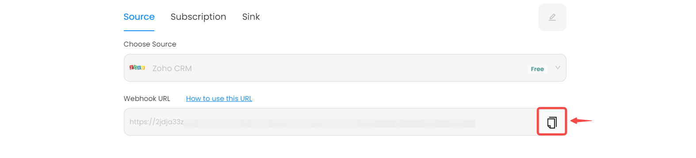
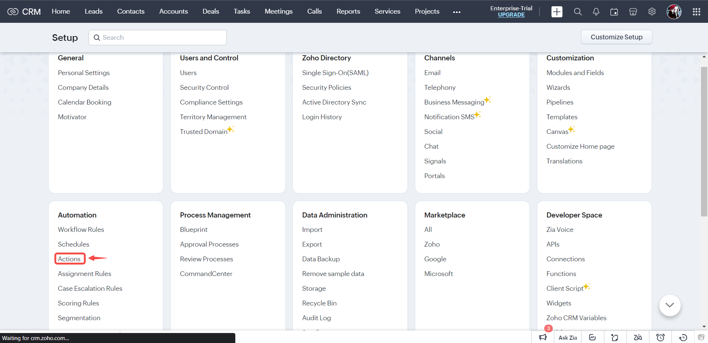
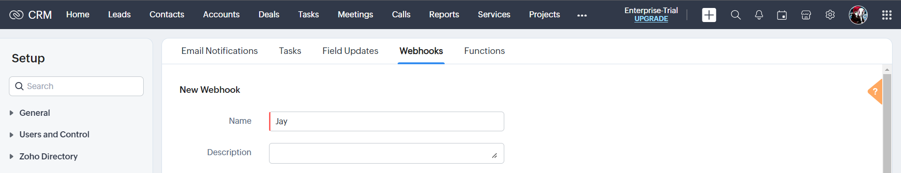
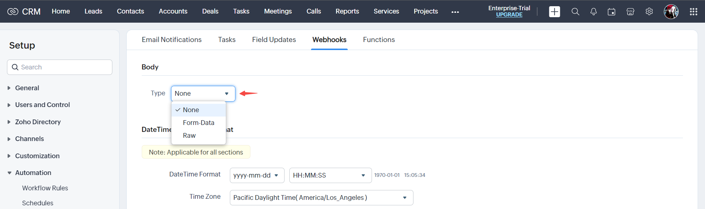
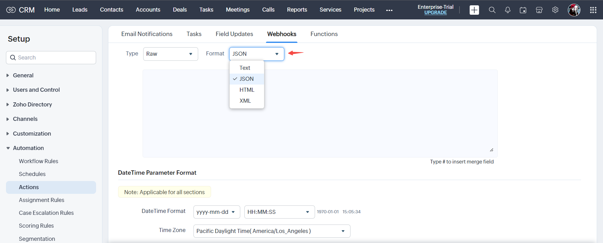
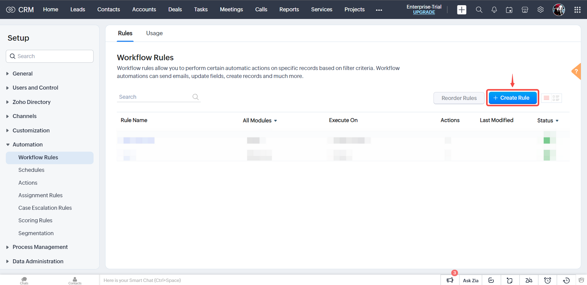
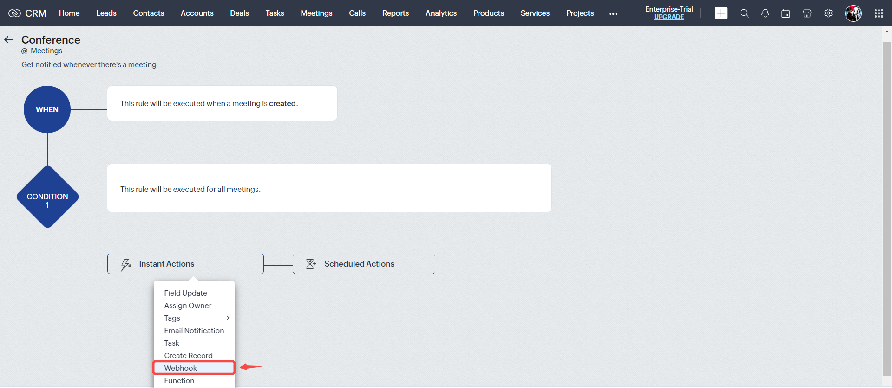
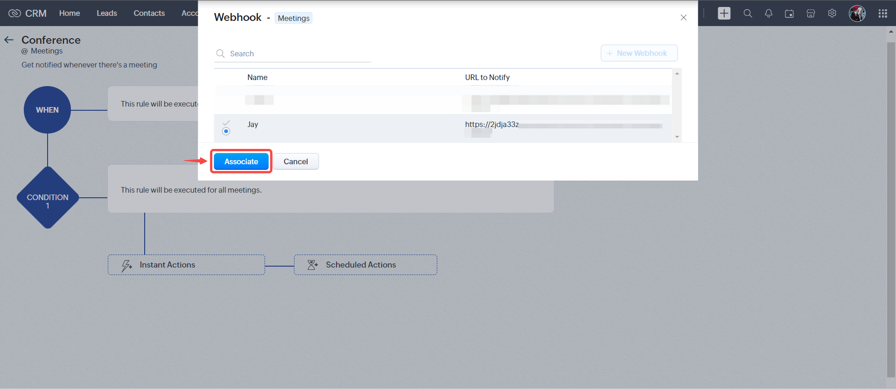

### Configuring Zoho CRM to Send Webhook Events 

### Step 1: Configure webhook

1. Click the copy icon to copy the webhook url

2. Log in to your [Zoho CRM account](https://crm.zoho.com/crm/org813836165/tab/Home/begin)

3. Navigate to the **Setup** page by clicking on the gear icon.

4. Click on **Actions**.

5. Click on **Webhooks**.

6. Click on the **Configure Webhook** button.

7. Name your Webhook.

8. Provide the payload URL copied from your Zoho CRM source connector in Vanus Cloud and select **General** authorization type.

9. Select the event you want to receive notification for.

10. Specify the necessary parameters.

11. Specify the body type.

*You can choose to use **Form-Data** or **Raw** from the picklist, to configure the body session*

#### Raw

If you choose the Raw Data option as the body type in the text editor, you have the flexibility to write your own data values. You can input data in various formats such as XML, JSON, HTML, or plain text. Additionally, you can utilize the # merge field feature to reference specific field values within the script.

#### Form Data

This feature enables you to construct the body section of the URL by seamlessly appending the parameter name, parameter type, or parameter value. You can create Form-Data in three distinct ways: **Module Parameters**, **Custom Parameters**, and **User-Defined Parameters**.

12. Save your settings.

---

### Step 2: Associate webhook to a workflow rule

1. Select **Workflow Rules**.

2. Click on **Create Rule**.

3. Select the appropriate event. Name your rule and click **Next**.

4. Specify workflow rule parameters.

5. Click **Next**.

6. Specify the conditions to be met for the event to be triggered.

7. Click on **Instant Actions** and select **Webhook**.

8. Select the required webhook and click on **Associate**.

9. Click **Save**.

:::note
You can navigate to **Webhooks** to monitor webhooks that have been successfully sent.
:::

