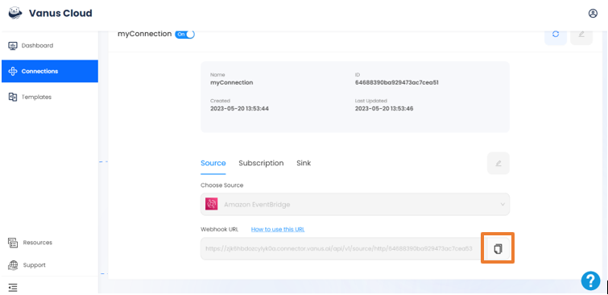
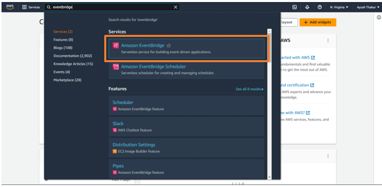
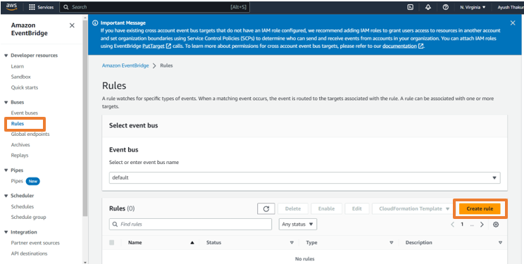
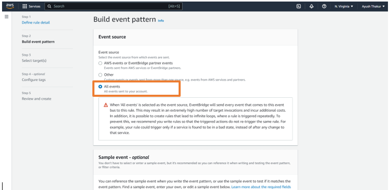
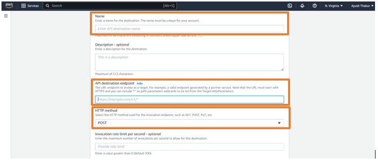
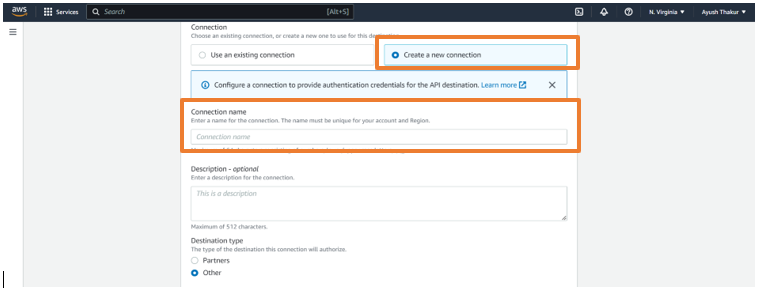
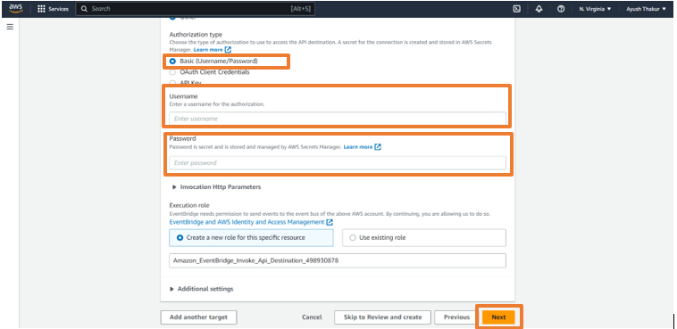

# Amazon EventBridge CreateBucket | DeleteBucket event triggers a Discord message

GitHub is the largest web-based platform that provides developers with a place to host and manage their software projects.

You can receive notifications when specific events occur in a repository by adding a GitHub Source on Vanus Cloud.

This guide will help you get a Discord notification whenever someone open a new pull request in your repository.

<iframe width="800" height="450" src="https://www.youtube.com/embed/JE9kcxfN9EQ" title="YouTube video player" frameBorder="0" allowFullScreen={true} allow="accelerometer; autoplay; clipboard-write; encrypted-media; gyroscope; picture-in-picture; web-share"></iframe>

## Get Started

### Step 1: Configure the Source

- Log in to [Vanus Cloud](https://cloud.vanus.ai/) and choose the **Amazon EventBridge CreateBucket | DeleteBucket event triggers a Discord message** template.

### Step 2: Configure Sink - Get the Discord Webhook URL

- Open Discord in your browser and go to your desired Discord Server

- Go to the Server settings and click on Integrations

- Click on New Webhook. Open the newly created Webhook and Copy the Webhook URL

- Paste the copied URL in the "Webhook URL" in Sink Configuration and click Submit

- Your connection has been succesfully setup

### Step 3: Create a Event in AWS

- Open the newly created connection and copy the webhook URL

- Go to [AWS Console](https://console.aws.amazon.com/events/home) and login with your root account

- Search for the EventBridge service and open it

- Click on Event Buses on the left sidebar and click on Create event bus

- Give a name to the event bus and click Create

- Now, click on Rules on the left sidebar and click on Create Rule

- Give a name to the rule, select the event bus we have created in the Event bus option and click on Next

- Select All events and click Next

- Select EventBridge API destination in the Target 1

- Select Create a new API destination

- Give a name to the connection, paste the copied URL in the API destination endpoint and select POST in HTTP Method option

- In Connection, select Create a new connection and give a name to the connection

- Select Basic (Username/Password) in Authorization type option

- Add your desired username and password and click Next

- Again, click Next in the Configure Tags

- Review the whole rule and click Create rule

- Your connection in the Vanus Cloud is not working perfectly
