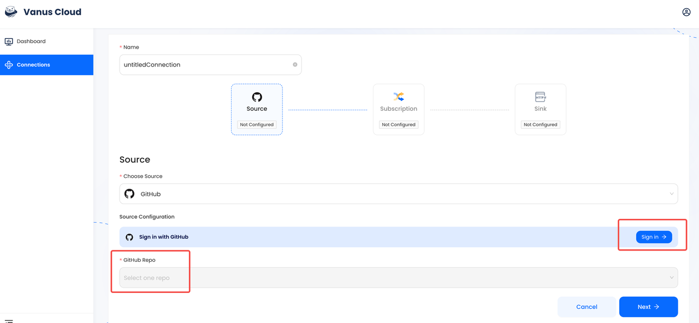
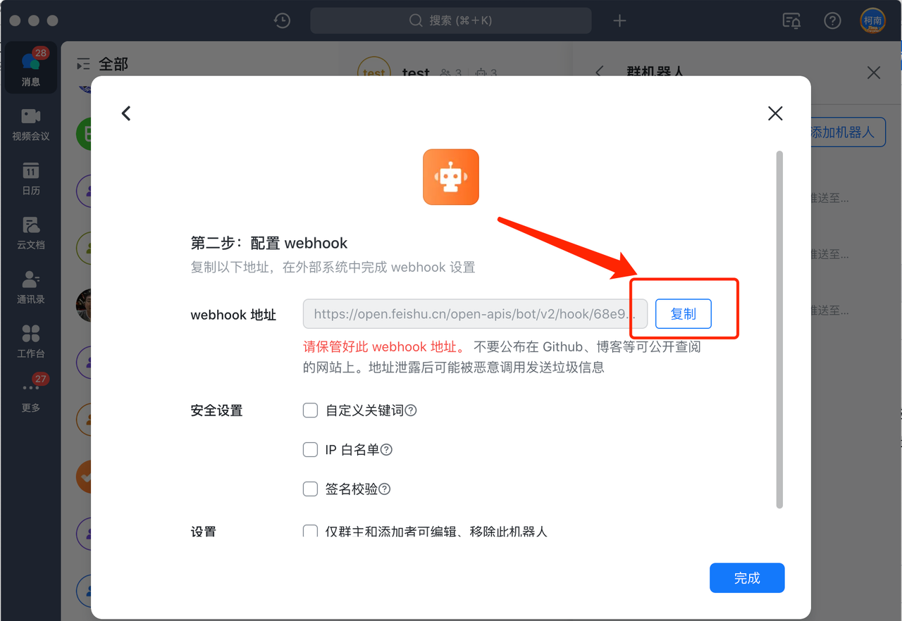
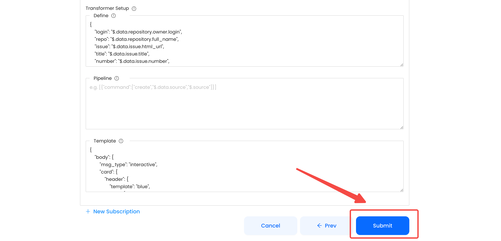
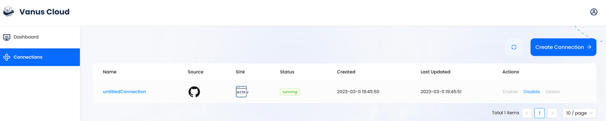

# GitHub star event triggers a Feishu message

GitHub is the largest web-based platform that provides developers with a place to host and manage their software projects.

You can receive notifications when specific events occur in a repository by adding a GitHub Source on Vanus Connect.

This guide will help you get a FeiShu notification whenever someone stars your repository.

<iframe width="800" height="450" src="https://www.youtube.com/embed/pMWOGgLXYjQ" title="YouTube video player" frameBorder="0" allowFullScreen={true} allow="accelerometer; autoplay; clipboard-write; encrypted-media; gyroscope; picture-in-picture; web-share"></iframe>

## Get Started

### Step 1: Configure the Source - Authorize GitHub and select a GitHub repo

- Log in to [Vanus Connect](https://cloud.vanus.ai/) and choose the "**GitHub star event triggers a** **Feishu** **message**" template.
- Find the "**Sign in with GitHub**" button and authorize GitHub. Then, select the repo you want to configure.

### Step 2: Configure Sink - Get the Feishu Webhook URL

- Add a bot to the specified group in Feishu settings and copy the Webhook URL to paste into the Sink configuration.

**Tip:** For detailed steps on how to obtain the Feishu Webhook URL, refer to the blog **[Retrieve Feishu Webhook URL - A Streamlined Guide](https://www.vanus.ai/blog/retrieve-feishu-webhook-url/.)**.

### Step 3: Configure Subscription - Create a Connection Using the Default Template

- Use the pre-configured Star Template and simply click "**Submit**" to create the Connection.

Note: You can customize the display format and content of the notifications by configuring the **Subscription**.

- After submission, the status will show as "**running**". 

## Result Display

- When someone stars your open-source GitHub repo, you will receive a real-time GitHub Star Notify in Feishu. 

The blue text in the notification received on Feishu are hyperlinks that can be clicked to view the GitHub profile of the developer directly.
