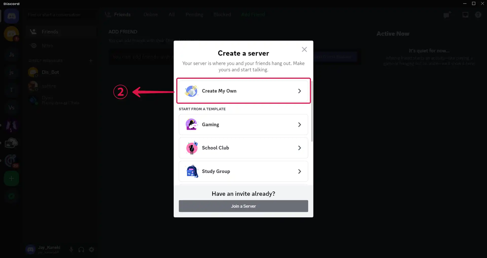

# GitHub issue comment event triggers a Discord message

GitHub is the largest web-based platform that provides developers with a place to host and manage their software projects.

You can receive notifications when specific events occur in a repository by adding a GitHub Source on Vanus Connect.

This guide will help you get a Discord notification whenever someone leaves a comment on an issue in your repository.

<iframe width="800" height="450" src="https://www.youtube.com/embed/GarKp84BeOI" title="YouTube video player" frameBorder="0" allowFullScreen={true} allow="accelerometer; autoplay; clipboard-write; encrypted-media; gyroscope; picture-in-picture; web-share"></iframe>

## Getting Started

### Step 1: Configure the Source - Authorize GitHub and select a GitHub repo

- Log in to [Vanus Connect](https://cloud.vanus.ai/) 

- Choose the **GitHub issue comment event triggers a Discord message** template. Click on **Try it now**①.

- Give the Conncection a **Name**②, scroll to **Authorize Github Account** and click the **Authorize**③ button.

- Select the repo④ you want to configure, and click **Next**⑤.

### Step 2: Create a Discord Server 

1. Go to the Discord application.

2. Create a new server by clicking the `+`① icon.

3. Choose a template or create your own, by selecting **Create My Own**②.

4. Click on **Skip this question**③ to move to the next step of your configuration.

5. Input a **Server Name**④ and click on **Create**⑤.

### Step 3: Get a webhook URL

1. Bring out the drop down settings menu by clicking `⌄`①.

2. Select **Server Settings**②.

3. Click on **Integrations**③ in the sidebar menu under APPS.

4. Click **Create Webhook**④.

5. Click on **Spidey Bot**⑤, the webhook you just created.

6. Tap the **Copy Webhook URL**⑥ button.

---

### Step 4: Discord Connection Settings

1. Go back to Vanus Connect.

2. Paste your webhook URL in the **Webhook URL**① field, and click **Submit**② to continue.

### Result Display

When a user comments on an issue in your repository, you will receive a real-time GitHub Notification on Discord.

