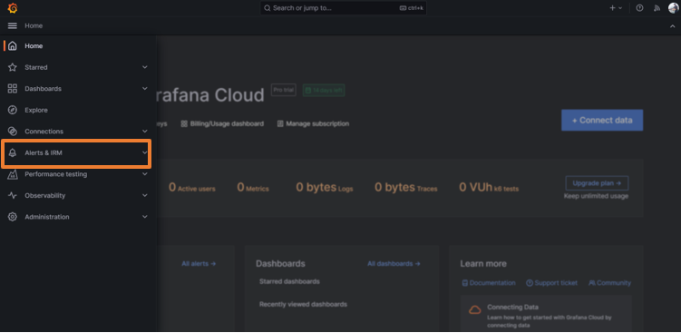

# Grafana resource utilization threshold event triggers a Discord message

GitHub is the largest web-based platform that provides developers with a place to host and manage their software projects.

You can receive notifications when specific events occur in a repository by adding a GitHub Source on Vanus Connect.

This guide will help you get a Discord notification whenever someone opens a new pull request in your repository.

<iframe width="800" height="450" src="https://www.youtube.com/embed/C4wUgHq4d8E" title="YouTube video player" frameBorder="0" allowFullScreen={true} allow="accelerometer; autoplay; clipboard-write; encrypted-media; gyroscope; picture-in-picture; web-share"></iframe>

## Get Started

### Step 1: Configure the Source

- Log in to [Vanus Connect](https://cloud.vanus.ai/) and choose the **Grafana resource utilization threshold event triggers a Discord message** template.

### Step 2: Configure Sink - Get the Discord Webhook URL

- Open Discord in your browser and go to your desired Discord Server.

- Go to the Server settings and click on **Integrations**.

- Click on **New Webhook**. 

- Open the newly created Webhook and Copy the Webhook URL.

- Paste the copied URL in the "Webhook URL" section in Sink Configuration and click **Submit**.

- Your connection has been successfully set up.

### Step 3: Create a Contact Point in Grafana

- Open the newly created connection and copy the webhook URL.

- Open [Grafana](https://grafana.com/) and log in to your account.

- Open the left sidebar and go to **Alerts & IRM**.

- Click on **Alerting**, go to Contact Points and Click on **Add contact point**.

- Give a name to the contact point, select **'Webhook'** in the Integration section, and paste the copied URL into the URL section.

- Finally, click on **Save Contact Point**. Your connection is working perfectly now.
